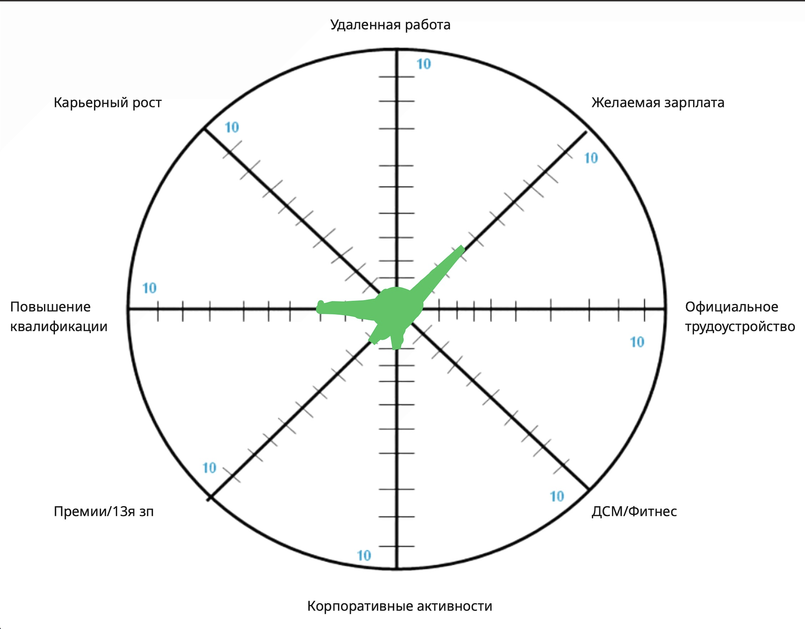
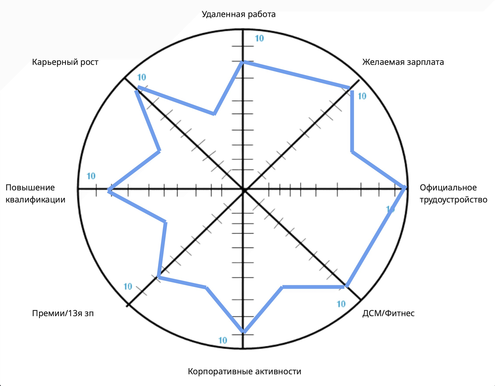
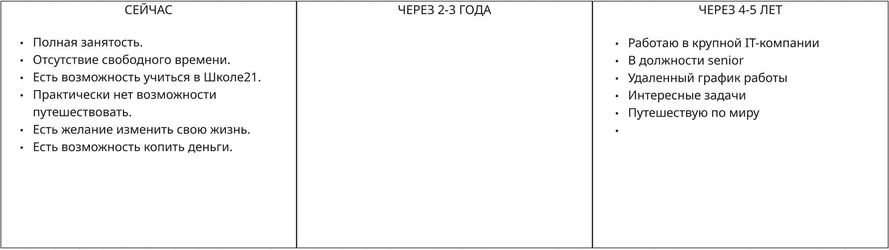

## Exercise 00
### Колесо карьерного баланса

#### Сейчас 

  

  - Удаленная работа:

  1. Нет удаленки;
  2. Иногда задачи можно решать удаленно;
  3. Удаленная работа 2-3 раза в неделю;
  4. Удаленная работа 3-4 раза в неделю;
  5. Гибридный график;
  6. Иногда нужно приходить в офис;
  7. Удаленная работа, иногда появляться в офисе;
  8. Удаленная работа, в офисе только по корпоративным событиям;
  9. Удаленная работа из Москвы;
  10. Полностью удаленная работа из любой точки мира;

  - Желаемая зарплата

  1. 100-150 тр/мес;
  2. 150-200 тр/мес;
  3. 200-250 тр/мес;
  4. 250-350 тр/мес;
  5. 350-500 тр/мес
  6. 5K-6,5K $ в мес;
  7. 6,5К-8К $ в мес;
  8. 8К-10К $ в мес;
  9. 10К-15К $ в мес;
  10. 15К-25К $ в мес;

  - Официальное трудоустройство

  1. Не официальное трудоустройство;
  2. Рабрта частично по ГПХ, самозанятости;
  3. Работа с ИП, самозанятым
  4. Частично официальное трудоустройство на 1/2 ставки;
  5. Официальный трудовой договор, но МРОТ в договоре;
  6. Устройство по ТК, но с серой зп;
  7. Устройство по ТК, без премирования;
  8. Устройство по ТК, с доп нагрузкой для премий;
  9. Устройство по ТК;
  10. Полностью официальное трудоустройство с прописаными мотивационными выплатами и всеми допами существующими в компании;

  - ДМС/Фитнес

  1. Нет ни чего;
  2. Есть свой спортзал;
  3. Есть льготный абонемент в спортзал для сотрудников;
  4. Есть ограниченый ДМC;
  5. Есть ограниченый ДМС и спортзал;
  6. ДМС после испытательного срока;
  7. ДМС и спортзал;
  8. Расширеный ДМС и спортивная активность на выбор;
  9. Расширеный ДМС с первого дня трудоустройства, любая спортивная активность на выбор за счет компании;
  10. Полный ДМС для сотрудников и членов семей, любые активности для сотрудников и членов семей;

  - Корпоротивные активности

  1\. Нет активностей; \
  5. Регулярные корпоративные активности; \
  10. Коллектив на регулярной основе принимает участие в выборе корпоративных активностей, голосует за их формат и регулярность;

  -  Премии/13я зп

  1\. Нет;\
  5. Есть премии;\
  10. Регулярное премирование сотрудников как квартальными премиями, так и индивидуальными за достижения. 13я зарплата. Новогоднее премирование. Подъемное премирование для новых сотрудников;

  - Повышение квалификации

  1\. Нет;\
  5. Есть курсы и стажировки;\
  10. Можно самому выбирать направление и вид повышения квалификации;

  - Карьерный рост

  1\. Нет;\
  5. Повышение дается с трудом;\
  10. Компания регулярно оценивает достижения сотрудников и реализует продвижения по карьерной лестнице;

#### Через несколько лет

  

  - Для достижения целей необходимо:

  1. Удаленная работа - Поиск вакансий с этим критерием;
  2. Желаемая зарплата - Так же поиск вакансий и развитие внутри компании;
  3. Официальное трудоустройство - Даже не рассматривать иное;
  4. ДМС/Фитнес - Зарание обсуждать этот аспект на собеседовании;
  5. Корпоративные активности - Уделять внимание компаниям, где это присутствует;
  6. Премии/13я зп - Выполнять все поставленные задачи и KPI для получения премий;
  7. Повышение квалификации - Путь начат, не останавливаться и набирать темп;
  8. Карьерный рост - Развиваться, повышать квалификацию и навыки;

## Exercise 01
### Карьерные цели

  

