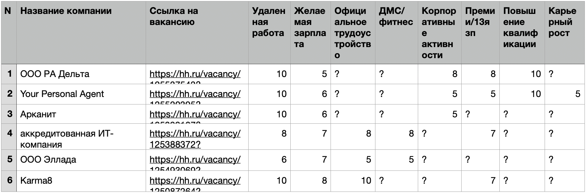
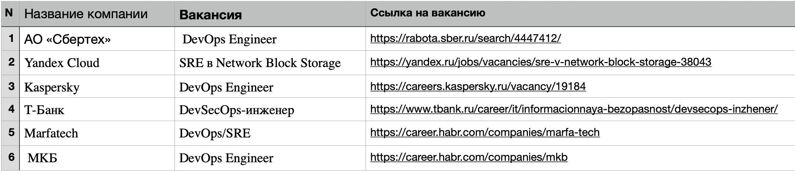
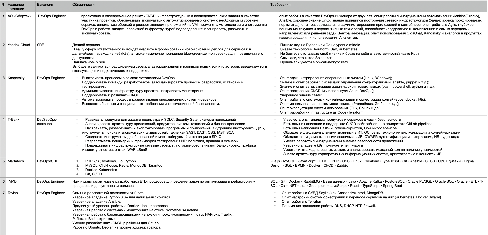
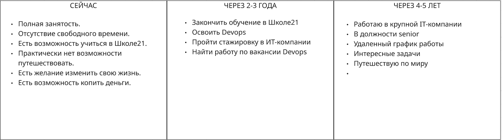
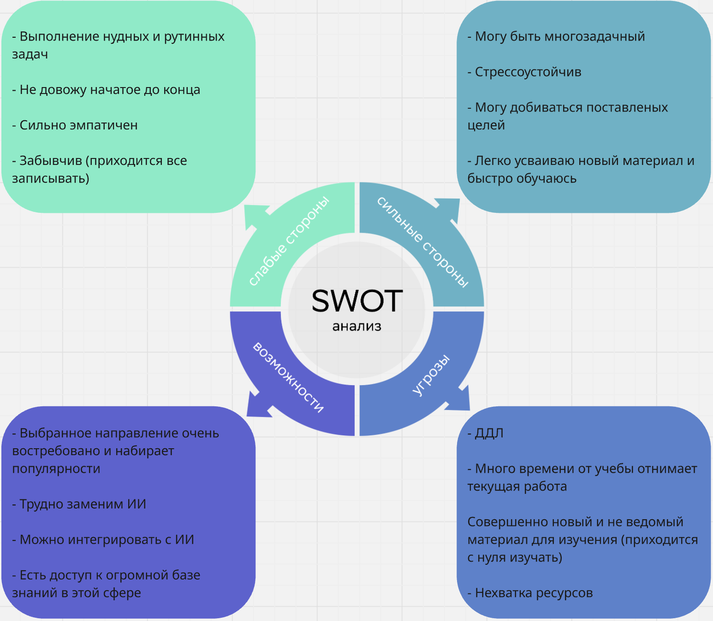

## Exercise 00

### Выбор компании

  Чек-лист выбора компаний с критериями

  

  Список компаний, где хочется поработать

  

## Exercise 01

### Анализ вакансий

  

На основе обязаностей и требований мне необходимо владеть такими навыками как:

- CI/CD
- Docker, Kubernetis, k8s
- MySQL, Reddis, PostgreSQL, MongoDB, Tarantool
- Python, bash, PHP, HTTP
- Grafana, Prometheus
- nginx, Proxy
- Понимание принципов работы DNS, DHCP, NTP, firewall

Для изучения и освоения недостающих навыков необходимо:

- Обучение в Школе21
- Стажировка в ИТ-компании
- Опытный наставник
- Peer-to-peer

## Exercise 02

### Анализ навыков

