# Basic Kubernetes

## Part 1. Использование готового манифеста

### Задание
- Запустить окружение Kubernetes с памятью 4 GB.\
Для запуска устанавливаем `minikube` и стаим отдельно утилиту `kubectl`. \
Запускаем миникуб локально командой `minikube start --driver=docker --memory=4096`

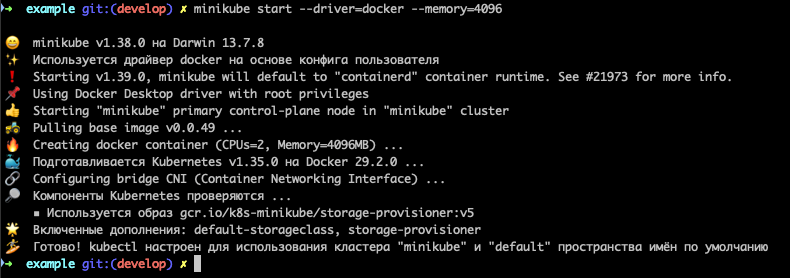

- Применить манифест из директории /src/example к созданному окружению Kubernetes.\
Из дерриктории с манифестом выполняем `kubectl apply -f microservices.yml` и проверяем запуск командой `kubectl get all` (иногда запуск нужно подождать)

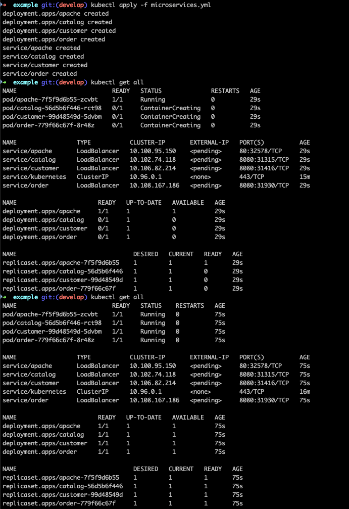

- Запустить стандартную панель управления Kubernetes с помощью команды minikube dashboard.\
При выполнении команды `minikube dashboard` открывается браузер (если браузер не открылся, то можно скопировать ссылку из вывода команды)

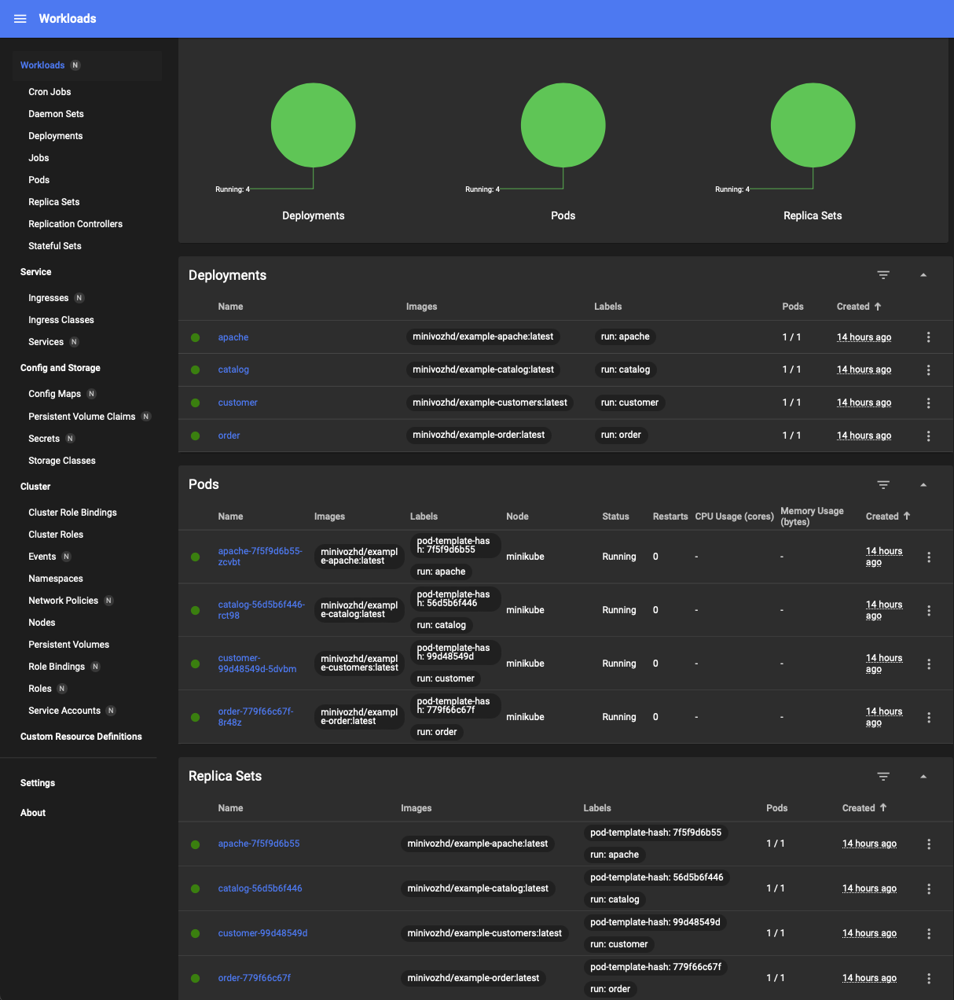

- Прокинуть туннели для доступа к развернутым сервисам с помощью команды minikube service.\
Командой `kubectl get svc` открываем все сервисы, командой `minikube service apache` создаем тунель (браузер откроется автоматически. Что бы получить только URL `minikube service apache --url`) 

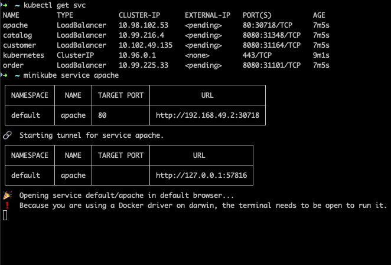

- Удостовериться в работоспособности развернутого приложения, открыв в браузере страницу приложения (сервис apache).\
Браузер открывается автоматически

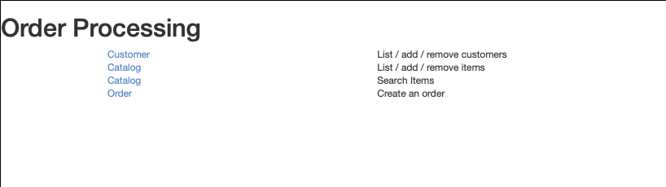

## Part 2. Написание собственного манифеста

### Задание

1. Написать собственные yml-файлы манифестов для приложения из первого проекта (`/src/services`), реализующие следующее:
   - карту конфигурации со значениями хостов БД и сервисов,
   - секреты с паролем и логином к БД и ключами межсервисной авторизации (их можно найти в файлах `application.properties`),
   - поды и сервисы для всех модулей приложения: postgres, rabbitmq и 7 сервисов приложения. Для всех сервисов нужно использовать единственную реплику.

Помним что нам нужно учесть: Сервисы на Java ожидают некоторый набор переменных окружения.

```yml
Session service

POSTGRES_HOST: db
POSTGRES_PORT: 5432
POSTGRES_USER : postgres
POSTGRES_PASSWORD: "postgres"
POSTGRES_DB: users_db

Hotel service

POSTGRES_HOST: db
POSTGRES_PORT: 5432
POSTGRES_USER : postgres 
POSTGRES_PASSWORD: "postgres" 
POSTGRES_DB: hotels_db

Payment service

POSTGRES_HOST: db
POSTGRES_PORT: 5432
POSTGRES_USER : postgres 
POSTGRES_PASSWORD: "postgres" 
POSTGRES_DB: payments_db

Loyalty service

POSTGRES_HOST: db
POSTGRES_PORT: 5432
POSTGRES_USER : postgres 
POSTGRES_PASSWORD: "postgres" 
POSTGRES_DB: balances_db

Report service

POSTGRES_HOST: db
POSTGRES_PORT: 5432
POSTGRES_USER : postgres 
POSTGRES_PASSWORD: "postgres" 
POSTGRES_DB: statistics_db
RABBIT_MQ_HOST: rabbitmq
RABBIT_MQ_PORT: 5672
RABBIT_MQ_USER: guest
RABBIT_MQ_PASSWORD: guest
RABBIT_MQ_QUEUE_NAME: messagequeue
RABBIT_MQ_EXCHANGE: messagequeue-exchange

Booking service

POSTGRES_HOST: db
POSTGRES_PORT: 5432
POSTGRES_USER : postgres 
POSTGRES_PASSWORD: "postgres" 
POSTGRES_DB: reservations_db
RABBIT_MQ_HOST: rabbitmq
RABBIT_MQ_PORT: 5672
RABBIT_MQ_USER: guest
RABBIT_MQ_PASSWORD: guest
RABBIT_MQ_QUEUE_NAME: messagequeue
RABBIT_MQ_EXCHANGE: messagequeue-exchange
HOTEL_SERVICE_HOST: hotel-service
HOTEL_SERVICE_PORT: 8082
PAYMENT_SERVICE_HOST: payment-service
PAYMENT_SERVICE_PORT: 8084
LOYALTY_SERVICE_HOST: loyalty-service
LOYALTY_SERVICE_PORT: 8085

Gateway service

SESSION_SERVICE_HOST: session-service
SESSION_SERVICE_PORT: 8081
HOTEL_SERVICE_HOST: hotel-service
HOTEL_SERVICE_PORT: 8082
BOOKING_SERVICE_HOST: booking-service
BOOKING_SERVICE_PORT: 8083
PAYMENT_SERVICE_HOST: payment-service
PAYMENT_SERVICE_PORT: 8084
LOYALTY_SERVICE_HOST: loyalty-service
LOYALTY_SERVICE_PORT: 8085
REPORT_SERVICE_HOST: report-service
REPORT_SERVICE_PORT: 8086

Сервисы открыты на соответствующих локальных портах:

Session service — 8081;
Hotel service — 8082;
Booking service — 8083;
Payment service — 8084;
Loyalty service — 8085;
Report service — 8086;
Gateway service — 8087.
```

В карту конфигурации со значениями хостов БД и сервисов `configmap.yml` можно вынести общие для всех сервисов переменные:

```yml
apiVersion: v1
kind: ConfigMap
metadata:
  name: my-config
data:
  POSTGRES_HOST: db
  POSTGRES_PORT: "5432"

  RABBIT_MQ_HOST: rabbitmq
  RABBIT_MQ_PORT: "5672"
  RABBIT_MQ_QUEUE_NAME: messagequeue
  RABBIT_MQ_EXCHANGE: messagequeue-exchange

  SESSION_SERVICE_HOST: session-service
  SESSION_SERVICE_PORT: "8081"

  HOTEL_SERVICE_HOST: hotel-service
  HOTEL_SERVICE_PORT: "8082"

  BOOKING_SERVICE_HOST: booking-service
  BOOKING_SERVICE_PORT: "8083"

  PAYMENT_SERVICE_HOST: payment-service
  PAYMENT_SERVICE_PORT: "8084"

  LOYALTY_SERVICE_HOST: loyalty-service
  LOYALTY_SERVICE_PORT: "8085"

  REPORT_SERVICE_HOST: report-service
  REPORT_SERVICE_PORT: "8086"
```

Секреты - это файлы с данными которые нельзя выгружать в GIT. В секреты вносим логины, пароли, приватные ключи. Данные берем из `application.properties`. Кубер работает с зашифрованными значениями по `base64`, мы можем сами их зашифровать с помощью `echo <value> | base64`, или использовать `stringData` и `type: Opaque` что бы Кубер сам шифровал.\

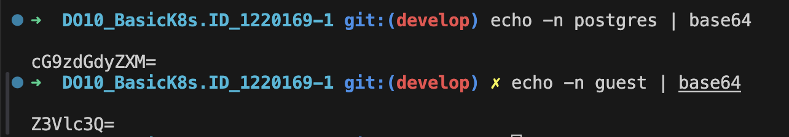

Мой `secrets.yml`

```yml
apiVersion: v1
kind: Secret
metadata:
  name: my-secrets
type: Opaque
stringData:
  POSTGRES_USER: postgres
  POSTGRES_PASSWORD: postgres
  RABBIT_MQ_USER: guest
  RABBIT_MQ_PASSWORD: guest

  GATEWAY_SERVICE_UUID: b51ceda2-bfa5-11eb-8529-0242ac130003
  BOOKING_SERVICE_UUID: 911ccb4c-c055-11eb-8529-0242ac130003

  PRIVAT_KEY: |
    MIIEvQIBADANBgkqhkiG9w0BAQEFAASCBK....

  PUBLIC_KEY: |
    MIIBIjANBgkqhkiG9w0BAQEFAAOCAQ8AMI....
```
Поды и сервисы: Использую следующую структуру 

```
├── configmap.yml
├── postgres-initsql.yml
├── postgres.yml
├── rabbitmq.yml
├── secrets.yml
└── services
    ├── booking.yml
    ├── gateway.yml
    ├── hotel.yml
    ├── loyalty.yml
    ├── payment.yml
    ├── report.yml
    └── session.yml
```

Нам нужно будет смонтировать нашу базу данных для сервисов в постгрес. Создаем `postgres-initdb.yml`

```yml
apiVersion: v1
kind: ConfigMap
metadata:
  name: postgres-initdb
data:
  init.sql: |
    \c postgres;

    DROP DATABASE IF EXISTS users_db;
    CREATE DATABASE users_db OWNER postgres;

    DROP DATABASE IF EXISTS hotels_db;
    CREATE DATABASE hotels_db OWNER postgres;

    DROP DATABASE IF EXISTS reservations_db;
    CREATE DATABASE reservations_db OWNER postgres;

    DROP DATABASE IF EXISTS payments_db;
    CREATE DATABASE payments_db OWNER postgres;

    DROP DATABASE IF EXISTS balances_db;
    CREATE DATABASE balances_db OWNER postgres;

    DROP DATABASE IF EXISTS statistics_db;
    CREATE DATABASE statistics_db OWNER postgres;
````

Мой `postgres`

```yml
apiVersion: apps/v1
kind: Deployment
metadata:
  name: postgres
spec:
  replicas: 1
  selector:
    matchLabels:
      app: postgres
  template:
    metadata:
      labels:
        app: postgres
    spec:
      containers:
        - name: postgres
          image: zapunk1/s21-postgres:spectrav
          ports:
            - containerPort: 5432
          env:
            - name: POSTGRES_USER
              valueFrom:
                secretKeyRef:
                  name: my-secrets
                  key: POSTGRES_USER
            - name: POSTGRES_PASSWORD
              valueFrom:
                secretKeyRef:
                  name: my-secrets
                  key: POSTGRES_PASSWORD
            - name: POSTGRES_DB
              value: postgres
          volumeMounts:
            - name: postgres-data
              mountPath: /var/lib/postgresql/data
            - name: initdb
              mountPath: /docker-entrypoint-initdb.d
              readOnly: true

      volumes:
        - name: postgres-data
          emptyDir: {}
        - name: initdb
          configMap:
            name: postgres-initdb
---
apiVersion: v1
kind: Service
metadata:
  name: db
spec:
  selector:
    app: postgres
  ports:
    - port: 5432
      targetPort: 5432
```

Мой `rabbitmq`

```yml
apiVersion: apps/v1
kind: Deployment
metadata:
  name: rabbitmq
spec:
  replicas: 1
  selector:
    matchLabels:
      app: rabbitmq
  template:
    metadata:
      labels:
        app: rabbitmq
    spec:
      containers:
        - name: rabbitmq
          image: zapunk1/s21-rabbitmq:spectrav
          ports:
            - containerPort: 5672
            - containerPort: 15672
          env:
            - name: RABBITMQ_USER
              valueFrom:
                secretKeyRef:
                  name: my-secrets
                  key: RABBIT_MQ_USER
            - name: RABBITMQ_PASS
              valueFrom:
                secretKeyRef:
                  name: my-secrets
                  key: RABBIT_MQ_PASSWORD
---
apiVersion: v1
kind: Service
metadata:
  name: rabbitmq
spec:
  selector:
    app: rabbitmq
  ports:
    - name: amqp
      port: 5672
      targetPort: 5672
    - name: management
      port: 15672
      targetPort: 15672
```

Сервисы идентичны, рассмотрим на примере `booking` и отдельно `gateway` - поскольку он является витриной, сервис ни кого не вызывает и ему не нужна база данных

```yml
apiVersion: apps/v1
kind: Deployment
metadata:
  name: booking-service
spec:
  replicas: 1
  selector:
    matchLabels:
      app: booking-service
  template:
    metadata:
      labels:
        app: booking-service
    spec:
      containers:
        - name: booking-service
          image: zapunk1/s21-booking:spectrav
          ports:
            - containerPort: 8083
          envFrom:
            - configMapRef:
                name: my-config
            - secretRef:
                name: my-secrets
          env:
            - name: POSTGRES_DB
              value: reservations_db
---
apiVersion: v1
kind: Service
metadata:
  name: booking-service
spec:
  selector:
    app: booking-service
  ports:
    - port: 8083
      targetPort: 8083
```

```yml
apiVersion: apps/v1
kind: Deployment
metadata:
  name: gateway-service
spec:
  replicas: 1
  selector:
    matchLabels:
      app: gateway-service
  template:
    metadata:
      labels:
        app: gateway-service
    spec:
      containers:
        - name: gateway-service
          image: zapunk1/s21-gateway:spectrav
          ports:
            - containerPort: 8087
          envFrom:
            - configMapRef:
                name: my-config
            - secretRef:
                name: my-secrets
            
---
apiVersion: v1
kind: Service
metadata:
  name: gateway-service
spec:
  selector:
    app: gateway-service
  ports:
    - port: 8087
      targetPort: 8087

```

2. Запустить приложение путем последовательного применения манифестов командой `kubectl apply -f <манифест>.yaml`.

Поднимаем кластер `minikube start --driver=docker --memory=4096`\
Запускаем приложения, сначала карты, секреты, базу и брокера:

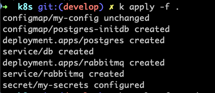

Затем запускаем все сервисы

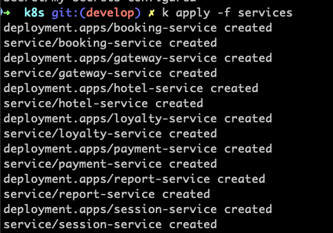

3. Проверить статус созданных объектов (секреты, конфигурационная карта, поды и сервисы) в кластере с помощью команд `kubectl get <тип_объекта> <имя_объекта>` и `kubectl describe <тип_объекта> <имя_объекта>`. Результат отобразить в отчете.

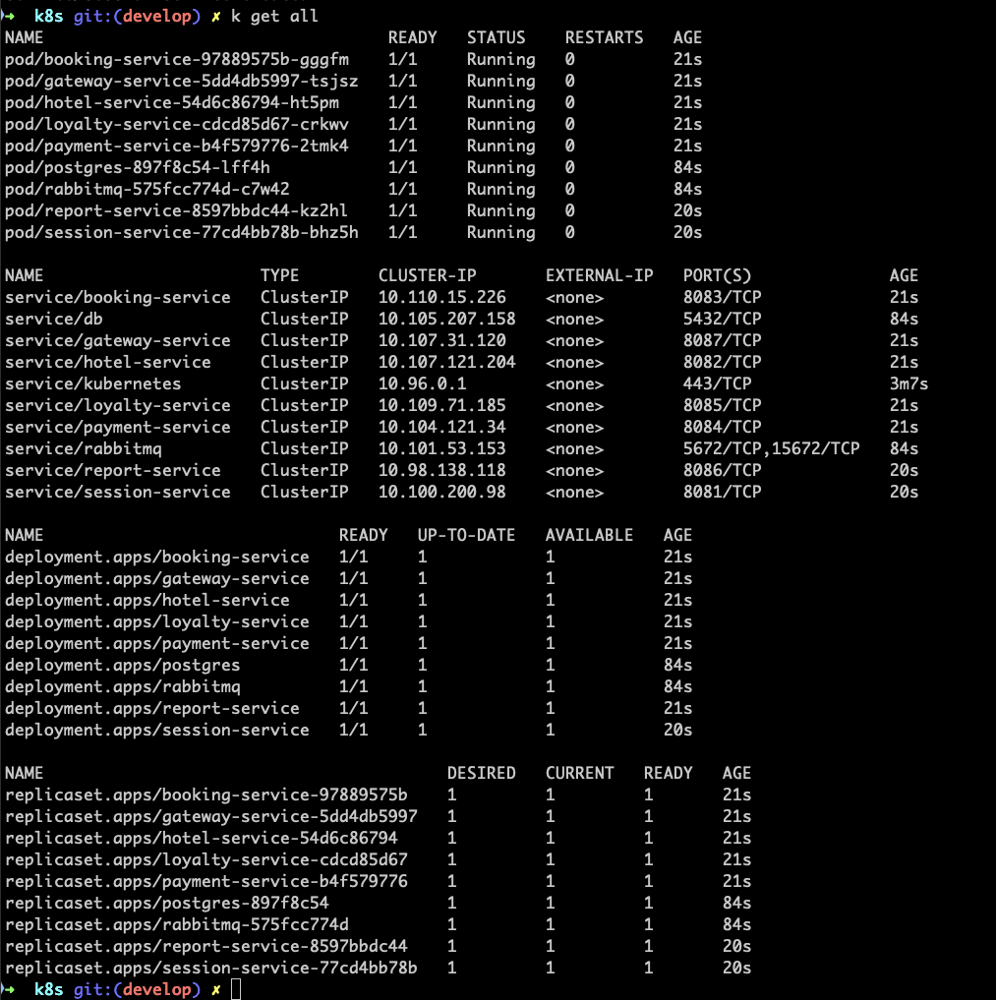

В описаниях вывод может содержать более 500 строк. Рассмотрим только на примере пода букинга. 

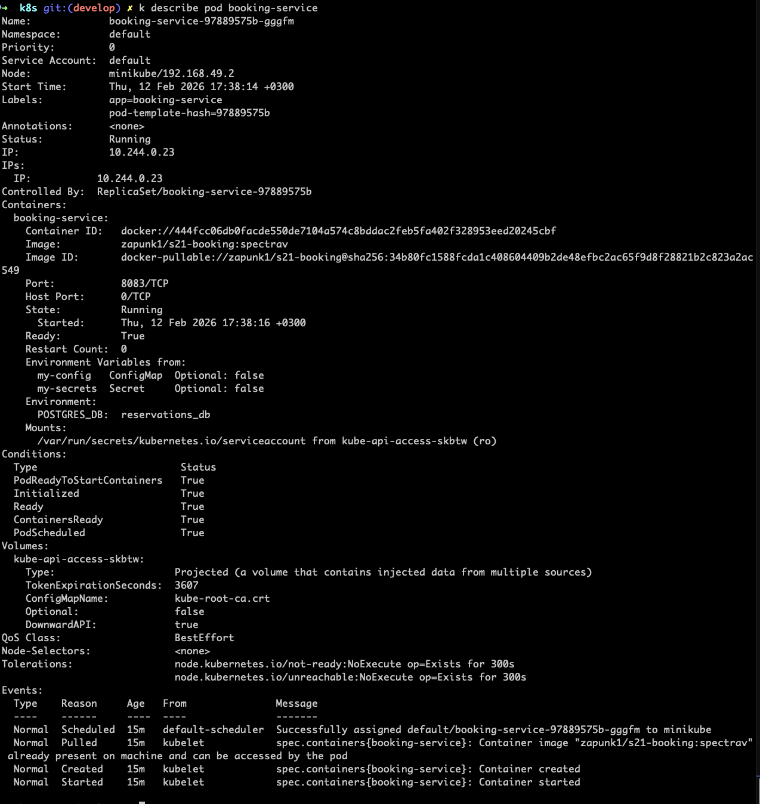

4. Проверить наличие правильных значений секретов, применив, например, команду `kubectl get secret my-secrets -o jsonpath='{.data.password}' | base64 --decode` для декодирования секрета.

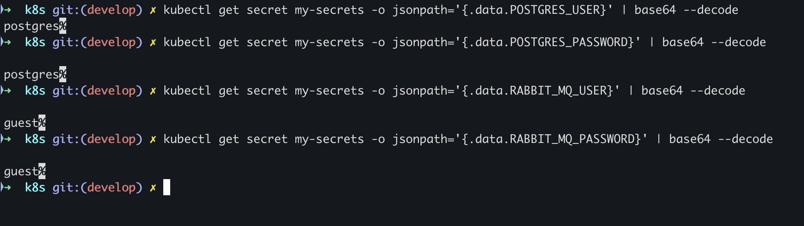

5. Проверить логи приложения, запущенного в кластере, командой `kubectl logs <имя_контейнера>`. Скриншот отобразить в отчете.

Вывод логов рассмотрим на примере gateway

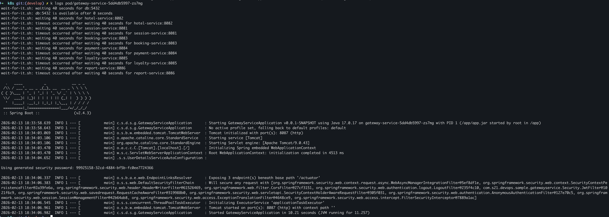

6. Прокинуть туннели для доступа к gateway service и session service.\
Сначала получаем список сервисов командой `kubectl get svc` (У меня используются алиасы на команды kubectl и minikube). Затем получаем URL тунеля

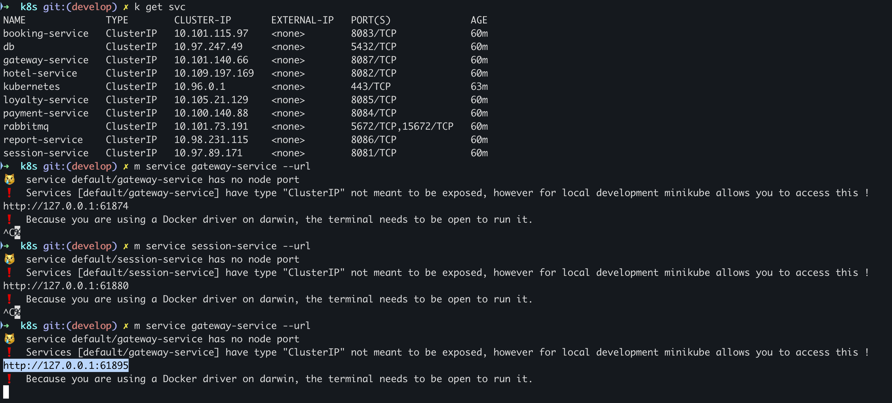

В новом окне терминала можем перейти по тунеллированным ссылкам к нашим контейнерам

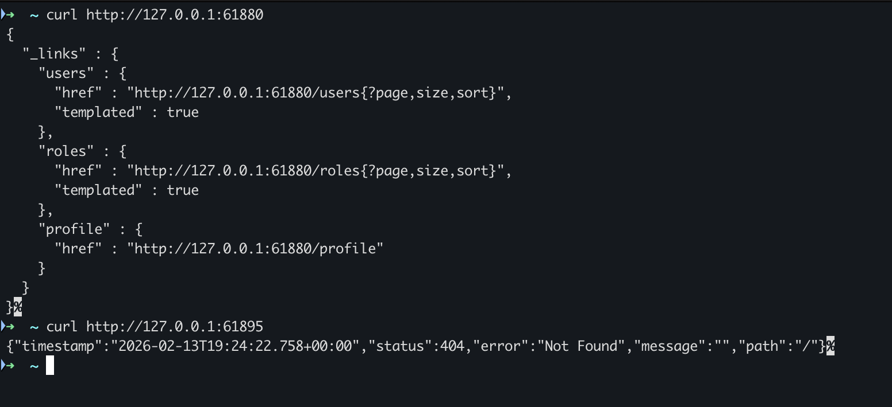

7. Запустить функциональные тесты Postman и удостовериться в работоспособности приложения. (Стоит обратить внимание, что порты тунелей в постмане отличаются от портов в скриншоте п.п.6, где мы прокидывали тунели. Это потому что я останавливал тунели, а перед тестами постман запускал заново и порты переназначились)

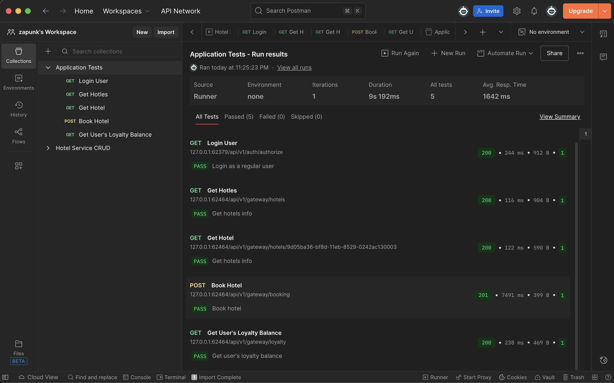

8. Запустить стандартную панель управления Kubernetes с помощью команды `minikube dashboard`. Отобразить в отчете следующую информацию в виде скриншотов с дашборда: текущее состояние узлов кластера, список запущенных Pod, а также другие метрики, такие как загрузка ЦП и память, логи Pod, конфигурации и секреты.\
Запускаем `minikube dashboard`, в открывшемся браузере видим:

Текущее состояние узлов кластера

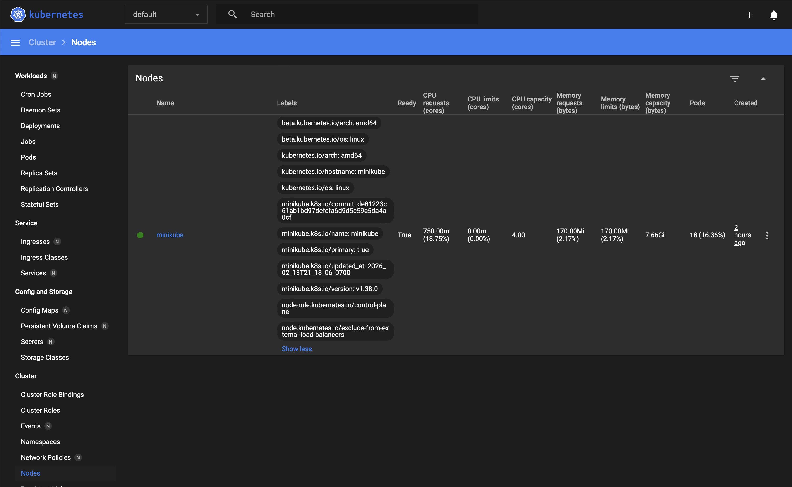

Список запущенных Pod

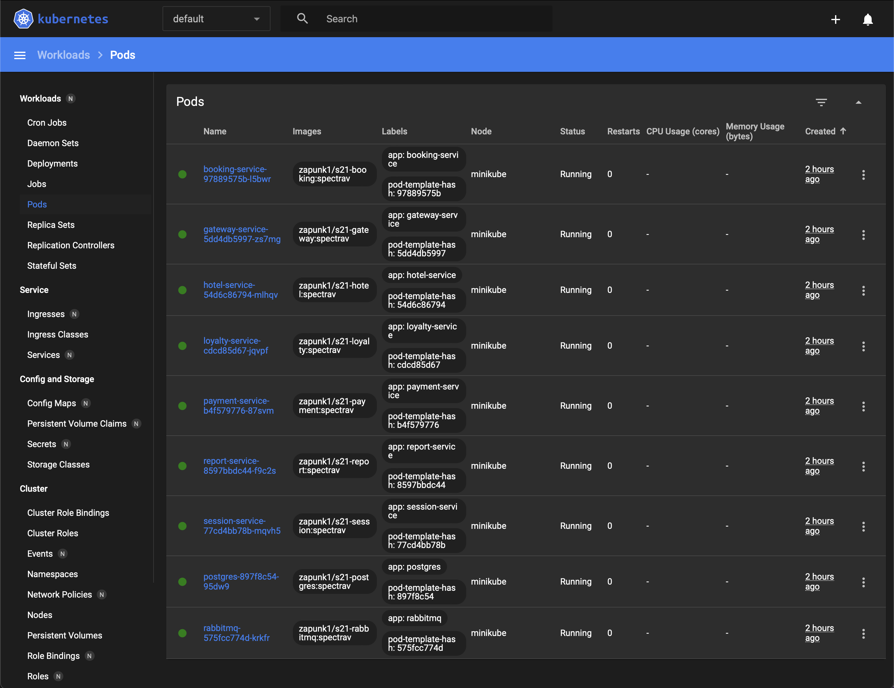

Загрузка ЦП и память

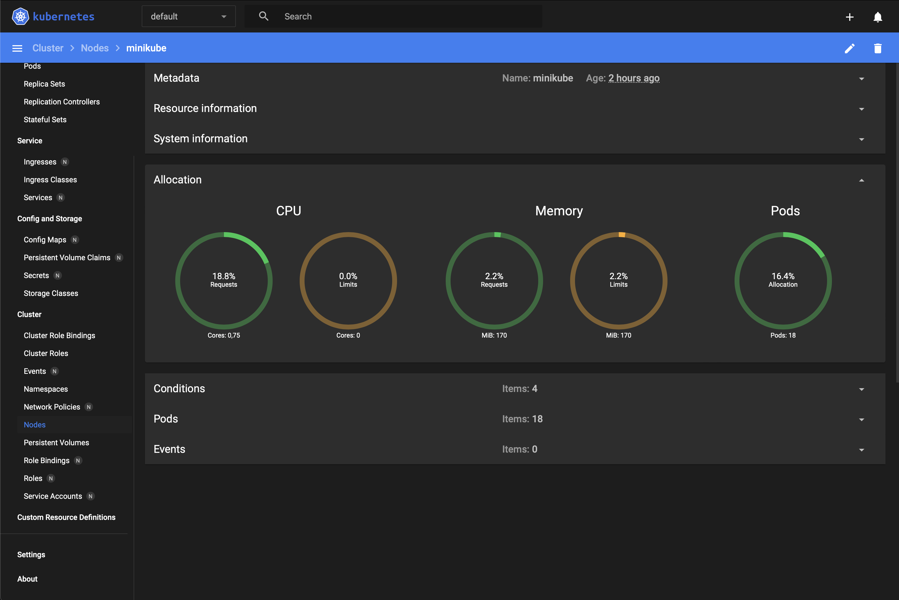

Логи Pod(На примере Loyalty)

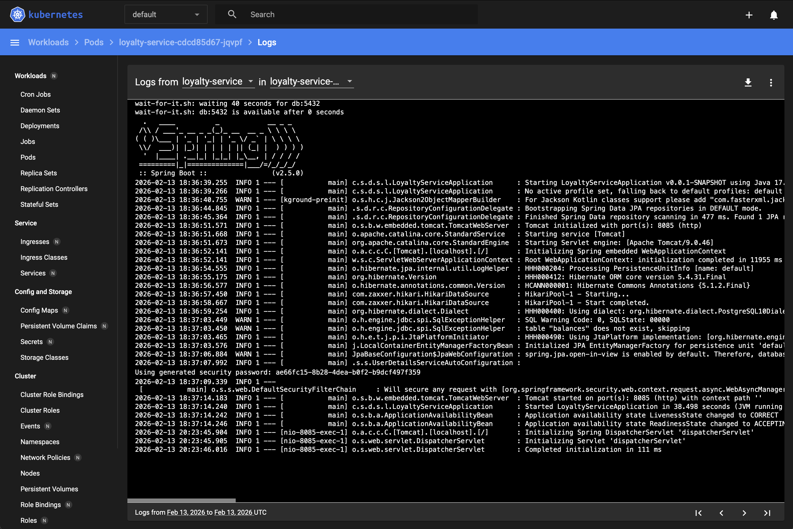

Конфигурации

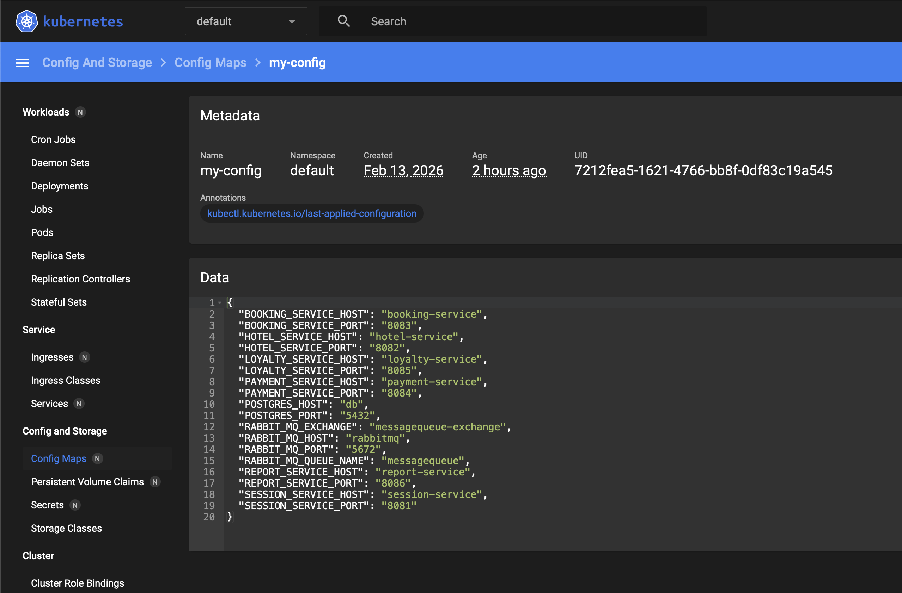

Секреты

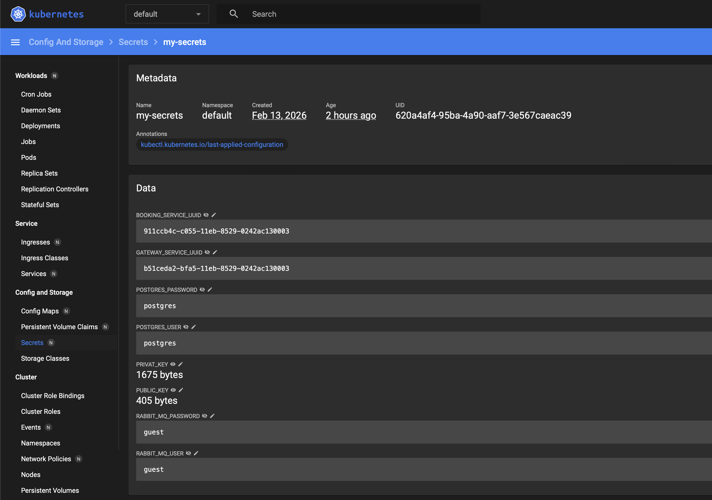

9. Обновить приложение (добавив новую зависимость в pom-файл) и пересобрать его со следующими стратегиями развертывания (замерить время переразвертывания приложения для каждого случая и отметить результаты в отчете):
   - пересоздание (recreate),
   - последовательное обновление (rolling).

Процесс идентичен для всех сервисов, в отчете расмотрим пример с `booking-service`

Возьмем одну любую harmless-библиотеку и добавим в pom.xml каждого сервиса. Например:

Логирование
```xml
<dependency>
    <groupId>net.logstash.logback</groupId>
    <artifactId>logstash-logback-encoder</artifactId>
</dependency>
```
JSON
```xml
<dependency>
    <groupId>com.fasterxml.jackson.core</groupId>
    <artifactId>jackson-databind</artifactId>
</dependency>
```
Утилиты
```xml
<dependency>
    <groupId>org.apache.commons</groupId>
    <artifactId>commons-lang3</artifactId>
</dependency>
```
Валидация
```xml
<dependency>
    <groupId>org.hibernate.validator</groupId>
    <artifactId>hibernate-validator</artifactId>
</dependency>
```

Важно: библиотека должна подтянуться в fat-jar.

Пересоберем докер образы и запушим в наш докер хаб
```sh
mvn clean package -DskipTests # что бы удалить старые targets/ если есть
docker build -t zapunk1/s21-booking:v2 .
docker push zapunk1/s21-booking:v2
```
Для стратегии Recreate добавляем в `Deployment` каждого манифеста сервисов:
```yml
...
spec:
  replicas: 1
  strategy:
    type: Recreate
...
```
Что делает Recreate
  - Удаляет ВСЕ старые Pod'ы
  - Потом создаёт новые

Применяем измененую стратегию `kubectl apply -f ./services/booking.yml`

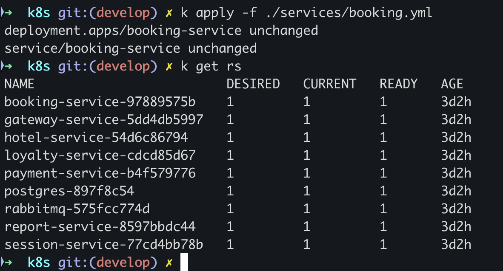

В манифестах каждого сервиса меняем тег образа на :v2
```yml
...
containers:
        - name: booking-service
          image: zapunk1/s21-booking:v2
...
```

Замеряем время переразвертывания приложения
```sh
date
kubectl apply -f ./services/booking.yml
kubectl rollout status deployment booking-service
date
```

Видим время `downtime` за которое старый ReplicaSet уничтожился, а новый создался с новым hash

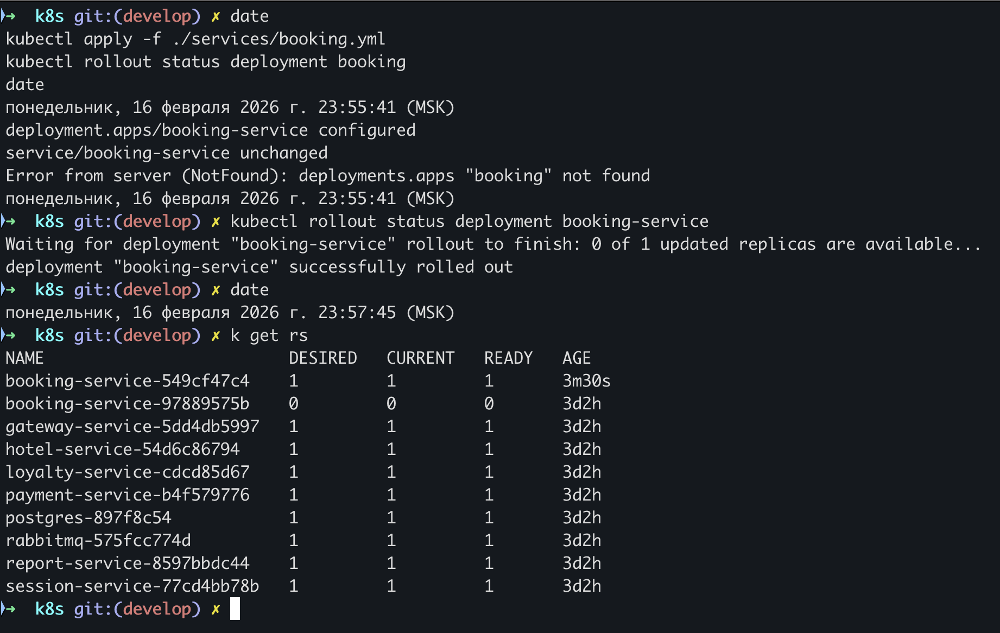

(Откатываемся на предидущую версию: убираем стратегию и меняем тег, применяем изменения)

Для стратегии Rolling добавляем в `Deployment` каждого манифеста сервисов:

```yml
...
spec:
  replicas: 1
  strategy:
    type: RollingUpdate
    rollingUpdate:
      maxUnavailable: 1
      maxSurge: 1
...
```
Что делает RollingUpdate
  - Создаёт новый Pod
  - Ждёт, пока он станет Ready
  - Удаляет один старый Pod
  - Повторяет процесс

Применяем измененую стратегию `kubectl apply -f ./services/booking.yml`

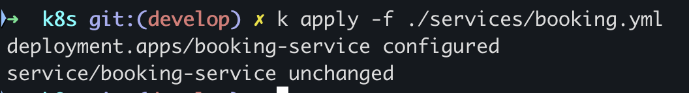

В манифестах каждого сервиса меняем тег образа на :v2
```yml
...
containers:
        - name: booking-service
          image: zapunk1/s21-booking:v2
...
```

Замеряем время переразвертывания приложения
```sh
date
kubectl apply -f ./services/booking.yml
kubectl rollout status deployment booking-service
date
```

При RolloingUpdate не происходит `downtime`, ведь сервис ждет когда новый под станет `ready`, а только потом уничтожает старый

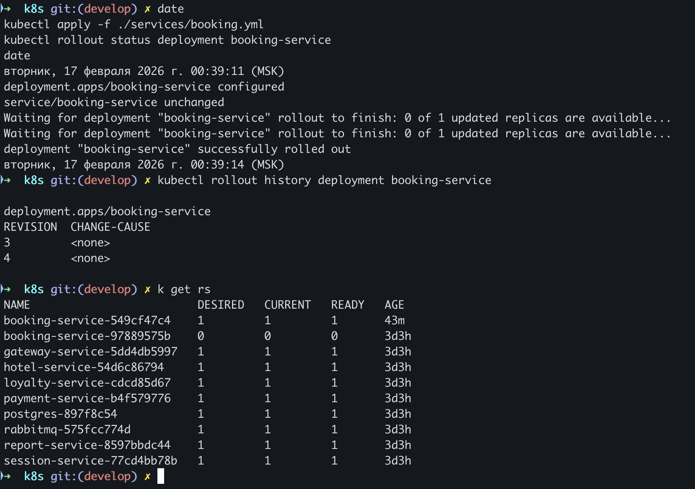

Дополнительно можем посмотреть описание деплоймента нашего сервиса: На скрине видим какая была применена стратегия; Сколько новых реплик создано; И вывод по маштабированиям. 

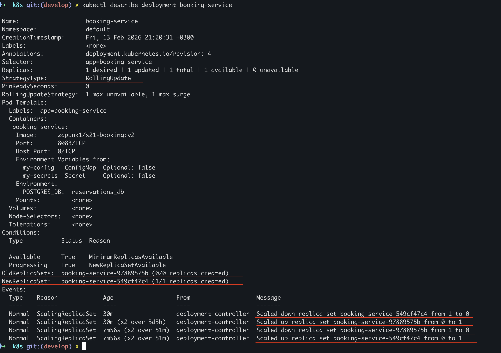

Для останльных сервисов процетуда абсолютно идентичная. 
