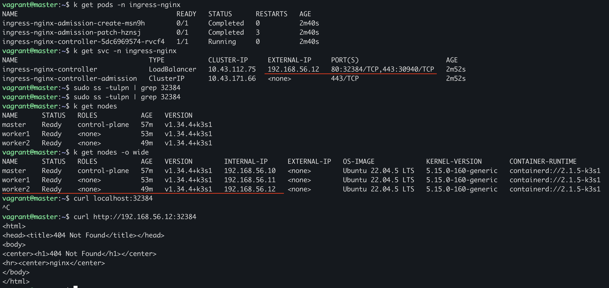

##  Развертывание собственного кластера k3s

### Задание

1. Получить набор виртуальных машин для кластера.

Используем уже знакомый инструмент `Vagrant`

```sh
Vagrant.configure("2") do |config|

  config.vm.box = "bento/ubuntu-22.04"

  config.vm.synced_folder ".", "/vagrant"

  nodes = {
    "master"  => "192.168.56.10",
    "worker1" => "192.168.56.11",
    "worker2" => "192.168.56.12"
  }

  nodes.each do |name, ip|
    config.vm.define name do |node|
      node.vm.hostname = name
      node.vm.network "private_network", ip: ip

      node.vm.provider "virtualbox" do |vb|
        vb.memory = 3072
        vb.cpus = 2
      end

      if name == "master"
        node.vm.provision "shell", path: "scripts/install_k3s_master.sh"
      else
        node.vm.provision "shell", path: "scripts/install_k3s_worker.sh"
      end
    end
  end
end
```

2. Установить k3s на всех трех машинах. При установке не использовать стандартный Ingress Controller при помощи флага `--disable=traefik`.

Используем скрипты для установки k3s на ноды и подключения воркеров к мастеру

MASTER
```sh
#!/bin/bash

set -e
echo "Установка k3s (without Traefik)..."
apt-get update -y
echo "Установка curl"
apt-get install -y curl
echo "Установка K3s"
curl -sfL https://get.k3s.io | \
INSTALL_K3S_EXEC="--node-ip=192.168.56.10 --advertise-address=192.168.56.10 --disable traefik --write-kubeconfig-mode=644" sh -
echo "Ждем 30 сек"
sleep 30
echo "Проверка запуска k3s"
systemctl status k3s --no-pager

echo "Копируем токен"
TOKEN=$(sudo cat /var/lib/rancher/k3s/server/node-token)
echo $TOKEN > /vagrant/token

echo "Export KUBECONFIG"
export KUBECONFIG=/etc/rancher/k3s/k3s.yaml
echo "export KUBECONFIG=/etc/rancher/k3s/k3s.yaml" >> ~/.bashrc

kubectl get nodes
```

WORKER
```sh
#!/bin/bash

set -e

MASTER_IP="192.168.56.10"

apt-get update -y
echo "Установка curl"
apt-get install -y curl
echo "Ждем токен...."
while [ ! -f /vagrant/token ]; do
  sleep 5
done
echo 
NODE_TOKEN=$(cat /vagrant/token)
echo "Подключаемся к Мастеру"
curl -sfL https://get.k3s.io | \
K3S_URL=https://$MASTER_IP:6443 \
K3S_TOKEN=$NODE_TOKEN \
INSTALL_K3S_EXEC="--node-ip=$(hostname -I | awk '{print $2}')" \
sh -

echo "Воркер подключен успешно"
```

3. Выполнить подключение узлов к кластеру, используя команду `k3s server` и флаги `--token` и `--server` для рабочих узлов и мастера соответственно. Когда k3s установлен, можно использовать переменную окружения `NODE_TOKEN`.

Данный подход более низкоуровневый и подойдет только для ручного подключения с каждой ноды. Я же применил автомаматический метод установки и подключения, что позволяет мне многократно перезапускать ВМ и автоматизировать процесс развертывания кластера. 


4. Установить Ingress Controller Nginx вместо стандартного. Ты можешь использовать официальный файл манифеста Ingress контроллера на базе Nginx, доступный на GitHub.

  - Переходим на мастер ноду `vagrant ssh master`
  - Запускаем наше приложение применив манифесты из DO10 выгруженные в репозиторий `k apply -k https://github.com/Zapunk/school21/DO10_BasicK8s/src/k8s?ref=main`(или можно скопировать на master и запустить из него)
  - Использую официальный манифест\
выполняем `k apply -f https://raw.githubusercontent.com/kubernetes/ingress-nginx/controller-v1.10.1/deploy/static/provider/cloud/deploy.yaml` (Обратим внимание, что контроллер развернулся на worker2 `EXTERNAL-IP 192.168.56.12`) 
    - HTTP → NodeIP:32384
    - HTTPS → NodeIP:30940



5. Получить доменное имя и сконфигурировать внутри кластера утилиту `cert-manager`, которая должна генерировать wildcard-сертификат для полученного домена.

Для учебного проекта будем использовать динамический DNS-сервис `nip.io`
  - сейчас мой ingress доступен по `192.168.56.12`, домен можем использовать такой `app.192.168.56.12.nip.io`. Wildcard сертификат будет `*.192.168.56.12.nip.io`
  - у меня нет публичного IP, использую private network(VirtualBox). Поэтому использовать буду `self-signed wildcard через cert-manager`

Это:\
корректная интеграция\
реальная работа cert-manager\
автоматическое создание TLS Secret\
корректная работа Ingress

  - создаем issuer.yml

```yml
apiVersion: cert-manager.io/v1
kind: ClusterIssuer
metadata:
  name: selfsigned-issuer
spec:
  selfSigned: {}
```

  - создаем certificate.yml

```yml
apiVersion: cert-manager.io/v1
kind: Certificate
metadata:
  name: wildcard-cert
  namespace: default
spec:
  secretName: wildcard-tls
  issuerRef:
    name: selfsigned-issuer
    kind: ClusterIssuer
  commonName: "*.192.168.56.12.nip.io"
  dnsNames:
  - "*.192.168.56.12.nip.io"
```

6. Создать ресурс Ingress для своего личного домена и настроить его для использования контроллера nginx ingress и полученного сертификата.

7. Создать PV (Persistent Volume) для базы данных PostgreSQL в манифесте из десятого проекта.

8. Запустить приложение, описанное в манифесте.

9. Запустить функциональные тесты Postman и удостовериться в работоспособности приложения.

10. Установить и запустить Prometheus Operator для сбора метрик в системе. Продемонстрировать в отчете результат выполнения команды `kubectl get pods -n monitoring`.

