##  Развертывание собственного кластера k3s

### Задание

1. Получить набор виртуальных машин для кластера.

Используем уже знакомый инструмент `Vagrant`

```sh
Vagrant.configure("2") do |config|

  config.vm.box = "bento/ubuntu-22.04"

  config.vm.synced_folder ".", "/vagrant"

  nodes = {
    "master"  => "192.168.56.10",
    "worker1" => "192.168.56.11",
    "worker2" => "192.168.56.12"
  }

  nodes.each do |name, ip|
    config.vm.define name do |node|
      node.vm.hostname = name
      node.vm.network "private_network", ip: ip

      node.vm.provider "virtualbox" do |vb|
        vb.memory = 3072
        vb.cpus = 2
      end

      if name == "master"
        node.vm.provision "shell", path: "scripts/install_k3s_master.sh"
      else
        node.vm.provision "shell", path: "scripts/install_k3s_worker.sh"
      end
    end
  end
end
```

2. Установить k3s на всех трех машинах. При установке не использовать стандартный Ingress Controller при помощи флага `--disable=traefik`.

Используем скрипты для установки k3s на ноды и подключения воркеров к мастеру

MASTER
```sh
#!/bin/bash

set -e
echo "Установка k3s (without Traefik)..."
apt-get update -y
echo "Установка curl"
apt-get install -y curl
echo "Установка K3s"
curl -sfL https://get.k3s.io | \
INSTALL_K3S_EXEC="server \
  --node-ip=192.168.56.10 \
  --advertise-address=192.168.56.10 \
  --cluster-cidr=10.42.0.0/16 \
  --service-cidr=10.43.0.0/16 \
  --disable traefik \
  --flannel-iface=eth1 \
  --write-kubeconfig-mode=644" \
sh -

echo "Ждем 30 сек"
sleep 30
echo "Проверка запуска k3s"
systemctl status k3s --no-pager

echo "Копируем токен"
TOKEN=$(sudo cat /var/lib/rancher/k3s/server/node-token)
echo $TOKEN > /vagrant/token

echo "Export KUBECONFIG"
export KUBECONFIG=/etc/rancher/k3s/k3s.yaml
echo "export KUBECONFIG=/etc/rancher/k3s/k3s.yaml" >> ~/.bashrc

kubectl get nodes
```

WORKER
```sh
#!/bin/bash

set -e

MASTER_IP="192.168.56.10"

apt-get update -y
echo "Установка curl"
apt-get install -y curl
echo "Ждем токен...."
while [ ! -f /vagrant/token ]; do
  sleep 5
done
echo 
NODE_TOKEN=$(cat /vagrant/token)
echo "Подключаемся к Мастеру"
curl -sfL https://get.k3s.io | \
K3S_URL=https://$MASTER_IP:6443 \
K3S_TOKEN=$NODE_TOKEN \
INSTALL_K3S_EXEC="--node-ip=$(hostname -I | awk '{print $2}')" \
sh -

echo "Воркер подключен успешно"
```

3. Выполнить подключение узлов к кластеру, используя команду `k3s server` и флаги `--token` и `--server` для рабочих узлов и мастера соответственно. Когда k3s установлен, можно использовать переменную окружения `NODE_TOKEN`.

Данный подход более низкоуровневый и подойдет только для ручного подключения с каждой ноды. Я же применил автомаматический метод установки и подключения, что позволяет мне многократно перезапускать ВМ и автоматизировать процесс развертывания кластера. К тому же у меня настроен кластер для конкретного IP `--node-ip=192.168.56.10`, это кретически важно, если у нас несколько сетевых интерфейсов. Так же задан диапазон адресов по умолчанию для Pods `--cluster-cidr=10.42.0.0/16` и для Swrvice (ClusterIP) `--service-cidr=10.43.0.0/16`. Отключен стандартный Ingress Controller `--disable traefik`. И поскольку у меня несколько сетевых интерфейсов, то для корректной организации сети между подами на разных узлах (overlay network), Flannel должен знать, через какой физический сетевой интерфейс узла отправлять пакеты другим узлам, поэтому принудительно указываем Flannel использовать интерфейс eth1 `--flannel-iface=eth1`. А `--write-kubeconfig-mode 644` изменяет права доступа к файлу конфигурации kubeconfig, который используется для подключения к кластеру с помощью kubectl. 

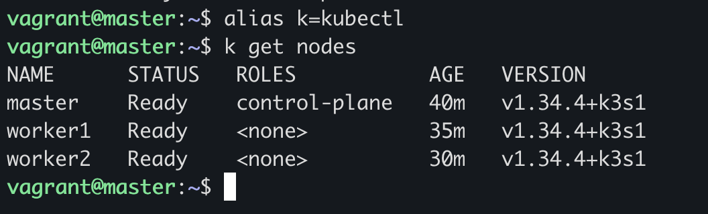

4. Установить Ingress Controller Nginx вместо стандартного. Ты можешь использовать официальный файл манифеста Ingress контроллера на базе Nginx, доступный на GitHub.

  - Переходим на мастер ноду `vagrant ssh master`
  - Запускаем наше приложение применив манифесты из DO10 выгруженные в репозиторий `k apply -k https://github.com/Zapunk/school21.git/DO11_ADVK8S/src/k3s/my-app?ref=main`(или можно скопировать на master и запустить из него)
  - Используя официальный манифест выполняем `k apply -f https://raw.githubusercontent.com/kubernetes/ingress-nginx/controller-v1.10.1/deploy/static/provider/cloud/deploy.yaml` (Обратим внимание, что контроллер развернулся на worker2 `EXTERNAL-IP 192.168.56.12`) 
    - HTTP → NodeIP:32384
    - HTTPS → NodeIP:30940

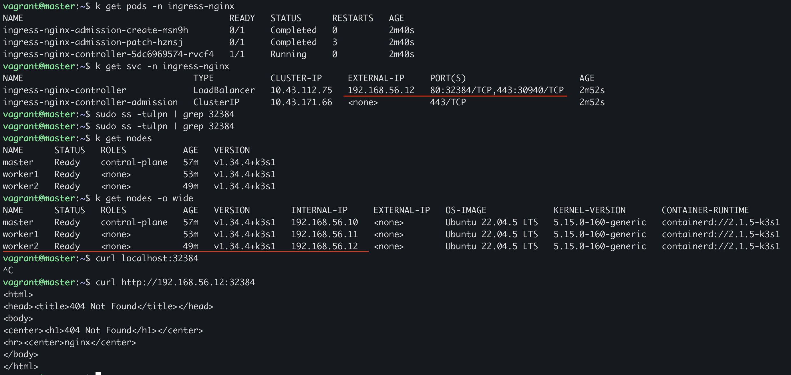

5. Получить доменное имя и сконфигурировать внутри кластера утилиту `cert-manager`, которая должна генерировать wildcard-сертификат для полученного домена.

Для учебного проекта будем использовать динамический DNS-сервис `nip.io`
  - сейчас мой ingress доступен по `192.168.56.12`, домен можем использовать такой `app.192.168.56.12.nip.io`. Wildcard сертификат будет `*.192.168.56.12.nip.io`
  - у меня нет публичного IP, использую private network(VirtualBox). Поэтому использовать буду `self-signed wildcard через cert-manager`

Это:\
корректная интеграция\
реальная работа cert-manager\
автоматическое создание TLS Secret\
корректная работа Ingress

  - создаем issuer.yml

```yml
apiVersion: cert-manager.io/v1
kind: ClusterIssuer
metadata:
  name: selfsigned-issuer
spec:
  selfSigned: {}
```

  - создаем certificate.yml

```yml
apiVersion: cert-manager.io/v1
kind: Certificate
metadata:
  name: wildcard-cert
  namespace: default
spec:
  secretName: wildcard-tls
  issuerRef:
    name: selfsigned-issuer
    kind: ClusterIssuer
  commonName: "*.192.168.56.12.nip.io"
  dnsNames:
  - "*.192.168.56.12.nip.io"
```
  - устанавливаем cert-manager
    - `k create namespace cert-manager`
    - `k apply -f https://github.com/cert-manager/cert-manager/releases/latest/download/cert-manager.yaml`

  - запускаем наши манифесты:
  
  issuer.yml
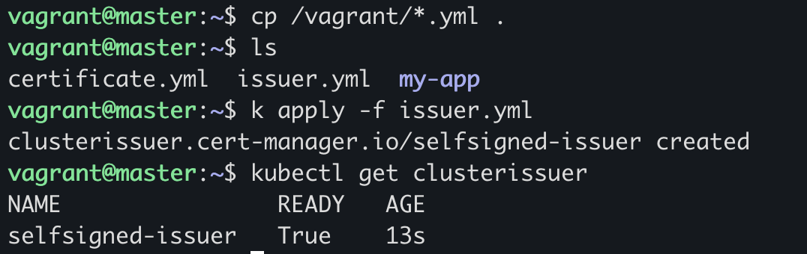

  certificate.yml
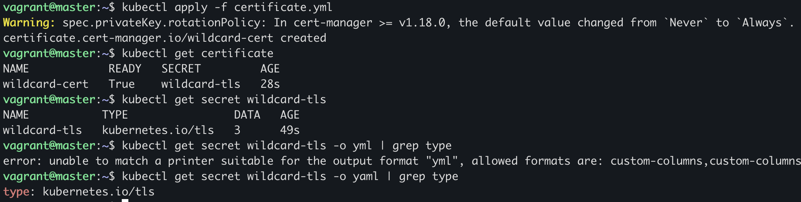


6. Создать ресурс Ingress для своего личного домена и настроить его для использования контроллера nginx ingress и полученного сертификата.

  - создаем ingress.yml(с учетом что postman будет обращаться и к gateway и session)

```yml
apiVersion: networking.k8s.io/v1
kind: Ingress
metadata:
  name: gateway-ingress
  annotations:
    kubernetes.io/ingress.class: "nginx"
    nginx.ingress.kubernetes.io/ssl-redirect: "true"
#    nginx.ingress.kubernetes.io/rewrite-target: /
spec:
  ingressClassName: nginx
  tls:
  - hosts:
    - api.192.168.56.12.nip.io
    secretName: wildcard-tls
  rules:
  - host: api.192.168.56.12.nip.io
    http:
      paths:
      - path: /api/v1/auth
        pathType: Prefix
        backend:
          service:
            name: session-service
            port:
              number: 8081
      - path: /api/v1/gateway
        pathType: Prefix
        backend:
          service:
            name: gateway-service
            port:
              number: 8087
```

  gateway-ingress.yml
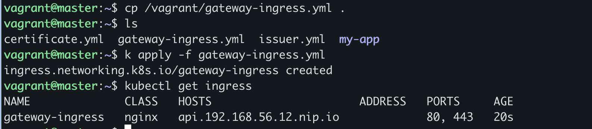

  - ПРОВЕРЯЕМ МАРШРУТИЗАЦИЮ

через CURL  
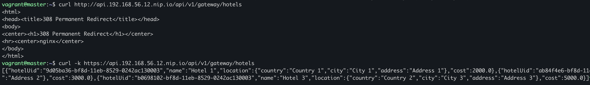

и в браузере
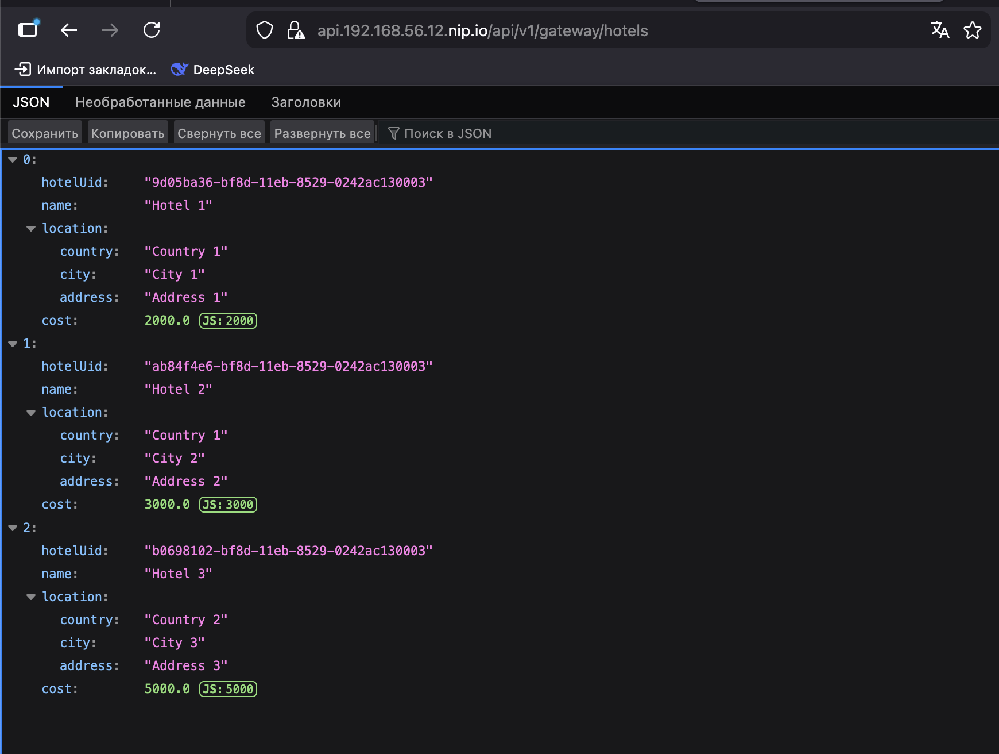

7. Создать PV (Persistent Volume) для базы данных PostgreSQL в манифесте из десятого проекта.

### ВАЖНО! 
Так как Pod postgres может быть запущен на любом узле, лучше использовать hostPath на worker2 (где чаще всего крутится нагрузка) или сделать nodeAffinity.

  - создаем postgres-pv.yml

```yml
apiVersion: v1
kind: PersistentVolume
metadata:
  name: postgres-pv
spec:
  capacity:
    storage: 5Gi
  accessModes:
    - ReadWriteOnce
  persistentVolumeReclaimPolicy: Retain
  storageClassName: manual
  hostPath:
    path: /data/postgres
  nodeAffinity:
    required:
      nodeSelectorTerms:
        - matchExpressions:
            - key: kubernetes.io/hostname
              operator: In
              values:
                - worker2
```

  - создаем postgres-pvc.yml

```yml
apiVersion: v1
kind: PersistentVolumeClaim
metadata:
  name: postgres-pvc
spec:
  storageClassName: manual
  accessModes:
    - ReadWriteOnce
  resources:
    requests:
      storage: 5Gi
```

На worker2 нужно создать директорию

`sudo mkdir -p /data/postgres`\
`sudo chmod 777 /data/postgres`

Применяем манифесты

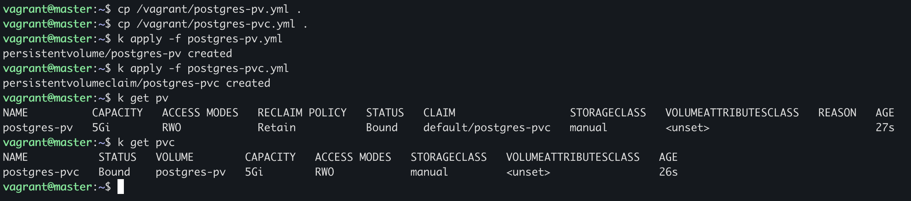

Изменяем postgres.yml из задания DO10

  - заменяем 
```yml
...
- name: postgres-data
  emptyDir: {}
...
```
на 
```yml
...
- name: postgres-data
  persistentVolumeClaim:
    claimName: postgres-pvc
...
```

Перезапускаем postgres, удаляем pod, создаем внутри тестовую базу, после удаления пода база сохраняется

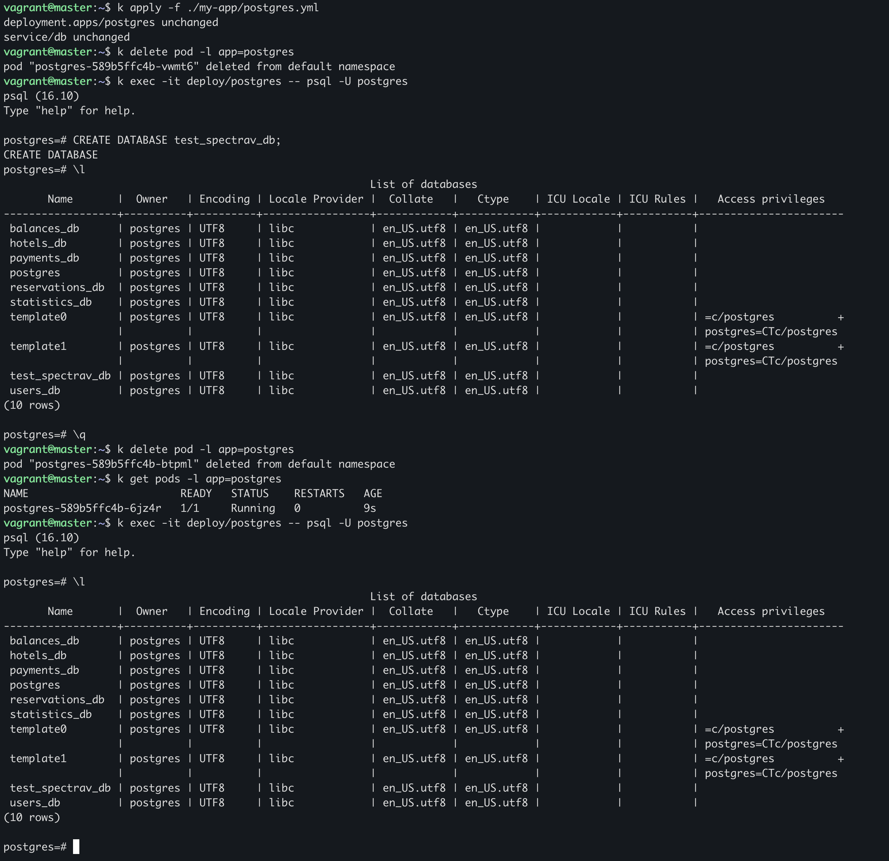

8. Запустить приложение, описанное в манифесте.

К данному моменту мой сервис и все манифесты уже запущенны
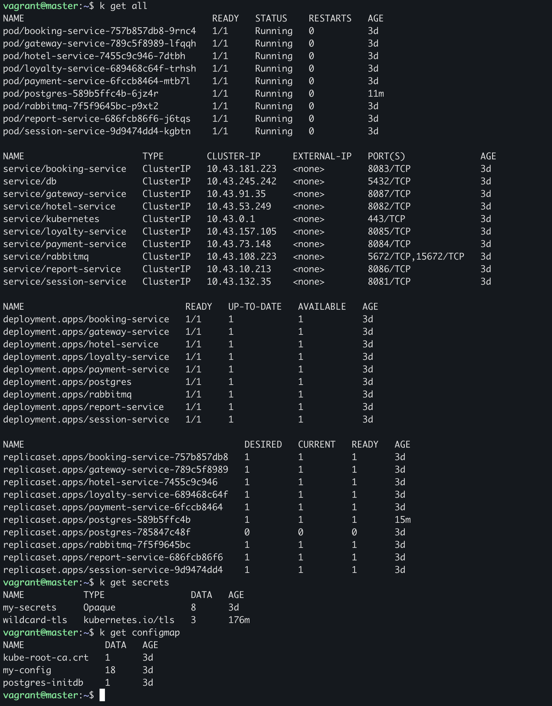

9. Запустить функциональные тесты Postman и удостовериться в работоспособности приложения.

  - Внесем еще одну правку касающуюся PVC. Поскольку Postgres теперь видит что БД у нас уже постонные, то он не будет их создавать при рестартах, в БД не будут создаваться таблицы и тесты проходить не будут. Наши сервисы должны пересоздавать БД и создавать в них таблицы, для этого мы добавим в `configmap.yml` SPRING_JPA_HIBERNATE_DDL_AUTO: update

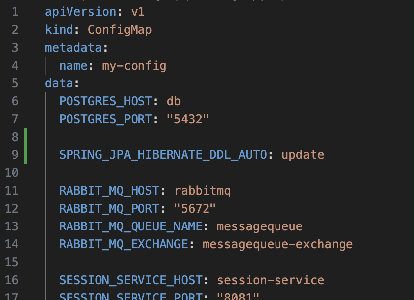

  - Перезапускаем манифесты, что бы применились изменения, применяя `k delete deployment <name>` затем `k apply -f <name>`

  - В постмане меняем Variables `{API_HOST}` на `app.192.168.56.12.nip.io`, а `{USERS_PORT}` и `{GATEWAY_PORT}` оставляем пустые. 

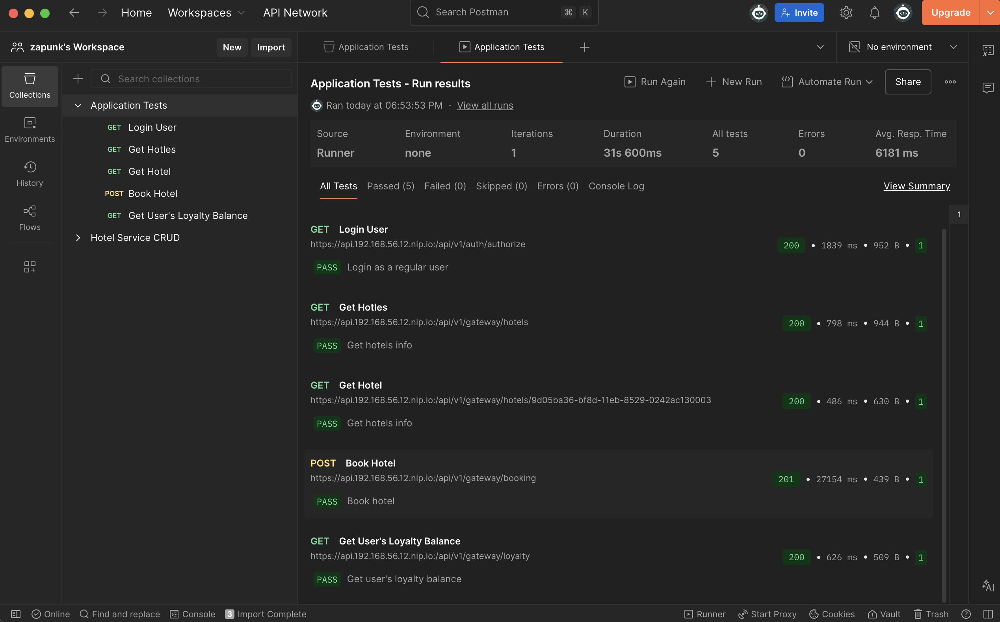

10. Установить и запустить Prometheus Operator для сбора метрик в системе. Продемонстрировать в отчете результат выполнения команды `kubectl get pods -n monitoring`.

  - Для начала нам потребуется Helm на master. `curl https://raw.githubusercontent.com/helm/helm/main/scripts/get-helm-3 | bash`

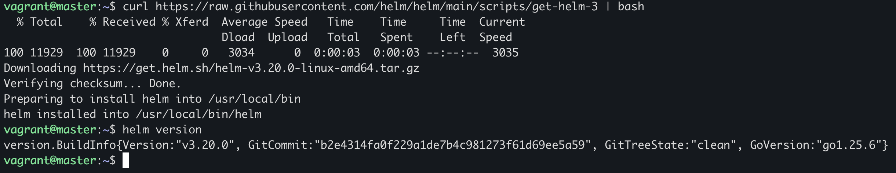

  - Добавляем репозиторий Prometheus `helm repo add prometheus-community https://prometheus-community.github.io/helm-charts` затем `helm repo update` 

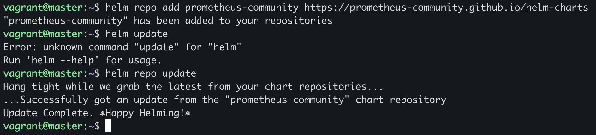

  - Создаем namespace monitoring

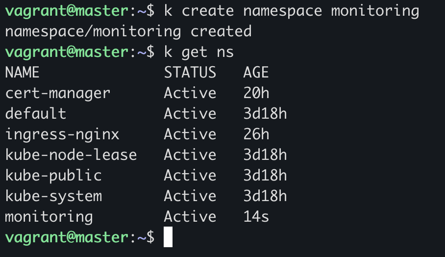

  - Устанавливаем Prometheus Operator `helm install prometheus prometheus-community/kube-prometheus-stack --namespace monitoring`. Что бы Helm знал где наш кластер используем `export KUBECONFIG=/etc/rancher/k3s/k3s.yaml`

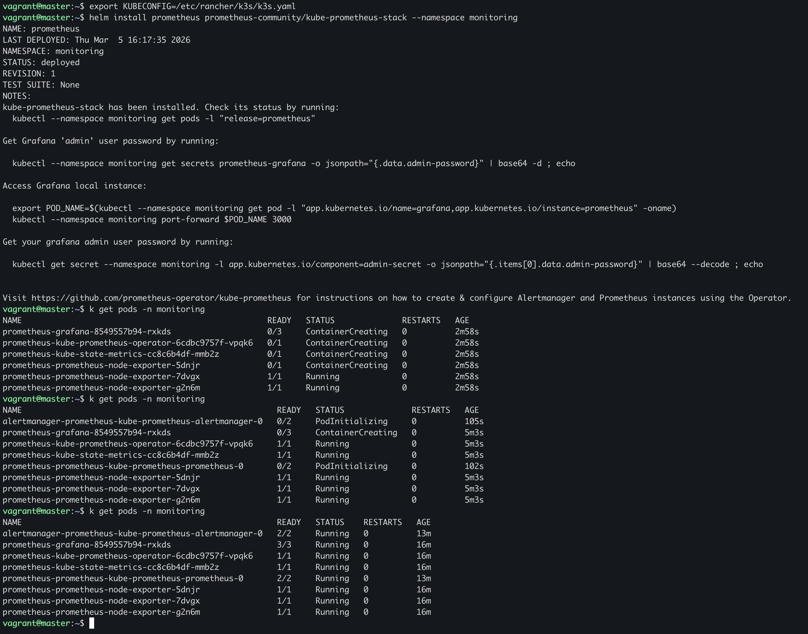
