# Helm и Kustomization

## Part 1. Развертывание приложения с помощью Kustomize

### Задание

1. Получить набор виртуальных машин с развернутым кластером.

- Используем уже знакомый нам инструмент `Vagrant`. За образец берем наш файл из предидущего проекта. Скрипты те же что и в предидущем проекте

```vagrantfile
Vagrant.configure("2") do |config|
  config.vm.box = "bento/ubuntu-22.04"
  config.vm.synced_folder ".", "/vagrant"

  # ---------------- MASTER ----------------
  config.vm.define "master" do |master|
    master.vm.hostname = "master"
    master.vm.network "private_network", ip: "192.168.56.10"

    master.vm.provider "virtualbox" do |vb|
      vb.memory = 3072
      vb.cpus = 2
    end

    master.vm.provision "shell", path: "scripts/install_k3s_master.sh"
  end

  # ---------------- WORKER 1 ----------------
  config.vm.define "worker1" do |worker|
    worker.vm.hostname = "worker1"
    worker.vm.network "private_network", ip: "192.168.56.11"

    worker.vm.provider "virtualbox" do |vb|
      vb.memory = 3072
      vb.cpus = 2
    end

    worker.vm.provision "shell", path: "scripts/install_k3s_worker1.sh"
  end

  # ---------------- WORKER 2 ----------------
  config.vm.define "worker2" do |worker|
    worker.vm.hostname = "worker2"
    worker.vm.network "private_network", ip: "192.168.56.12"

    worker.vm.provider "virtualbox" do |vb|
      vb.memory = 3072
      vb.cpus = 2
    end

    worker.vm.provision "shell", path: "scripts/install_k3s_worker2.sh"
  end
end
```
- ВАЖНО! После запуска клстера нам нужно сообщить `kubectl` где находится наш кластер. Выполняем команду `vagrant ssh master -c "sudo cat /etc/rancher/k3s/k3s.yaml" > ~/.kube/config` она скопирует конфиг на наш хост, затем открываем файл конфига на хосте и в пункте `server: https://127.0.0.1:6443` меняем IP локалхоста на IP master node `server: https://192.168.56.10:6443`

2. Перенести манифесты из предыдущих блоков.

```
.
├── base
│   ├── app
│   │   ├── booking-deployment.yaml
│   │   ├── booking-service.yaml
│   │   ├── gateway-deployment.yaml
│   │   ├── gateway-service.yaml
│   │   ├── hotel-deployment.yaml
│   │   ├── hotel-service.yaml
│   │   ├── loyalty-deployment.yaml
│   │   ├── loyalty-service.yaml
│   │   ├── payment-deployment.yaml
│   │   ├── payment-service.yaml
│   │   ├── report-deployment.yaml
│   │   ├── report-service.yaml
│   │   ├── session-deployment.yaml
│   │   └── session-service.yaml
│   ├── kustomization.yaml
│   ├── postgres
│   │   ├── postgres-initdb.yaml
│   │   ├── postgres-pv.yaml
│   │   ├── postgres-pvc.yaml
│   │   └── postgres.yaml
│   └── rabbitmq
│       └── rabbitmq.yaml
└── overlays
    └── production
        ├── certificate.yaml
        ├── configmap.yaml
        ├── ingress.yaml
        ├── issuer.yaml
        ├── kustomization.yaml
        ├── replicas-patch.yaml
        └── secrets.yaml

7 directories, 27 files
```

3. Установить *kustomize* на локальной машине.


4. Cоздать скелет проекта развертывания с одной базовой конфигурацией (base) и одной оверлейной конфигурацией (production):

- Создаем структуру проекта стандарта DevOps проектов

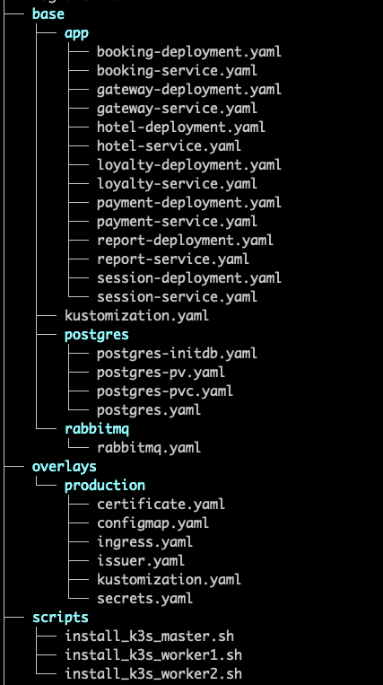

5. Написать базовые и оверлейные конфигурации для kustomize. В базовых указать сервисы и развертывания, в production добавить конкретные секреты и конфигурационные значения.

- base
```yaml
apiVersion: kustomize.config.k8s.io/v1beta1
kind: Kustomization

resources:
  - ./postgres/postgres-pv.yaml
  - ./postgres/postgres-pvc.yaml
  - ./postgres/postgres.yaml
  - ./postgres/postgres-initdb.yaml
  - ./rabbitmq/rabbitmq.yaml 

  - ./app/booking-deployment.yaml
  - ./app/booking-service.yaml
  - ./app/gateway-deployment.yaml
  - ./app/gateway-service.yaml
  - ./app/hotel-deployment.yaml
  - ./app/hotel-service.yaml
  - ./app/loyalty-deployment.yaml
  - ./app/loyalty-service.yaml
  - ./app/payment-deployment.yaml
  - ./app/payment-service.yaml
  - ./app/report-deployment.yaml
  - ./app/report-service.yaml
  - ./app/session-deployment.yaml
  - ./app/session-service.yaml
```

- overlays
```yaml
apiVersion: kustomize.config.k8s.io/v1beta1
kind: Kustomization

resources:
  - ../../base

  - configmap.yaml
  - secrets.yaml
  - ingress.yaml
  - certificate.yaml
  - issuer.yaml
```

6. Создать `replicas-patch.yaml` для оверлей production, который модифицирует количество реплик для деплоймента gateway service до 3 реплик.

```yaml
apiVersion: apps/v1
kind: Deployment
metadata:
  name: gateway-service
spec:
  replicas: 3
```

- Теперь добавим в `overlays/prodaction/kustomization.yaml` 

```yaml
...
patches:
  - replicas-patch.yaml
```

7. Собрать результирующий конфигурационный файл, учитывая оверлей `production`.

- Командой `kustomize build overlays/production` получаем большой финальный YAML-файл. Пример:

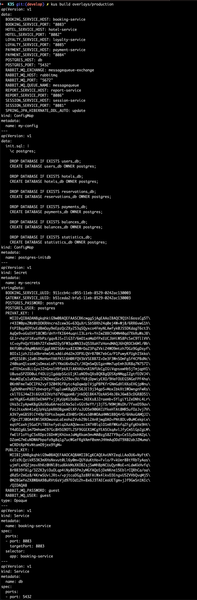

- Ставим офф манифест ingress-nginx `k apply -f https://raw.githubusercontent.com/kubernetes/ingress-nginx/controller-v1.10.1/deploy/static/provider/cloud/deploy.yaml`
- Так же нам понадобится `cert-manager`, ставим офф манифест из репы `k apply -f https://github.com/cert-manager/cert-manager/releases/latest/download/cert-manager.yaml`
- Теперь запускаем наш сервис `k apply -k overlays/production`. Ждем 8-10 мин. 

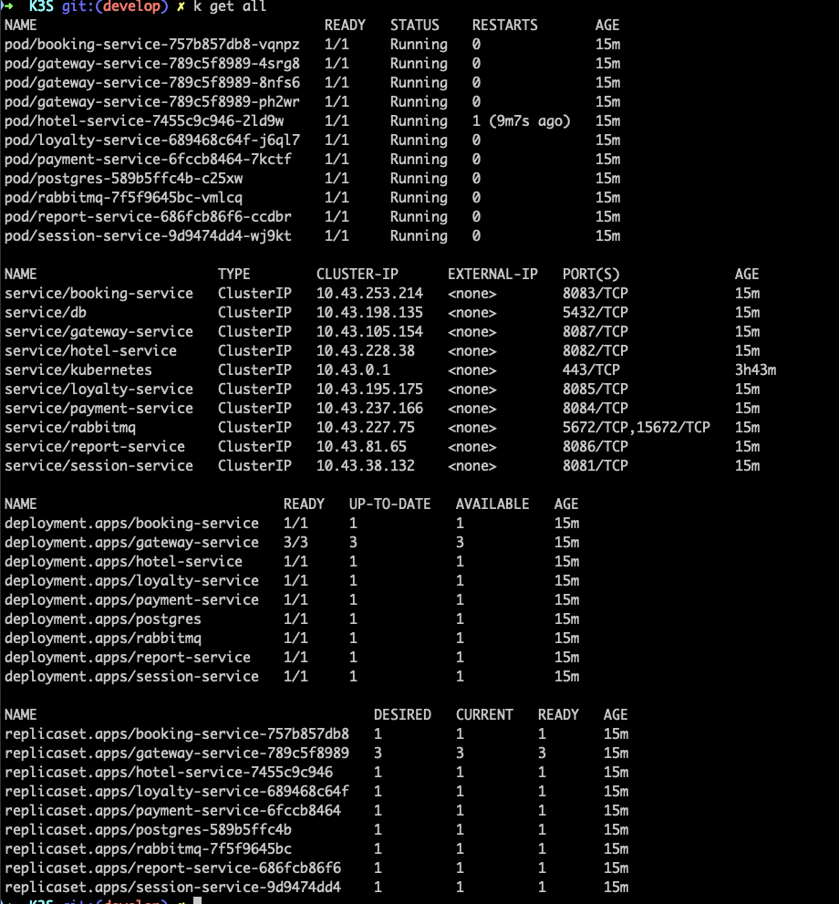

8. Запустить функциональные тесты Postman и удостовериться в работоспособности приложения.

- В постмане меняем Variables `{API_HOST}` на `app.192.168.56.12.nip.io`, а `{USERS_PORT}` и `{GATEWAY_PORT}` оставляем пустые.

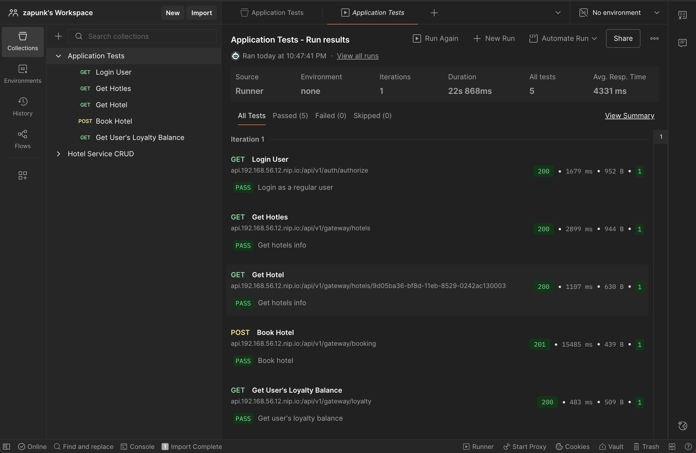

## Part 2. Развертывание приложения с помощью Helm

### Задание 

1. Получить набор виртуальных машин с развернутым кластером.

- Вносим небольшие улучшения в Vagrantfile 

```Vagrantfile
Vagrant.configure("2") do |config|
  config.vm.box = "bento/ubuntu-22.04"
  config.vm.synced_folder ".", "/vagrant"

  # ---------------- MASTER ----------------
  config.vm.define "master" do |master|
    master.vm.hostname = "master"
    master.vm.network "private_network", ip: "192.168.56.10"

    master.vm.provider "virtualbox" do |vb|
      vb.memory = 3072
      vb.cpus = 2
    end

    master.vm.provision "shell", path: "scripts/install_k3s_master.sh"
    master.vm.provision "shell", path: "scripts/install_addons.sh"
  end

  # ---------------- WORKER 1 ----------------
  config.vm.define "worker1" do |worker|
    worker.vm.hostname = "worker1"
    worker.vm.network "private_network", ip: "192.168.56.11"

    worker.vm.provider "virtualbox" do |vb|
      vb.memory = 3072
      vb.cpus = 2
    end

    worker.vm.provision "shell", path: "scripts/install_k3s_worker1.sh"
  end

  # ---------------- WORKER 2 ----------------
  config.vm.define "worker2" do |worker|
    worker.vm.hostname = "worker2"
    worker.vm.network "private_network", ip: "192.168.56.12"

    worker.vm.provider "virtualbox" do |vb|
      vb.memory = 3072
      vb.cpus = 2
    end

    worker.vm.provision "shell", path: "scripts/install_k3s_worker2.sh"
    worker.vm.provision "shell" inline: <<-SHELL
      echo "Создание директории /data/postgres"
      sudo mkdir -p /data/postgres
      sudo chmod 755 /data/postgres
      echo "Директория создана"
    SHELL
  end
end
```

- Скрипт с дополнениями

```shell
#!/bin/bash

sleep 30

echo "Установка ingress-Nginx..."
kubectl apply -f https://raw.githubusercontent.com/kubernetes/ingress-nginx/controller-v1.10.1/deploy/static/provider/cloud/deploy.yaml

echo "Установка cert-manager..."
kubectl apply -f https://github.com/cert-manager/cert-manager/releases/latest/download/cert-manager.yaml

echo "Установка дополнений завершена"
```

2. Перенести манифесты из предыдущих блоков.

- Аналогично пункту первого задания

3. Установить *helm* на локальной машине и удостовериться, что этот инструмент имеет валидное подключение к полученному удаленному кластеру Kubernetes.

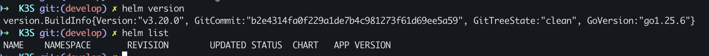

4. Создать *helm*-чарты и шаблоны для своего приложения с помощью команды `helm create`. Эта команда создаст базовую структуру чарта с шаблонами для ресурсов: deployment, service и ingress.

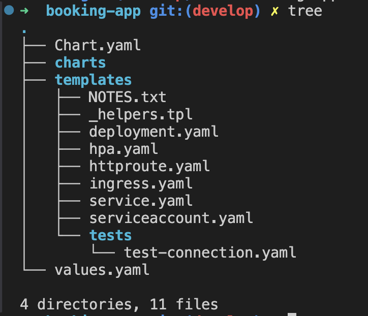

5. Отредактировать файл `values.yaml` на диаграмме, чтобы указать параметры конфигурации для твоего приложения, необходимые для создания манифестов Kubernetes для указанных развертываний (deployments). Описать объекты развертывания и сервисов в директории шаблонов (templates).

- Удаляем ненужные нам дефолтные файлы из `/tamplates` 
- Переносим конфигурационные(secret, configmap, ingress и т.д.) и инфраструктурные манифесты(postgres и rabbit)
- Создаем один шаблон deployment на все сервисы
```yaml
{{- range $name, $svc := .Values.services }}
---
apiVersion: apps/v1
kind: Deployment
metadata:
    name: {{ $svc.name }}
spec:
    replicas: {{ $svc.replicas }}
    selector:
        matchLabels:
            app: {{ $svc.name }}
    template:
        metadata:
            labels:
                app: {{ $svc.name }}
        spec:
            containers:
                - name: {{ $svc.name }}
                  image: {{ $svc.image }}
                  ports:
                    - containerPort: {{ $svc.port }}
                  envFrom:
                    - configMapRef:
                        name: my-config
                    - secretRef:
                        name: my-secrets
{{- end }}
```
- Создаем один шаблон service на все сервисы
```yaml
{{- range $name, $svc := .Values.services }}
---
apiVersion: v1
kind: Service
metadata:
  name: {{ $svc.name }}
spec:
  selector:
    app: {{ $svc.name }}
  ports:
    - port: {{ $svc.port }}
      targetPort: {{ $svc.port }}
{{- end }}
```
- Теперь структура выглядит так
```bash
.
├── Chart.yaml
├── charts
├── templates
│   ├── _helpers.tpl
│   ├── certificate.yaml
│   ├── configmap.yaml
│   ├── deployment.yaml
│   ├── ingress.yaml
│   ├── issuer.yaml
│   ├── postgres-initdb.yaml
│   ├── postgres-pv.yaml
│   ├── postgres-pvc.yaml
│   ├── postgres-service.yaml
│   ├── postgres.yaml
│   ├── rabbitmq-service.yaml
│   ├── rabbitmq.yaml
│   ├── secrets.yaml
│   └── service.yaml
└── values.yaml

3 directories, 17 files
```

6. Упаковать *helm*-чарт с помощью команды `helm package` для создания файла `*.tgz`, содержащего чарт и его зависимости.

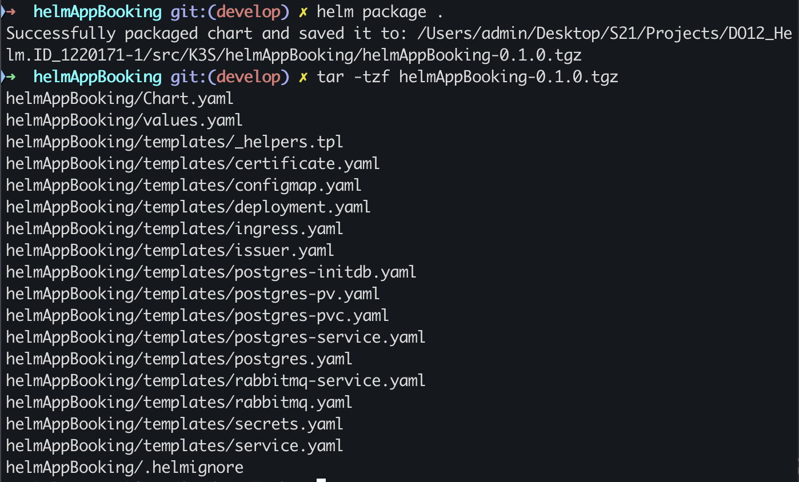

7. Развернуть *helm*-чарт в кластере Kubernetes с помощью команды `helm install`. Указать произвольный `namespace` и `release-name`.

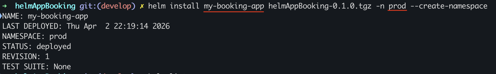

8. Проверить статус развернутого приложения при помощи команды `kubectl get`. Результаты представить в отчете.

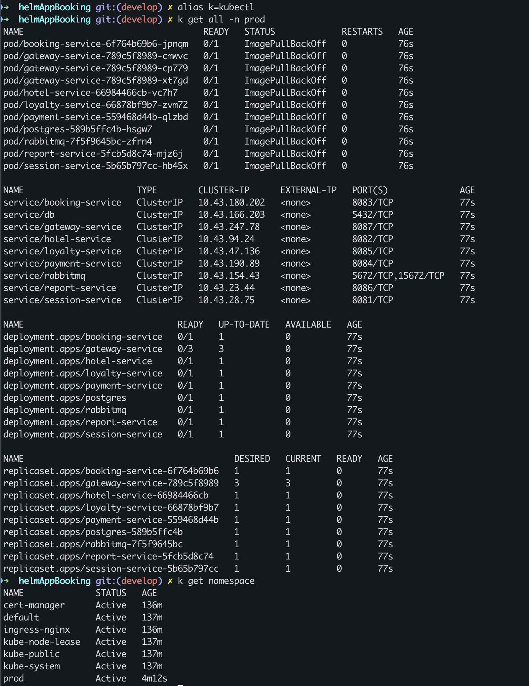

9. Внести как минимум одно изменение в `values.yaml` и выполнить команду `helm upgrade`. 
- меняем колличество реплик некоторых сервисов
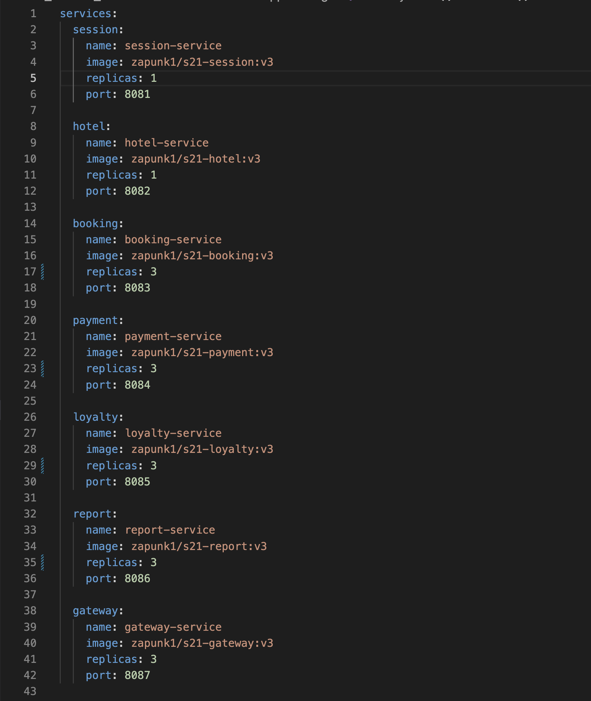

- Видим что после `upgrade` коллическтво подов увеличилось
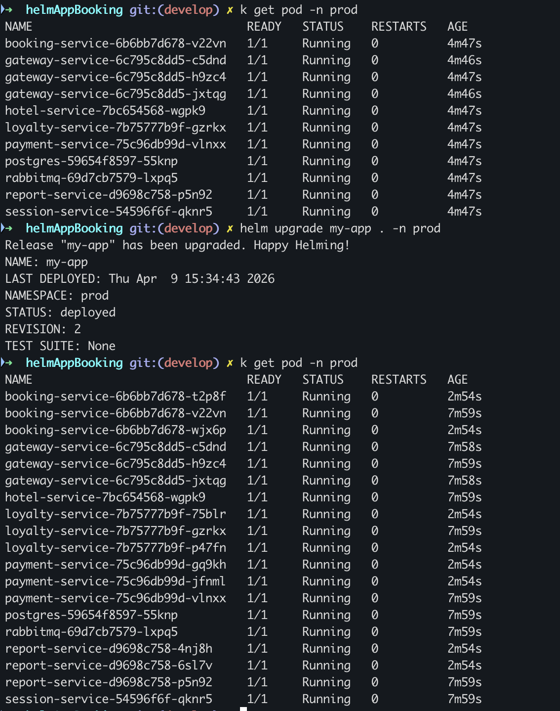

10. Запустить функциональные тесты Postman и удостовериться в работоспособности приложения.
- Меняем адресс запроса на наше доменное имя, а порты убираем
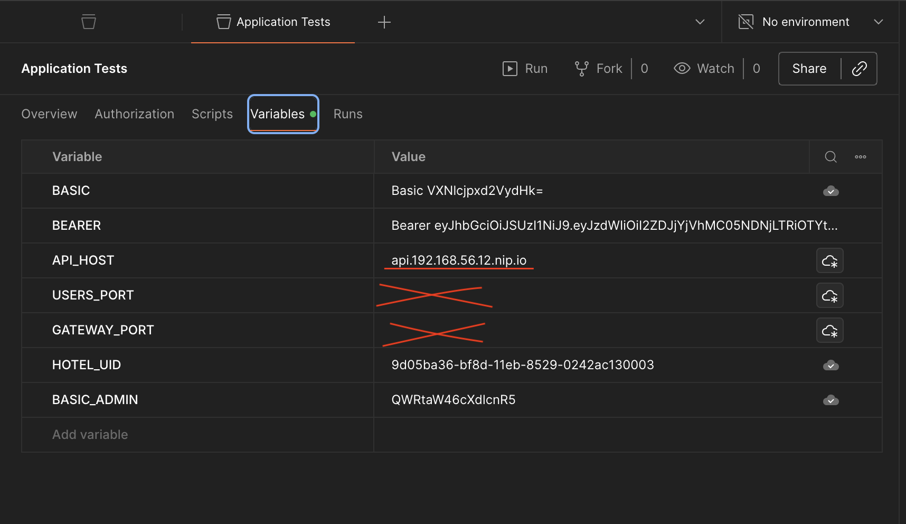

- Видим что тесты проходят!
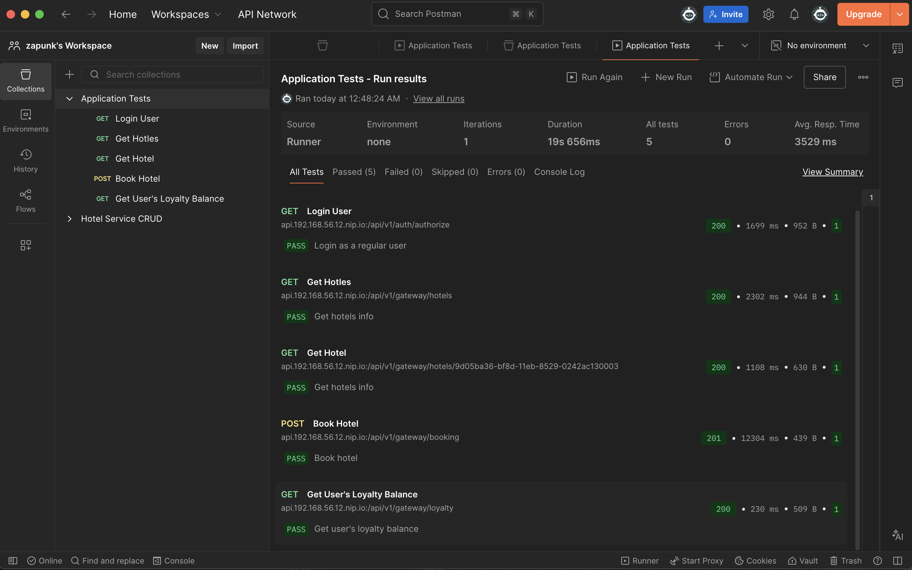
