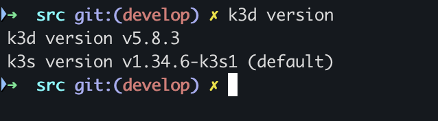
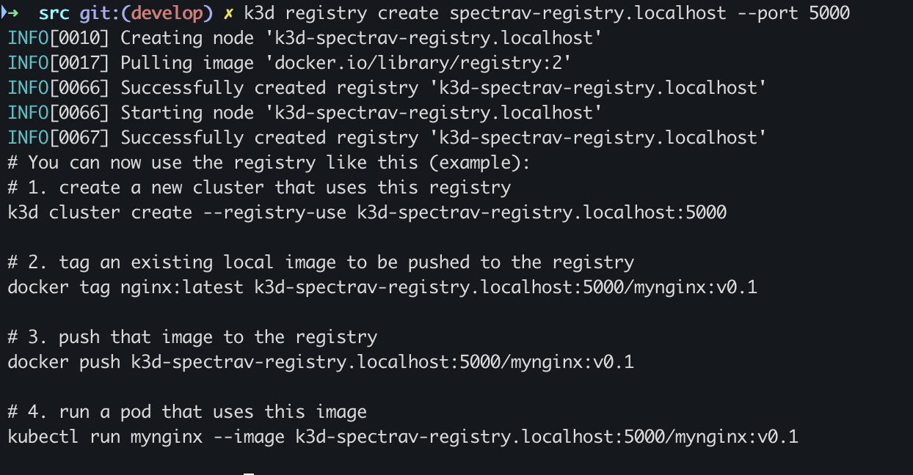
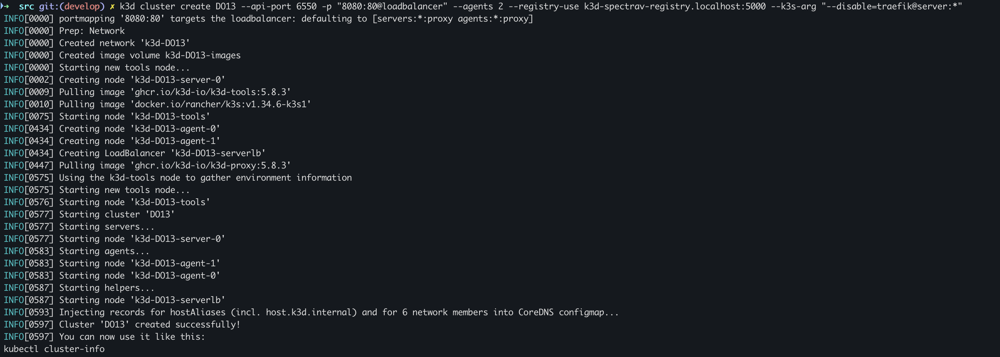
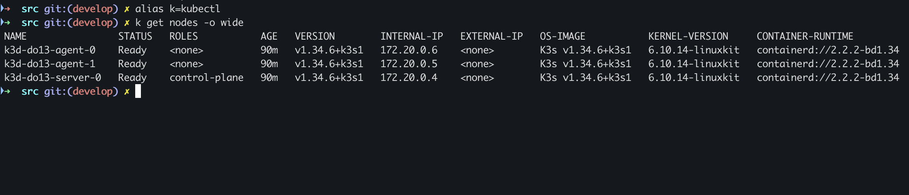
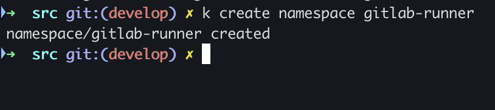
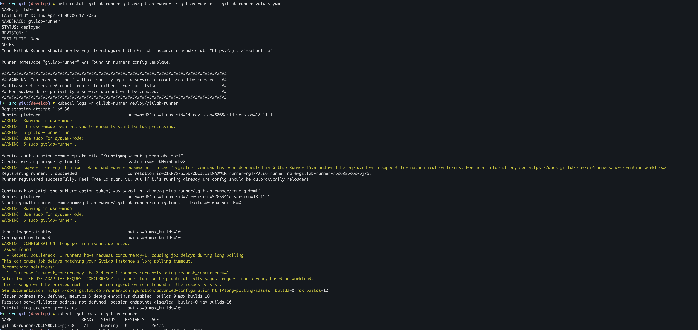
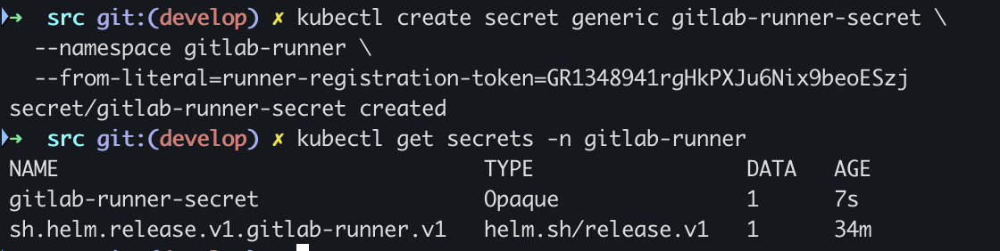

## Part 1. Настройка CI и CD

### Задание

1. Склонировать рабочий репозиторий.
- Выполним команду `git clone <url>` (ссылку на репозеторий берем из проекта)

2. Получить доступ к удаленному кластеру Kubernetes.
- На этот раз кластер разверну в `DOCKER`
    - На хост установим `k3d`
    
    - Создадим registry `k3d registry create spectrav-registry --port 5000`. Нам понадобится свое хранилище для более быстрой отладки

    - Создадим кластер кубернетес `k3d cluster create DO13 --api-port 6550 -p "8080:80@loadbalancer" --agents 2 --registry-use k3d-spectrav-registry:5000 --k3s-arg "--disable=traefik@server:*"`. При создании отключаем встроеный ингресс

    - Получаем доступ к удаленному кластеру

    - Ставим ingress-controller Nginx `kubectl apply -f https://raw.githubusercontent.com/kubernetes/ingress-nginx/main/deploy/static/provider/cloud/deploy.yaml`

3. Создать отдельный неймспейс для раннера GitLab `kubectl create namespace gitlab-runner`.



4. Установить раннер GitLab в кластере Kubernetes: ты можешь использовать Helm-чарт для раннера GitLab, чтобы установить его в своем кластере Kubernetes. Helm-чарт автоматически создаст развертывание для раннера, который создаст один или несколько модулей, выполняющие задания контейнеров приложения.

- Добавляем репозиторий
```sh
helm repo add gitlab https://charts.gitlab.io
helm repo update
```

- Создаем `gitlab-runner-vlues.yaml`
```sh
gitlabUrl: https://git.21-school.ru

runnerRegistrationToken: GR1348941rgHkPXJu6Nix9beoESzj

runners:
  executor: kubernetes

rbac:
  create: true
```

- Устанавливаем раннер
```sh
helm install gitlab-runner gitlab/gitlab-runner -n gitlab-runner -f gitlab-runner-values.yaml
```

- Раннер установлен, но не настроен(сделаем это в следующем пункте)


5. Создать секрет для хранения регистрационного токена GitLab.
```sh
kubectl create secret generic gitlab-runner-secret \
  --namespace gitlab-runner \
  --from-literal=runner-registration-token=GR1348941rgHkPXJu6Nix9beoESzj
```


6. Создать конфигурационный файл `config.toml` для использования установленного на выданном кластере Kubernetes раннера. Там же необходимо указать ограничения по ресурсам и докер-образ (например, `docker:stable`). Зарегистрировать установленный раннер при помощи написанного конфигурационного файла.

ВАЖНО! Конфигурационный файл config.toml был задан через Helm values (gitlab-runner-values.yaml).
При запуске runner’а Helm chart создает ConfigMap с шаблоном конфигурации, который преобразуется в config.toml внутри Pod’а. Если бы я разворачивал кластер на ВМ, то файл пришлось бы создавать в ручную. 

- Для наилучшей работы создадим свой собственный кастомный образ и выгрузим его в свой registry. Который будет уже содержать все необходимое (curl, bash, git, Newman, maven, Helm и kubectl)
```sh
FROM docker:24.0.7
RUN apk add --no-cache \
    bash \
    curl \
    git \
    nodejs \
    npm \
    openjdk17 \
    maven

RUN npm install -g newman
RUN curl -LO https://dl.k8s.io/release/v1.29.0/bin/linux/amd64/kubectl && \
    chmod +x kubectl && \
    mv kubectl /usr/local/bin/
RUN curl https://raw.githubusercontent.com/helm/helm/main/scripts/get-helm-3 | bash
WORKDIR /workspace
```
- Делаем сборку `docker build -t localhost:5000/my-image:1.0 .` 
- Пушим в свой реджистри `docker push localhost:5000/my-image:1.0`

- Обновляем gitlab-runner-values.yaml
```sh
gitlabUrl: https://git.21-school.ru

runnerRegistrationToken: GR1348941rgHkPXJu6Nix9beoESzj

runners:
  executor: kubernetes

  config: |
    [[runners]]
      name = "kubernetes-runner"
      executor = "kubernetes"

      [runners.kubernetes]
        namespace = "gitlab-runner"
        image = "k3d-spectrav-registry.localhost:5000/my-image:1.0"

        privileged = true
        allow_privileged_escalation = true

        cpu_request = "200m"
        memory_request = "256Mi"

        cpu_limit = "500m"
        memory_limit = "512Mi"

        poll_timeout = 600

rbac:
  create: true
```
executor                      - есть\
ограничения ресурсов          - есть\
докер-образ                   - есть\
регистрация runner            - есть

7. Разработать следующий пайплайн:

   - build — сборка приложения (запускать автоматически для веток с префиксом `feature_`);
   - test — запуск модульных тестов и функциональных тестов postman через утилиту newman (запускать автоматически для веток с префиксом `feature_`);
   - staging — запуск приложения в staging-окружении (запускать мануально и только для тегов).

- Пересобирать буду только один сервис и применять его к рабочему приложению, остальные делаются аналогично, но это сильно увеличивает время работы пайплайна. 

ВАЖНО!!! Только для учебного проекта я создаю Cluster Role с правами на все namespaces `kubectl create clusterrolebinding gitlab-runner-cluster-admin --clusterrole=cluster-admin --serviceaccount=gitlab-runner:gitlab-runner` 

- Дополняю раннер. Для D-in-D прописал `insecure-registry`, что бы он знал что мой `regestry` на хосте. Так же прописал `sa`, иначе он запускается в дефолтном неймспейсе. И для `Role-Based Access Control` дал права управлять кластером
```sh
gitlabUrl: https://git.21-school.ru

runnerRegistrationToken: GR1348941rgHkPXJu6Nix9beoESzj

runners:
  executor: kubernetes
  serviceAccountName: gitlab-runner

  config: |
    [[runners]]
      name = "kubernetes-runner"
      executor = "kubernetes"

      [runners.kubernetes]
        namespace = "gitlab-runner"
        service_account = "gitlab-runner"
        image = "k3d-spectrav-registry:5000/my-image:1.0"

        privileged = true
        allow_privileged_escalation = true

        cpu_request = "200m"
        memory_request = "256Mi"

        cpu_limit = "500m"
        memory_limit = "512Mi"

        poll_timeout = 600

        [[runners.kubernetes.services]]
          name = "docker:24-dind"
          privileged = true
          command = [
            "--tls=false",
            "--insecure-registry=k3d-spectrav-registry:5000"
          ]

rbac:
  create: true
  clusterWideAccess: true
```

- В корне проекта создаю файл .gitlab-ci.yml.
```sh
stages:
  - build
  - deploy-test
  - test
  - cleanup
  - staging

variables:
  KUBE_NAMESPACE: prod-$CI_COMMIT_SHORT_SHA
  REGISTRY: k3d-spectrav-registry:5000

build:
  stage: build
  image: $REGISTRY/my-image:2.0
  services:
    - name: docker:24-dind
      command: ["--tls=false", "--insecure-registry=$REGISTRY"]
  variables:
    DOCKER_HOST: tcp://docker:2375
    DOCKER_TLS_CERTDIR: ""
  script:
    - sleep 20
    - cd src/services/gateway-service
    - mvn clean package -DskipTests
    - docker build -t $REGISTRY/s21-gateway:$CI_COMMIT_SHORT_SHA .
    - docker push $REGISTRY/s21-gateway:$CI_COMMIT_SHORT_SHA
  artifacts:
    paths:
    - src/services/gateway-service/target/*.jar
  only:
    - /^feature_.*$/

deploy-test:
  stage: deploy-test
  image: $REGISTRY/my-image:1.0
  script:
    - kubectl create namespace $KUBE_NAMESPACE || true
    - helm upgrade --install my-app ./src/helm --namespace $KUBE_NAMESPACE --set services.gateway.image=$REGISTRY/s21-gateway:$CI_COMMIT_SHORT_SHA
    - kubectl rollout status deployment/gateway-service -n $KUBE_NAMESPACE
    - sleep 100
    - |
      echo "Waiting for API..."
      for i in {1..30}; do
        if curl -s http://gateway-service.$KUBE_NAMESPACE.svc.cluster.local:8087/api/v1/gateway/hotels; then
          break
        fi
        echo "Retry $i..."
        sleep 5
      done
  only:
    - /^feature_.*$/

test:
  stage: test
  image: $REGISTRY/my-image:1.0
  needs: ["deploy-test"]
  script:
    - newman run ./src/application_tests.postman_collection.json --env-var "API_HOST=http://ingress-nginx-controller.ingress-nginx.svc.cluster.local" --env-var "USERS_PORT=" --env-var "GATEWAY_PORT="
  only:
    - /^feature_.*$/

cleanup:
  stage: cleanup
  image: $REGISTRY/my-image:1.0
  script:
    - kubectl delete namespace $KUBE_NAMESPACE || true
  when: always
  only:
    - /^feature_.*$/

staging:
  stage: staging
  image: $REGISTRY/my-image:1.0
  script:
    - helm upgrade --install my-app ./src/helm -n prod --create-namespace 
  only:
    - tags
  when: manual
```

- Сам `Dockerfile` для `gateway-service`. За основу взял из предидущего проекта. 
```sh
FROM eclipse-temurin:17-jre-focal
WORKDIR /app
COPY target/*.jar app.jar
COPY wait-for-it.sh .
RUN chmod +x wait-for-it.sh
CMD ["./wait-for-it.sh", "-t", "40", "db:5432", "--",\
     "./wait-for-it.sh", "-t", "40", "hotel-service:8082", "--",\
     "./wait-for-it.sh", "-t", "40", "session-service:8081", "--",\
     "./wait-for-it.sh", "-t", "40", "booking-service:8083", "--",\
     "./wait-for-it.sh", "-t", "40", "payment-service:8084", "--",\
     "./wait-for-it.sh", "-t", "40", "loyalty-service:8085", "--",\
     "./wait-for-it.sh", "-t", "40", "report-service:8086",  "--",\
     "java", "-jar", "./app.jar"]
```

- Пришлось немного усовершенствовать до `v:2.0` свой кастомный образ(добавил кеширование зависимостей `maven`), за-то джоба сборки перестала зависать на скачивании зависимостей для `maven` и процесс ускорился. 
```sh
FROM docker:24.0.7
RUN apk add --no-cache \
    bash \
    curl \
    git \
    nodejs \
    npm \
    openjdk17 \
    maven

RUN npm install -g newman

RUN curl -LO https://dl.k8s.io/release/v1.29.0/bin/linux/amd64/kubectl && \
    chmod +x kubectl && \
    mv kubectl /usr/local/bin/

RUN curl https://raw.githubusercontent.com/helm/helm/main/scripts/get-helm-3 | bash

RUN mkdir -p /root/.m2/repository
COPY ./services/gateway-service/pom.xml /tmp/pom.xml
RUN cd /tmp && mvn dependency:go-offline -B || true

WORKDIR /workspace
```

- Теперь при пуше в ветку `feature_` автоматически будет запускаться пайплайн, который:
  - соберет новый бинарник сервиса `gateway-service`
  - запушит его в мой реджестри
  - создаст новый уникальный неймспейс
  - развернет приложение с пересобраным `gateway-service`
  - запустит тесты `Postman` через утелиту `newman`
  - и в конце удалит полностью созданый неймспейс 

- Этап `staging` при `git tag <name_tag> && git push origin <name_tag>` в любую ветку создаст пайплайн, который будет ожидать ручного запуска через UI. Который в свою очередь выполнит деплой.

8. Использовать секреты для передачи приватных ключей сервисам для авторизации (файл `application.properties` в директории с исходным кодом сервисов).

- Поскольку в предидущем задании у меня уже был подготовлен файл с секретами, который передает приватный ключ сервисам, значения вынесены из `application properties` и подставляются в приложения через переменные окружения, то остается использовать только его. 

мой secrets.yaml
```sh
apiVersion: v1
kind: Secret
metadata:
  name: {{ .Release.Name }}-secrets
type: Opaque
stringData:
  POSTGRES_USER: postgres
  POSTGRES_PASSWORD: postgres
  RABBIT_MQ_USER: guest
  RABBIT_MQ_PASSWORD: guest

  GATEWAY_SERVICE_UUID: b51ceda2-bfa5-11eb-8529-0242ac130003
  BOOKING_SERVICE_UUID: 911ccb4c-c055-11eb-8529-0242ac130003

  PRIVAT_KEY: |
    MIIEv....

  PUBLIC_KEY: |
    MIIBI....
```

9. Внести изменение в код приложения. Добавить новую зависимость в `pom.xml` файл и зафиксировать изменение.

Данный пункт делаем по аналогии проекта DO10. Процесс идентичен для всех сервисов, в отчете расмотрим пример с `gateway-service`

Возьмем одну любую harmless-библиотеку и добавим в pom.xml каждого сервиса. Например:

Логирование
```xml
<dependency>
    <groupId>net.logstash.logback</groupId>
    <artifactId>logstash-logback-encoder</artifactId>
</dependency>
```
JSON
```xml
<dependency>
    <groupId>com.fasterxml.jackson.core</groupId>
    <artifactId>jackson-databind</artifactId>
</dependency>
```
Утилиты
```xml
<dependency>
    <groupId>org.apache.commons</groupId>
    <artifactId>commons-lang3</artifactId>
</dependency>
```
Валидация
```xml
<dependency>
    <groupId>org.hibernate.validator</groupId>
    <artifactId>hibernate-validator</artifactId>
</dependency>
```

Важно: библиотека должна подтянуться в fat-jar.

После этого `stage: build` будет пересобирать образ с новыми зависимостями. 

Заключение: Мой выбор по разворачиванию Кубернетес в Докере был не самым лучшим решением. На ВМ это было бы в десятки раз проще. Но Я изучил как работает D-in-D и registry. По CI/CD было два решения: 
  - первый, плодить неймспейсы, но для этого нужно было создавать уникальный хост для ingress. Т.к запросы бы шли через один ingress-controller и могли возникать ошибки в какой неймспейс проксить. 
  - второй, использовать cleanup, и отдельным стейджем деплоить финальную версию. Для моего учебного проекта этого решения оказалось вполне достаточно. 