## Установка ОС

- на скиншоте указана версия Ubuntu

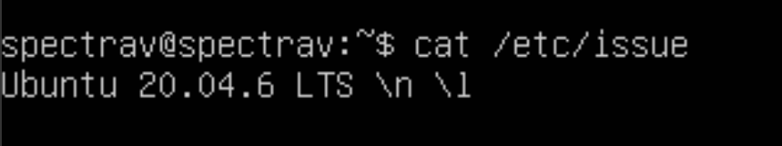

## Создание пользователя

- На скриншоте вызов команды для создания пользователя

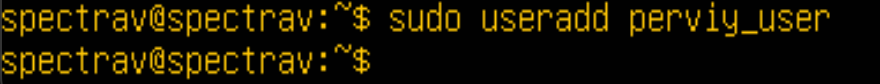

- На скриншоте новый пользователь

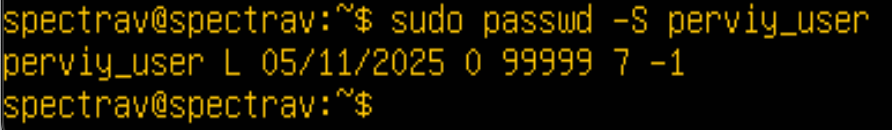

## Настройка сети ОС

- Задаем название машины. На скриншотах ниже команды: 
  1. Для переименования машины.

  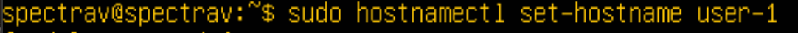

  2. Открываем в редакторе `Vi` файл `hosts`.

  

  3. В строке `127.0.0.1` меняем имя на новое, сохраняем и закрываем редактор.

  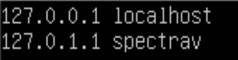

  4. Перезагружаем сервис управления входом пользователей(что бы не перезагружать систему). 

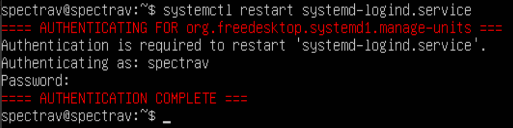

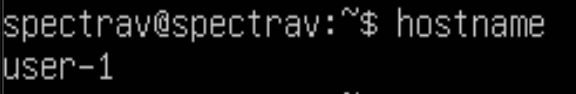

- Устанавливаем временную зону

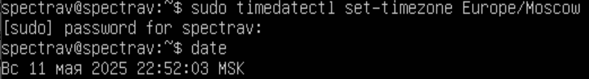

- Выводим название сетевых интерфейсов

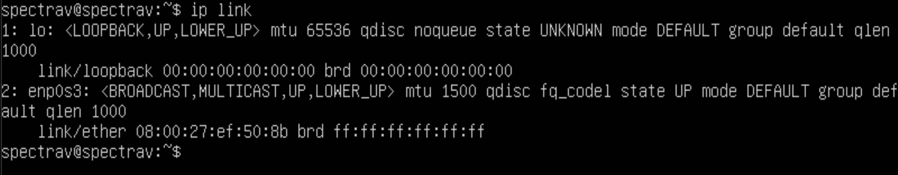

  - lo -  это виртуальный loopback-интерфейс, который зацикливает компьютер сам на себя. Используется в основном для отладки веб страниц.

- Получение IP-адреса

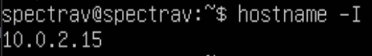

  - DHCP(Dynamic Host Configuration Protocol) протокол динамических конфигураций хостов. Метод автоматически назначать IP-адреса компьютерам в сети.

- Внешний и внутренний IP.

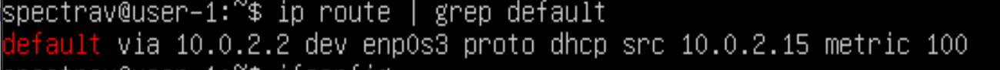

- Статичные настройки.

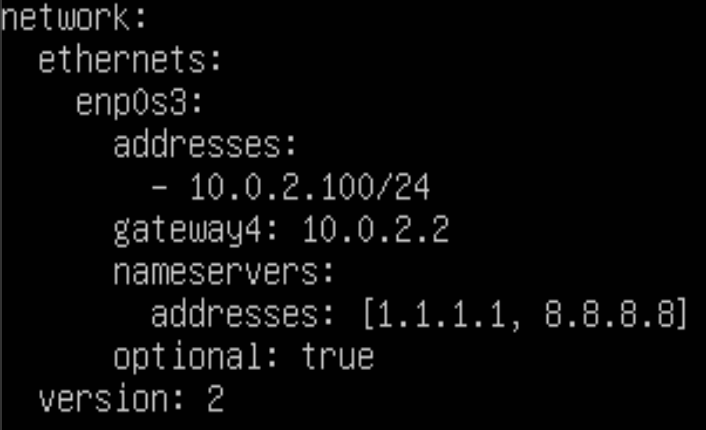

- Пинг удаленых хостов.

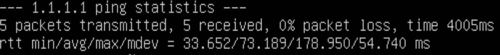

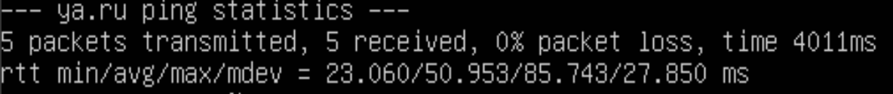

## Обновление ОС

- ОС обновлена до последней версии.

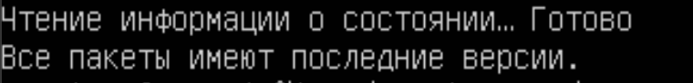

## Использование команды sudo

- `SUDO`- (Substitute User and Do) Подмени пользователя и выполни.Утилита, позволяющая запускать программы с правами суперпользователя.

- Смена hostname OS повым пользователем командой `sudo`

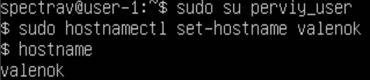

## Установка и настройка службы времени

- Время текущего часового пояса.

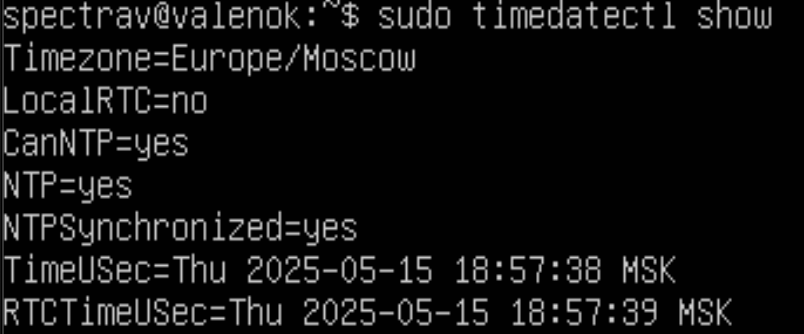

## Установка текстовых редакторов

- VIM.
`I` режим вставки. `esc` + `:wq` выйти и сохранить. 

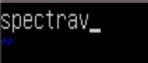

- NANO. 
`ctrl x` + `y` выйти и сохранить

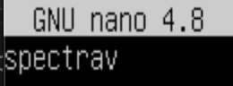

- EMACS. 
Есть автосейв. `ctrl x` + `ctrl c` + `y` выйти и сохранить

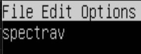

- VIM. 
`I` режим вставки. `esc` + `:q!` выйти без сохранения.

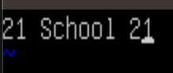

- NANO. `ctrl x` + `n` выйти без сохранения.

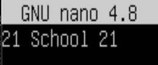

- EMACS. Есть автосейв. `ctrl x` + `ctrl c` + `n` выйти без сохранения.

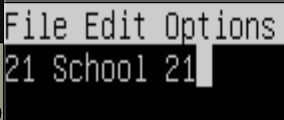

- VIM. Простой поиск осуществляется через `/` `слово` `enter`

Поиск и замена чезез `:%s/слово/новое слово`

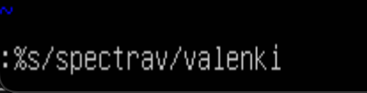

- NANO. Простой поиск `ctrl` + `W`

Поиск и замена `ctrl` + `\`

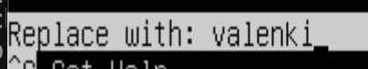

- EMACS. Простой поиск `ctrl` + `s`

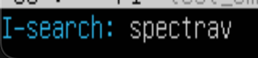

Поиск и замена `alt` + `%`

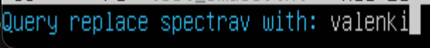

## Установка и базовая настройка сервиса SSHD

- `sudo apt install openssh-server`

- `sudo systemctl enable ssh`

- `sudo nano /etc/ssh/sshd_config`
меняем порт с 22 по умолчанию, на 2022 и разкомичиваем.

- ps - инструмент для мониторинга процессов. Эта команда позволяет выводить информацию о запущенных процессах, узнать их идентификаторы(PID), статус, потребление ресурсов и другие детали. Ключ `-e` нужен чтобы показать все запущенные процессы, а команда `grep` для того, что бы вывести только нужный нам процесс.

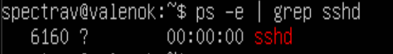

- `sudo reboot`

- ключ `-tan` с командой `netstat` - это комбинация из трех ключей:
   - `-t` отображать только TCP-подключения.
   - `-a` показывает все соединения, включая ожидающие.
   - `-n` выводит IP-адреса и порты в числовом формате.

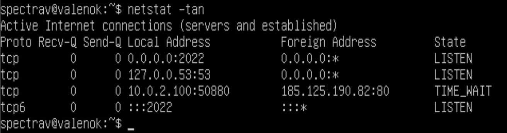

На скриншоте в столбцах указаны:
   - первый: протокол
   - второй: полученые пакеты
   - третий: отправленые пакеты
   - четвертый: локальный адрес и порт
   - пятый: удаленый адрес и порт
   - шестой: состояние соединения(LISTEN - ожидают подключения, TIME WAIT - завершающиеся соединения)
   - 0.0.0.0 "слушает все интерфейсы"

## Установка и запуск утилиты top и htop.

- Команда `top`
  - uptime 1:06
  - пользователей 1
  - средняя загрузка системы 0,00
  - общее колличество процессов 96
  - загрузка CPU 0,3
  - загрузка памяти 1971,6
  - PID процесса, занимающего больше всего памяти (`shift` + `m`) 950
  - PID процесса, занимающего больше всего процессорного времени (`shift` + `p`) 10020

- Команда `htop`.

  - PID
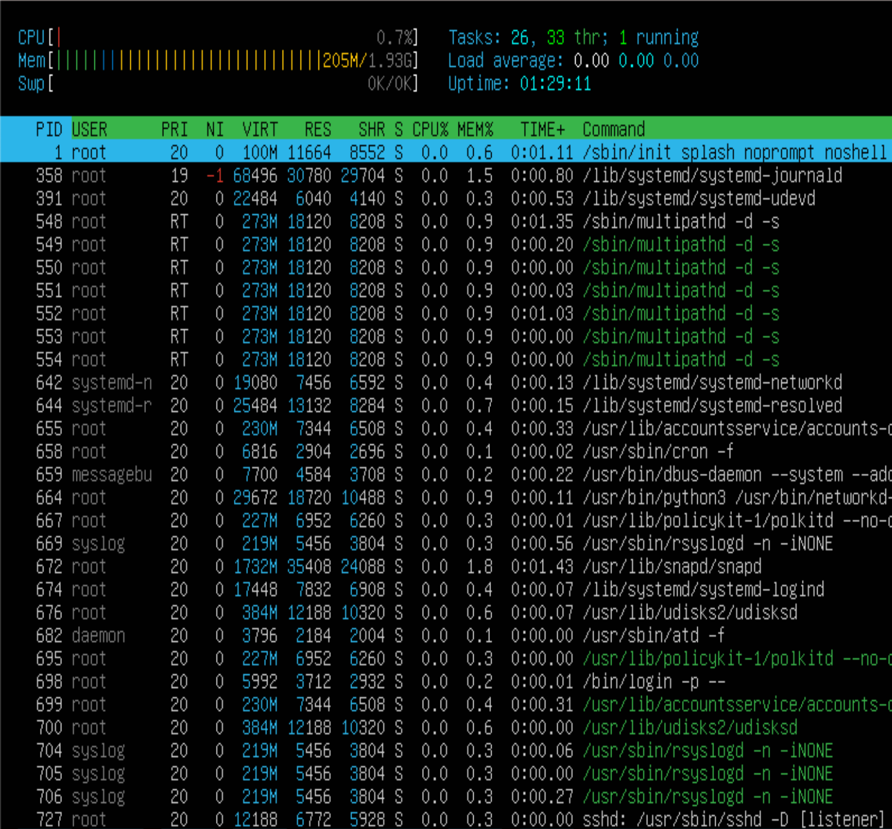

  - PERCENT_CPU

  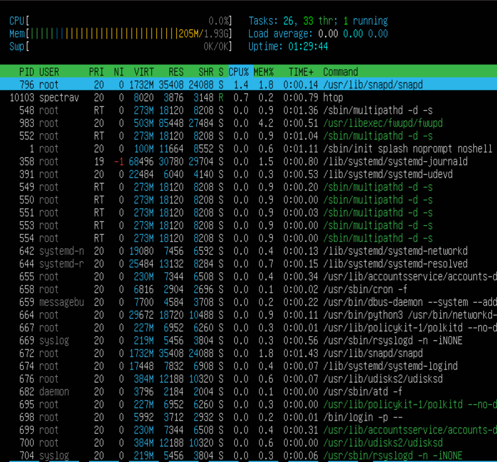

  - PERCENT_MEM

  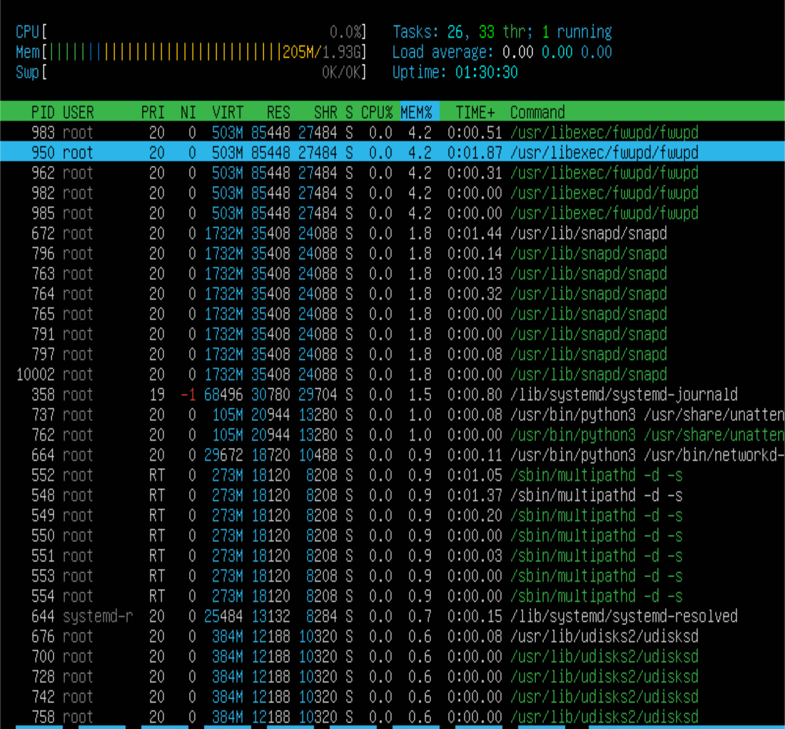

  - TIME

  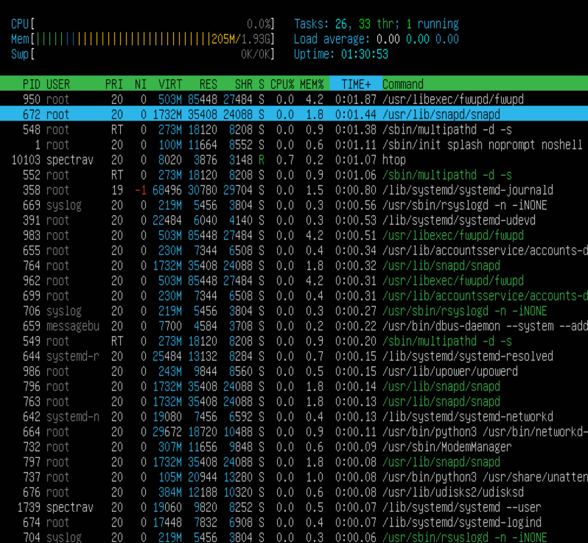

  - sshd

  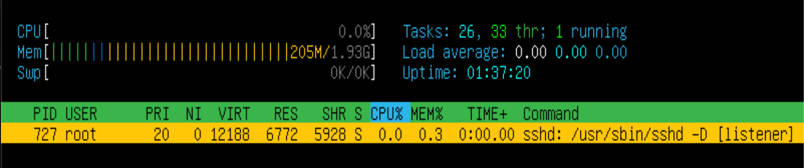

  - syslog

  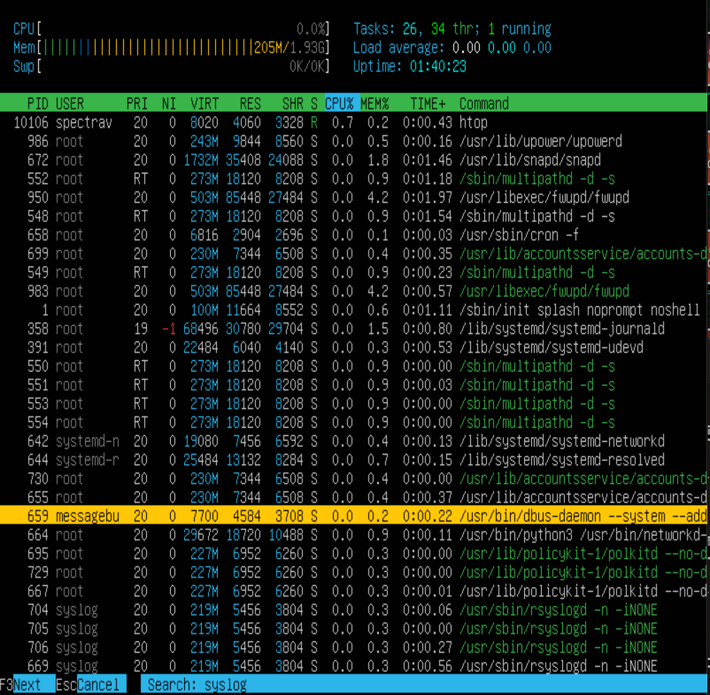

  - hostname, clock & uptime

  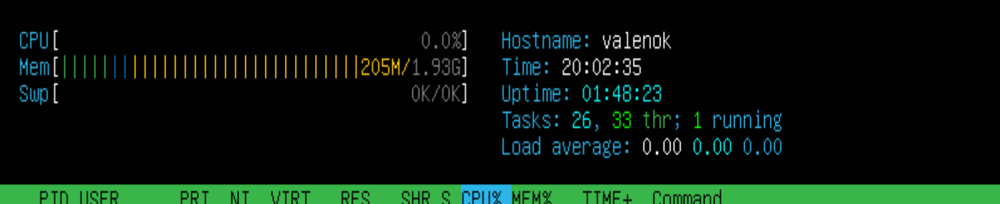

## Использование утилиты fdisk

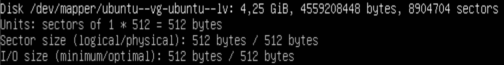

- название диска `mapper`

- размер 4,25G

- колличество секторов 8904704

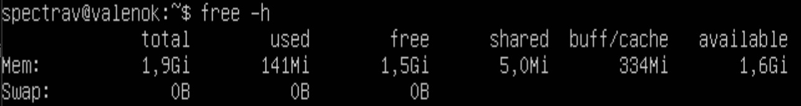

- размер swap 0

## Использование утилиты df

### Команда df

- Размер раздела 4299472

- Размер занятого пространства 4150680

- Размер свободного пространства 0

- Процент использования 100%

- Единица измерения 1килобайт(двоичный)

### Команда df -Th

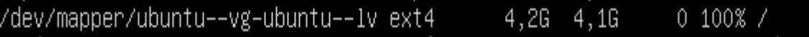

- Размер раздела 4,2G

- Размер занятогопространства 4,1G

- Размер свободного пространства 0

- Процент использования 100%

- Тип файловой системы exp4

## Использование утилиты du

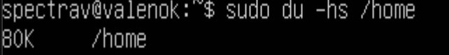

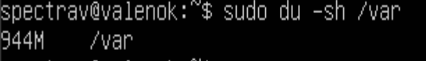

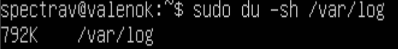

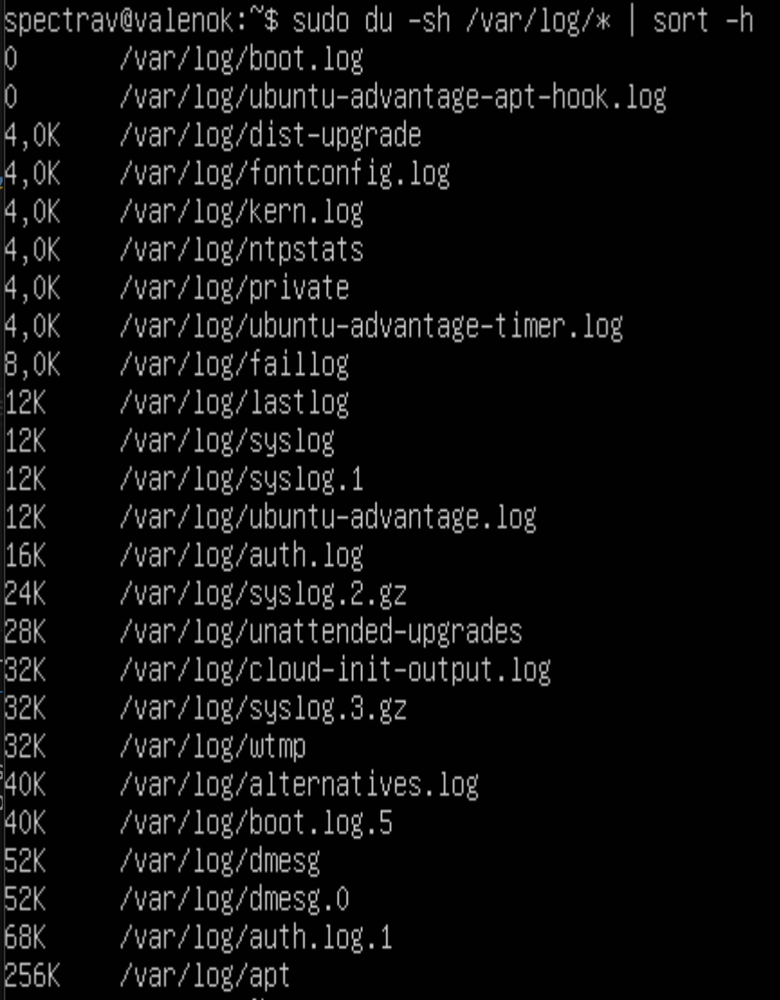

## Установка и использование утилиты ncdu

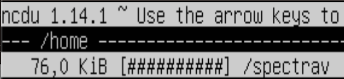

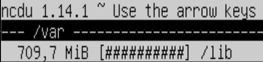

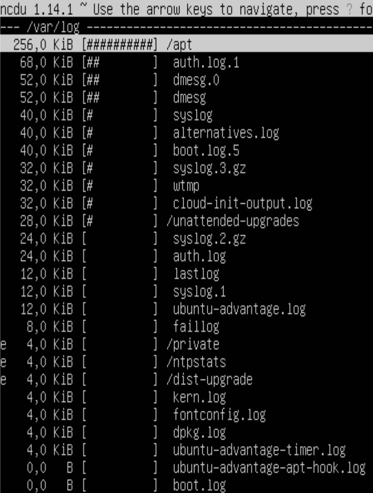

## Работа с системными журналами

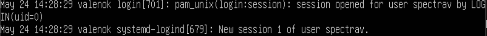

- Время последней успешной авторизации 14:28:29

- Имя пользователя spectrav

- Метод входа pam_unix(означает что вход выполнен для пользователя выполневшего команду `sudo`, при аутентификации была проверка пароля)

- перезапуск sshd

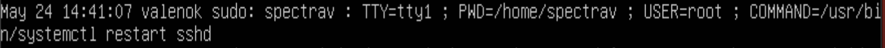

## Использование планировщика заданий CRON

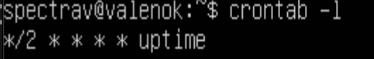

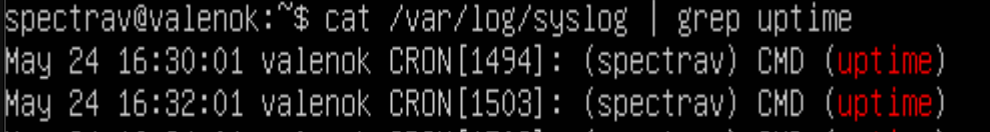

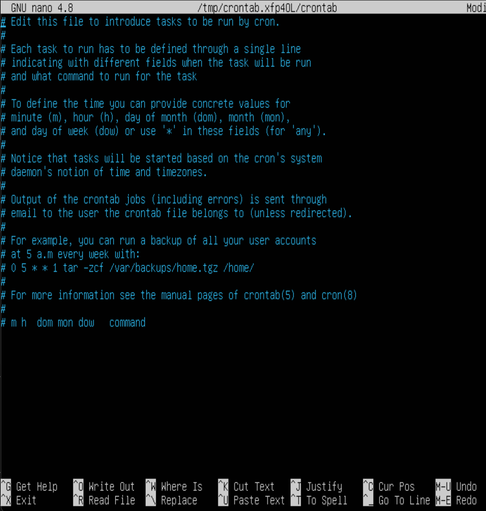