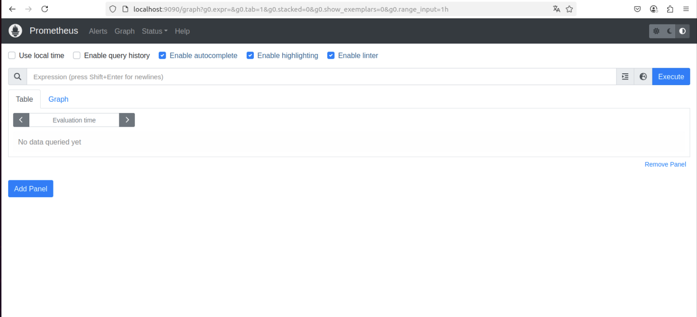
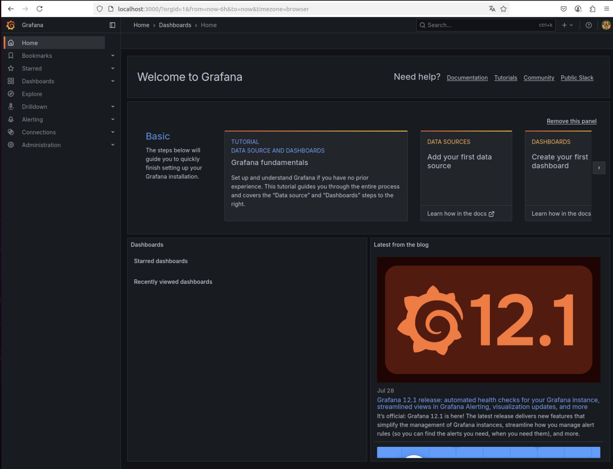
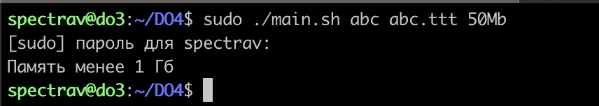
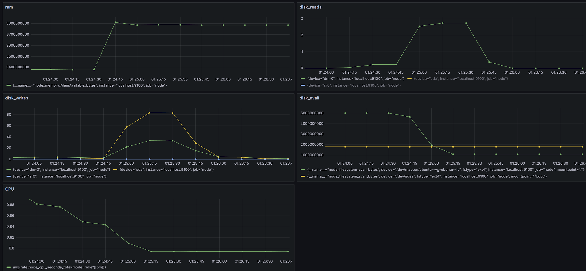
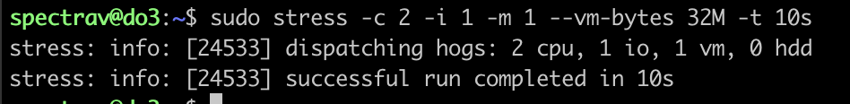
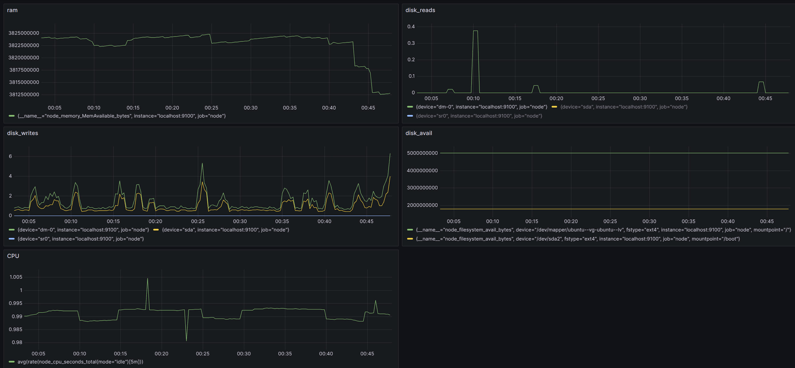

## Part 7. Prometheus и Grafana

- запуск Prometheus

- запуск Grafana

- добавили на дашборд Grafana отображение ЦПУ, доступной оперативной памяти, свободное место и кол-во операций ввода/вывода на жестком диске

- запустили скрипт из части 2

- Мониторинг

- Stress

- Stress

