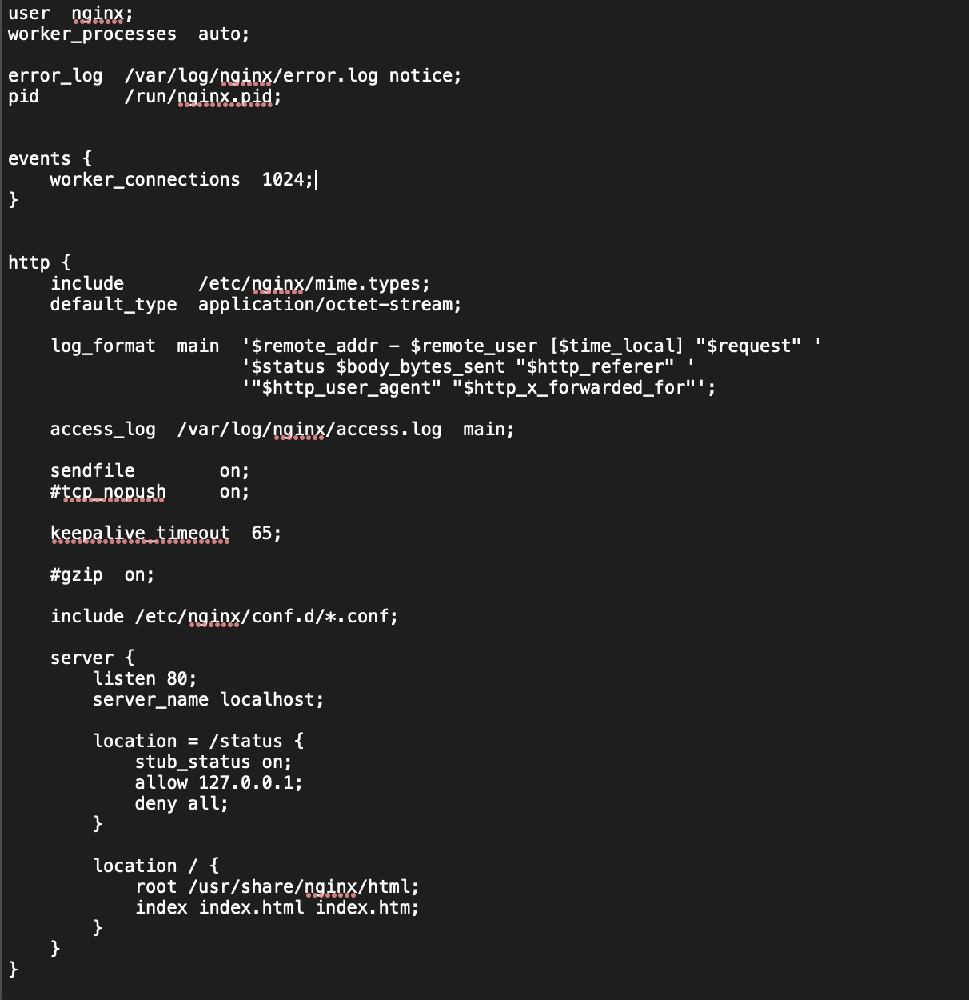

## Готовый докер

  - Выкаченый готовый образ nginx через `docker pull`

    

  - Hаличие докер-образа через `docker images`

    

  - Запуск докер-образа через `docker run -d` и проверка через `docker ps`

    

  - Просмотр информации о контейнере через `docker inspect`. Видим размер контейнера, список проброшеных портов и ip контейнера

    

  - Остановка докер контейнер через `docker stop` и проверка через `docker ps`

    

  - Запуск докера с портами 80 и 443

    

  - Перезапуск докера через `docker restart`

    

## Операции с контейнером

  - Чтение конфигурационного файла nginx.conf

    

  - Создание файла nginx.conf на локальной машине(копирование)

    

  - Настраиваем блок `server` для страницы статуса

    

  - Копируем файл обратно в докер-образ

    

  - Перезапуск nginx внутри контейнера

    

  - Проверяем что страничка отдается `localhost:80/status`

    

  - Экспортируем контейнер в файл

    

  - Остановка и удаление контейнера, а затем принудительное удаление образа

    

  
  - Импорт контейнера обратно и запуск его

    

  - Запуск контейнера

    

  - Проверяем статус

    
    