## 1. Настройка gitlab-runner

1. Установка `gitlab-runner` на виртуальную машину

  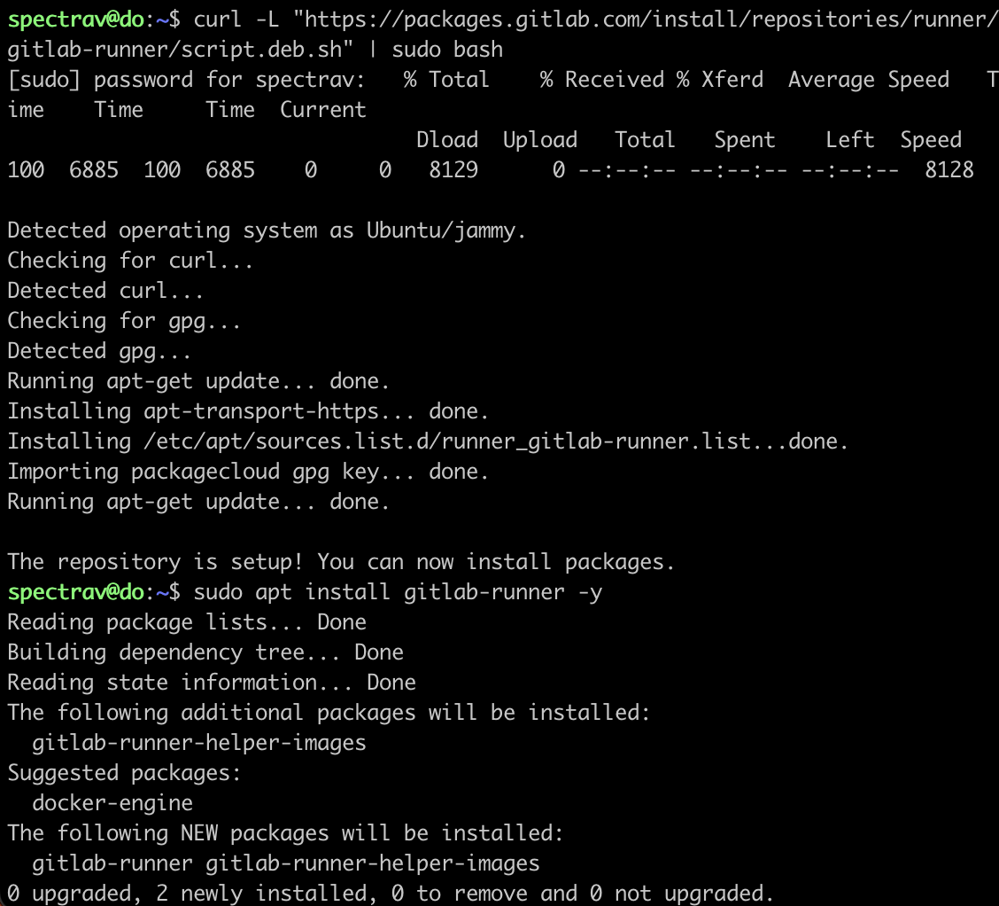

2. Настройка `gitlab-runner`

  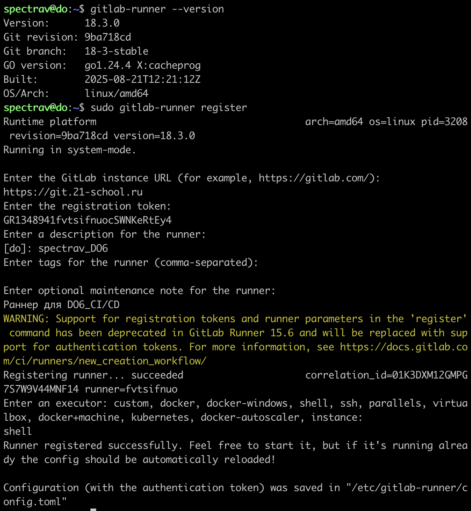

## 2. Сборка

1. Написание этапа CI по сборке приложения из папки `code-samples`

  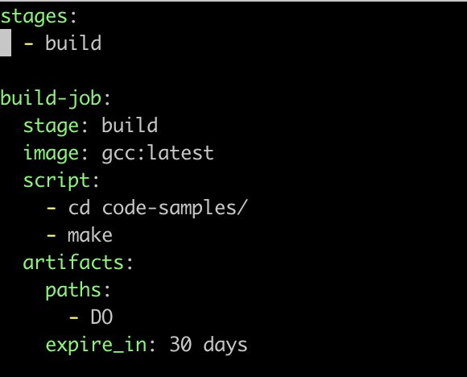

2. Пушим и проверяем пайплайн

 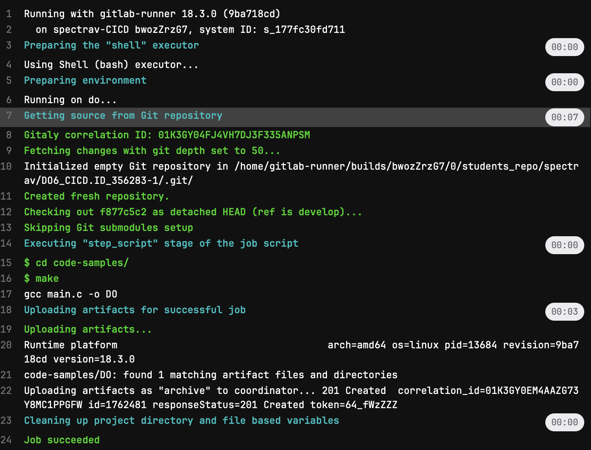

## 3. Тест кодстайла

1. Этап для CI, который запускает скрипт кодстайла. А так же фейлит пайплайн, если тест завален и отображает в пайплайне вывод.  

  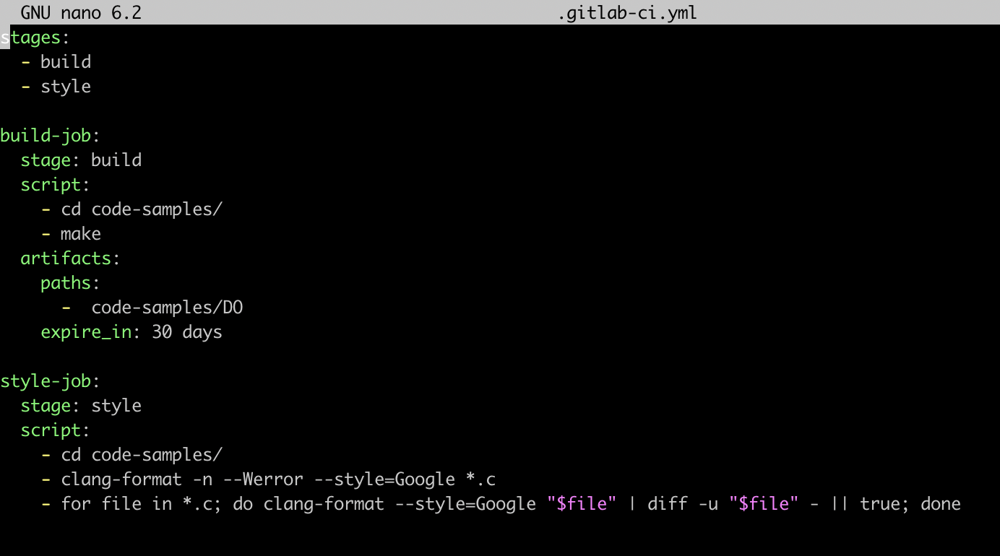

  Видим что пайплайн зафейлен 

  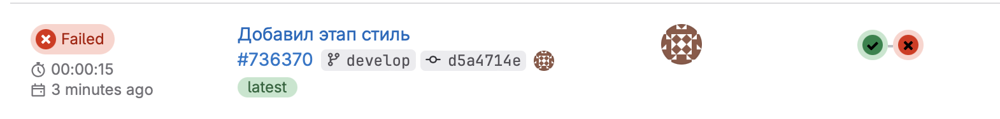

  Видим вывод в пайплайн кодстайла

  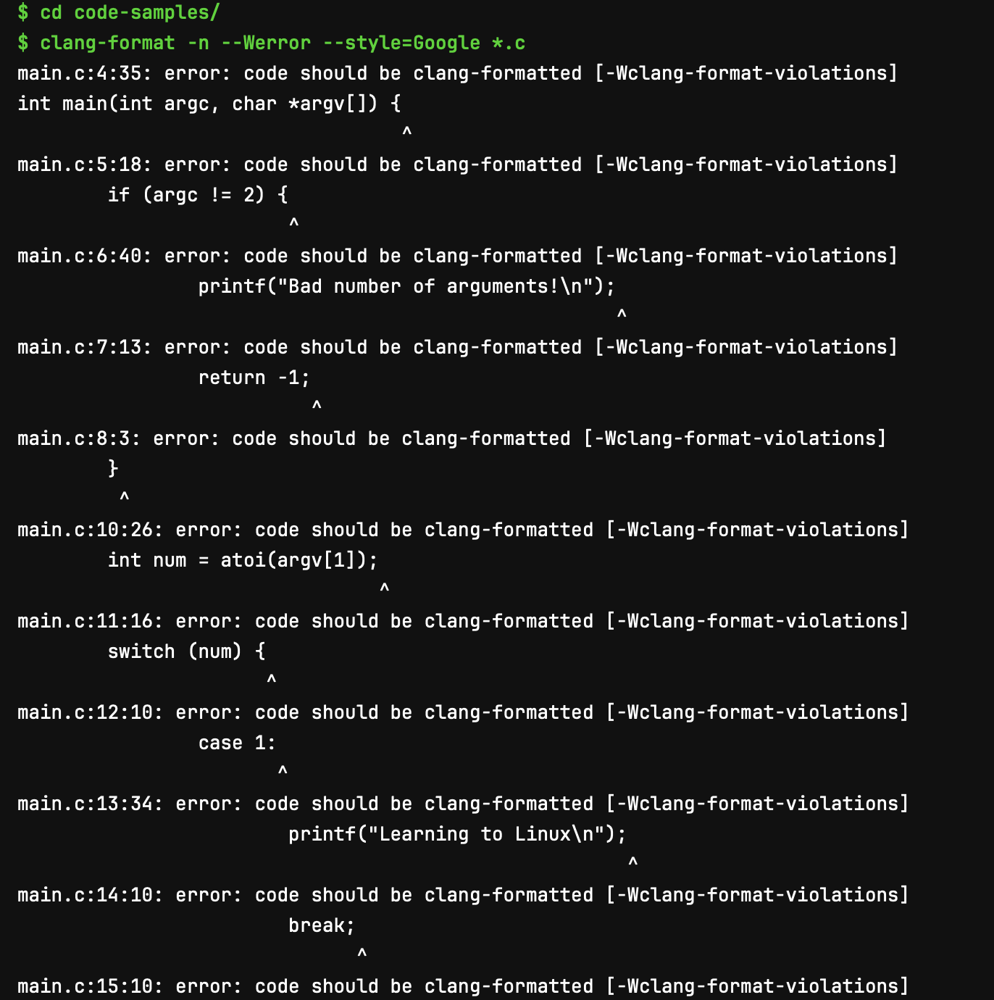

  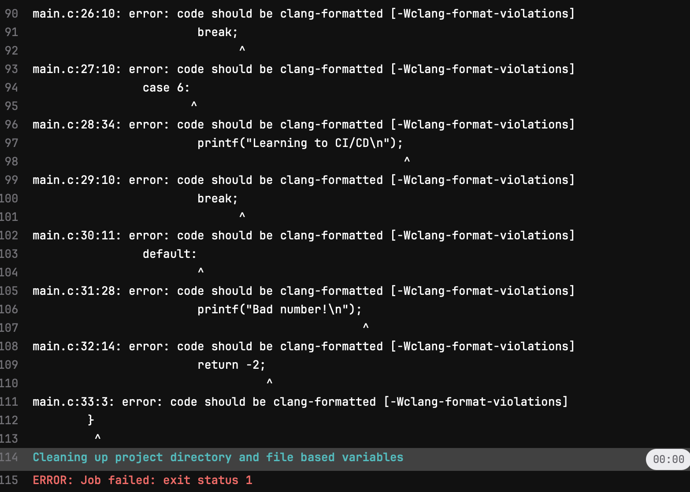

2. Теперь исправляем кодстайл с помощью `clang-format -i --style=Google *.c` и все работает. 

  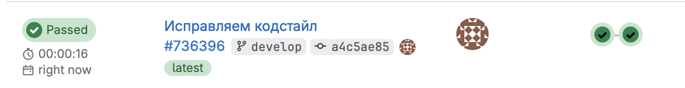

## 4. Интеграционные тесты

1. Добавляем тесты, и видим что тесты выводятся в пайплайн и если тест не проходит, то пайплайн фейлится. 

  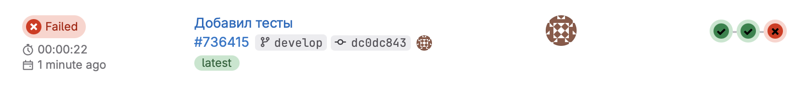

  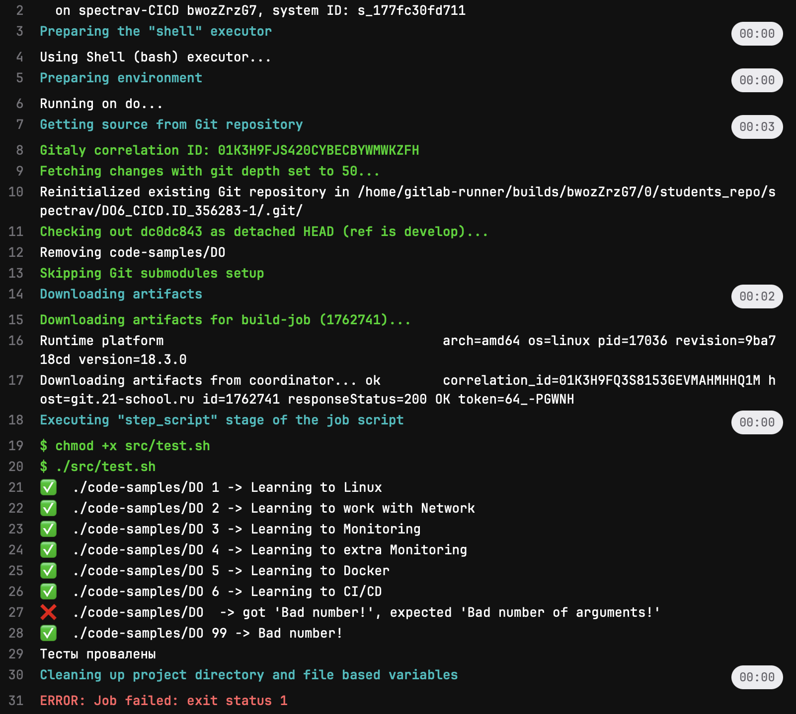

2. Поправляем тесты, что бы все заработало. 

  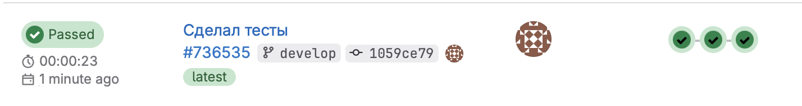

  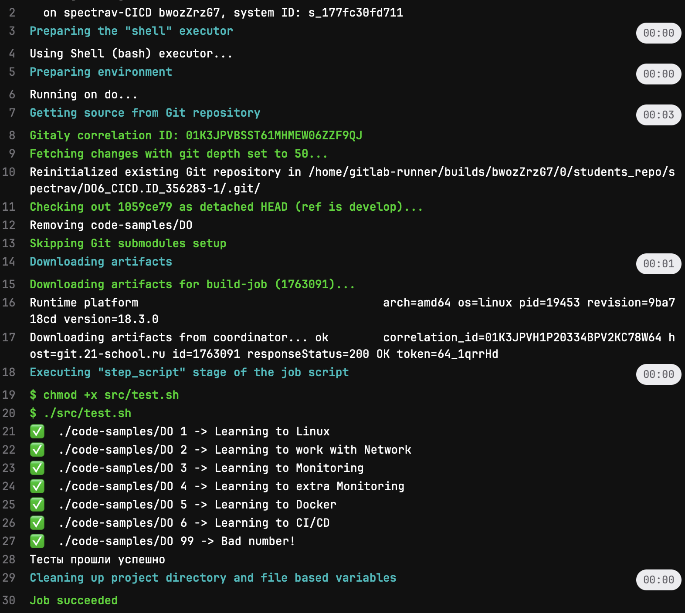

## 5. Этап деплоя

1. Поднимаем вторую ВМ с помощью FULL COPY, настраиваем локальную сеть между ВМ

2. На ВМ1 настраиваем пользователя gitlab-runner, что бы раннер мог подключаться к ВМ2. 

  - Создаем пароль для пользователя gitlab-runner(изначально он не настроен) `sudo passwd gitlab-runner` проверяем `cat /etc/passwd | grep gitlab-runner` должно быть "...gitlab-runner:/bin/bash"

  - добавляем пользователя gitlab-runner группу sudo `sudo usermod -aG sudo gitlab-runner`

  - заходим под пользователем gitlab-runner `su - gitlab-runner`

  - на ВМ1 генерим ssh-ключ и с помощью `ssh-copy-id spectrav@10.10.0.2` копируем его на ВМ2

  - что бы раннер знал при первом подключении что ключ существует делаем `ssh-keyscan -p 22 10.10.0.2 >> ~/.ssh/known_hosts` проверяем `cat ~/.ssh/known_hosts` что добавлен второй ключ

  - на ВМ2 даем права директории `sudo chmod -R 777 /usr/local/bin`

3. Пишем этап диплой для CD

  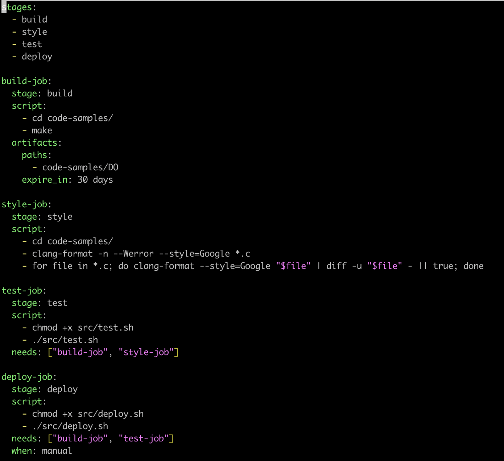

4. Пишем скрипт для копирования артефактов на ВМ2

  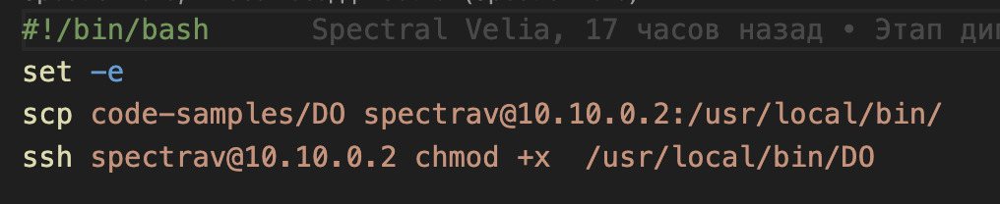

5. Пушим, проверяем, диплой ждет запуска вручную

  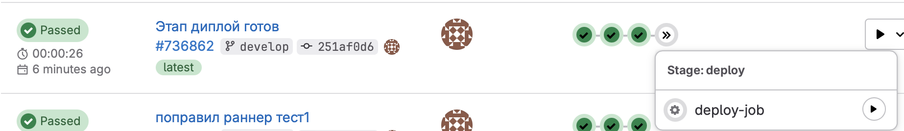

запускаем... и все работает! Наслаждаемся и гуляем. 

  

  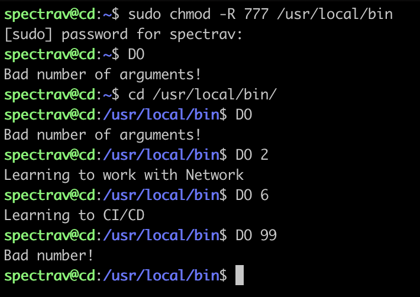

## 6. Дополнительно. Уведомления

1. Через бот @BotFather создаем своего бота под своим ником и названием проекта. Получаем 'token'

2. Через бот @userinfobot узнаем свой ID

3. Из папки materials используем bash-скрипт `tgbot.sh`, меняем на свои данные token и ID

4. В раннере прописываем в каждый job `after_script` с запуском нашего скрипта `./src/tgbot.sh`

5. Пушим. Наслаждаемся и гуляем.  