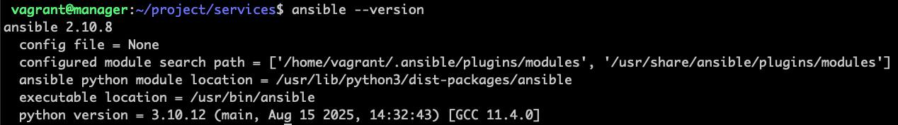
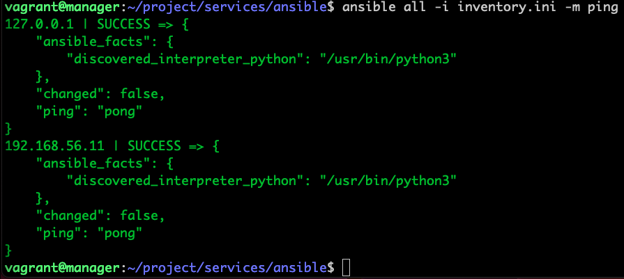
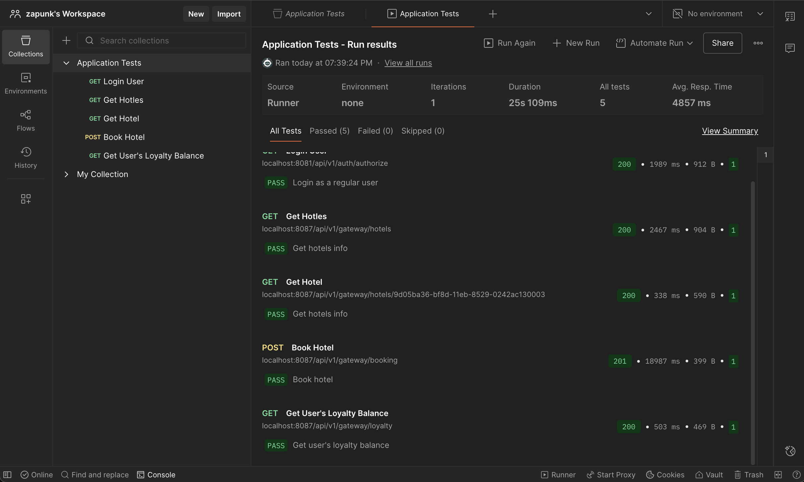
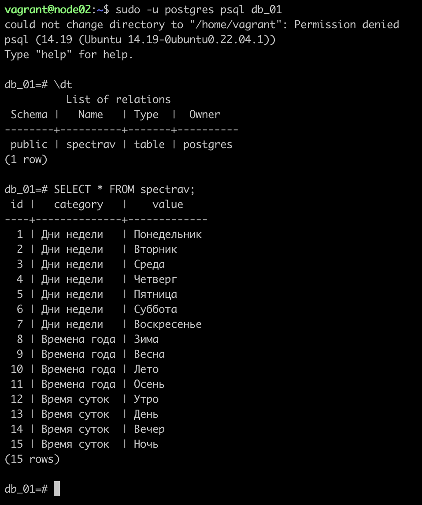

## Part 1. Удаленное конфигурирование узла через Ansible

### Создать с помощью Vagrant три машины: manager, node01, node02. Не устанавливать с помощью shell-скриптов docker при создании машин на Vagrant! Прокинуть порты node01 на локальную машину для доступа к пока еще не развернутому микросервисному приложению

  ```shell
  Vagrant.configure("2") do |config|
    config.ssh.forward_agent = true
    config.vm.box = "bento/ubuntu-22.04"
    config.vm.synced_folder ".", "/vagrant"

    config.vm.define "manager" do |manager|
         manager.vm.hostname = "manager"
        manager.vm.network "private_network", ip: "192.168.56.10"
    
        manager.vm.provider "virtualbox" do |vb|
            vb.memory = 4096
            vb.cpus = 4
            vb.name = "manager"
        end    
    end

    config.vm.define "node01" do |node|
        node.vm.hostname = "node01"
        node.vm.network "private_network", ip: "192.168.56.11"

        [8081,8082,8083,8084,8085,8086,8087].each do |port|
            node.vm.network "forwarded_port", guest: port, host: port
        end
        
        node.vm.provider "virtualbox" do |vb|
            vb.memory = 2048
            vb.cpus = 2
            vb.name = "node01"
        end
    end

    config.vm.define "node02" do |node|
        node.vm.hostname = "node02"
        node.vm.network "private_network", ip: "192.168.56.12"
        node.vm.provider "virtualbox" do |vb|
            vb.memory = 2048
            vb.cpus = 2
            vb.name = "node02"
        end    
    end
end
  ```

### Подготовить manager как рабочую станцию для удаленного конфигурирования (помощь по Ansible в материалах)

- Зайти на manager.

    

- На manager проверить подключение к node01 через ssh по приватной сети.
- Сгенерировать ssh-ключ для подключения к node01 из manager (без passphrase).
- Копируем ssh-ключи на ноды с помощью `ssh-copy-id vagrant@192.168.56.xx`

    

- Скопировать на manager docker-compose файл и исходный код микросервисов. (Используй проект из папки src и docker-compose файл из предыдущей главы)

  - В Vagrant у меня уже есть общая папка, поэтому проект уже доступен из ВМ. Но для облекчения процесса скопирую проект из общей папки в рабочую папку ВМ с помощью скрипта.

```shell
    mkdir -p /home/vagrant/project/services/ansible
    cp -r /vagrant/* /home/vagrant/project/services/ansible
```

  - Так же в docker-compose у меня используются образы микросервиса из моего DockerHub, поэтому для запуска нам нужне только /database

- Установить Ansible на менеджер и создать папку ansible, в которой создать inventory-файл.

    

    мой inventory.ini - файл

```shell
[node01]
192.168.56.11 ansible_user=vagrant

[node02]
192.168.56.12 ansible_user=vagrant
```

- Использовать модуль ping для проверки подключения через Ansible.

    

### Написать первый плейбук для Ansible, который выполняет apt update, устанавливает docker, docker-compose, копирует compose-файл из manager'а и разворачивает микросервисное приложение

```shell
- hosts: node01,node02
  become: true
  tasks:
    - name: Скопировать скрипт установки Docker
      copy:
        src: files/install_docker.sh
        dest: /tmp/install_docker.sh
        mode: '0755'

    - name: Установить Docker
      shell: /tmp/install_docker.sh
      args:
        creates: /usr/bin/docker

    - name: Создать каталог
      file:
        path: /project/services/ansible/files
        state: directory
        mode: '0755'

    - name: Скопировать docker-compose.yml на ноды
      copy:
        src: files/docker-compose.yml
        dest: /project/services/ansible/files/docker-compose.yml
        mode: '0644'

    - name: Скопировать папку database (init.sql)
      copy:
        src: ../database/
        dest: /project/services/database/
        mode: '0644'

    - name: Deploy
      shell: docker compose -f /project/services/ansible/files/docker-compose.yml up -d
      args:
        chdir: /project/services/ansible/files

    - name: Статус контейнеров
      shell: docker ps
      register: docker_ps
      changed_when: false

    - name: Вывести статус контейнеров
      debug:
        var: docker_ps.stdout_lines
```

Данный playbook копирует готовый скрипт по установке Docker(из предыдущей главы) и в скрипте уже есть инструкция `apt update` поэтому обновление всех пакетов произойдет на всех нодах.

Видим что все заработало


### Прогнать заготовленные тесты через postman и удостовериться, что все они проходят успешно


### Сформировать три роли

- роль application выполняет развертывание микросервисного приложения при помощи docker-compose;

```shell
- name: Скопировать скрипт установки Docker
  copy:
    src: "{{ playbook_dir }}/files/install_docker.sh"
    dest: /tmp/install_docker.sh
    mode: '0755'

- name: Установить Docker
  shell: /tmp/install_docker.sh
  args:
    creates: /usr/bin/docker

- name: Создать каталог проекта
  file:
    path: /project/services/ansible/files
    state: directory
    mode: '0755'

- name: Создать директорию для базы данных
  file:
    path: /project/services/database
    state: directory
    mode: '0755'

- name: Скопировать docker-compose.yml
  copy:
    src: "{{ playbook_dir }}/files/docker-compose.yml"
    dest: /project/services/ansible/files/docker-compose.yml
    mode: '0644'

- name: Скопировать init.sql
  copy:
    src: "{{ playbook_dir }}/files/database/init.sql"
    dest: /project/services/database/init.sql
    mode: '0644'

- name: Deploy
  community.docker.docker_compose:
    project_src: /project/services/ansible/files
    state: present

- name: Статус контейнеров
  shell: docker ps
  register: docker_ps

- name: Вывести статус контейнеров
  debug:
    var: docker_ps.stdout_lines
```

- apache устанавливает и запускает стандартный apache сервер;

```shell
- name: Установить Apache
  apt:
    name: apache2
    state: present
    update_cache: yes

- name: Запустить Apache
  service:
    name: apache2
    state: started
    enabled: yes

- name: Создать тестовую страницу
  copy:
    content: "YUHHU!!! Apache already work!"
    dest: /var/www/html/index.html
```

- postgres устанавливает и запускает postgres, создает базу данных с произвольной таблицей и добавляет в нее три произвольные записи.

```shell
- name: Установить PostgreSQL
  apt:
    name:
      - postgresql
      - python3-psycopg2
    state: present
    update_cache: yes

- name: Запустить PostgreSQL
  service:
    name: postgresql
    state: started
    enabled: yes

- name: Копировать SQL-скрипт
  copy:
    src: init.sql
    dest: /tmp/init.sql
    mode: '0644'

- name: Создать базу данных db_01
  shell: |
    sudo -u postgres psql -tAc "SELECT 1 FROM pg_database WHERE datname='db_01'" | grep -q 1 || \
    sudo -u postgres psql -c "CREATE DATABASE db_01"
  args:
    executable: /bin/bash

- name: Создать таблицу и вставить данные
  shell: sudo -u postgres psql -d db_01 -f /tmp/init.sql
  args:
    chdir: /tmp
```

Таблица с тремя записями:

```sql
CREATE TABLE IF NOT EXISTS spectrav (
    id INT GENERATED ALWAYS AS IDENTITY PRIMARY KEY,
    category TEXT NOT NULL,
    value TEXT NOT NULL,
    UNIQUE (category, value)
);

INSERT INTO spectrav (category, value)
SELECT 'Дни недели', v
FROM (VALUES
    ('Понедельник'),
    ('Вторник'),
    ('Среда'),
    ('Четверг'),
    ('Пятница'),
    ('Суббота'),
    ('Воскресенье')
) AS t(v)
WHERE NOT EXISTS (
    SELECT 1 FROM spectrav WHERE category = 'Дни недели' AND value = t.v
);

INSERT INTO spectrav (category, value)
SELECT 'Времена года', v
FROM (VALUES
    ('Зима'),
    ('Весна'),
    ('Лето'),
    ('Осень')
) AS t(v)
WHERE NOT EXISTS (
    SELECT 1 FROM spectrav WHERE category = 'Времена года' AND value = t.v
);

INSERT INTO spectrav (category, value)
SELECT 'Время суток', v
FROM (VALUES
    ('Утро'),
    ('День'),
    ('Вечер'),
    ('Ночь')
) AS t(v)
WHERE NOT EXISTS (
    SELECT 1 FROM spectrav WHERE category = 'Время суток' AND value = t.v
);
```

- Назначить первую роль node01 и вторые две роли node02, проверить postman-тестами работоспособность микросервисного приложения, удостовериться в доступности postgres и apache-сервера. Для Apache веб-страница должна открыться в браузере. Что касается PostgreSQL, необходимо подключиться с локальной машины и отобразить содержимое ранее созданной таблицы с данными.

Назначение ролей в плейбуке:

```shell
- hosts: node01
  become: true
  roles:
    - application

- hosts: node02
  become: true
  roles:
    - apache
    - postgres
```

Прогоняем тесты в `Postman`



Проверяем доступность Apache


Проверяем PostgreSQL



## Part 2. Service Discovery

### Написать два конфигурационных файла для consul

- consul_server.hcl:

  - настроить агент как сервер;
  - указать в advertise_addr интерфейс, направленный во внутреннюю сеть Vagrant;

```shell
server = true
node_name = "consul_server"
advertise_addr = "192.168.56.10"
client_addr = "0.0.0.0"
data_dir = "/opt/consul"
bootstrap_expect = 1
ui = true

connect {
  enabled = true
}

ports {
  grpc = 8502
}
```

- consul_client.hcl:

  - настроить агент как клиент;
  - указать в advertise_addr интерфейс, направленный во внутреннюю сеть Vagrant.

```shell
server = false
node_name = "{{ inventory_hostname }}"
advertise_addr = "{{ ansible_host }}"
client_addr = "0.0.0.0"
retry_join = ["192.168.56.10"]
data_dir = "/opt/consul"

connect {
  enabled = true
}

ports {
  grpc = 8502
}
```

### Создать с помощью Vagrant четыре машины: consul_server, api, manager и db

- Прокинуть порт 8082 с api на локальную машину для доступа к пока еще не развернутому api.
- Прокинуть порт 8500 с consul_server для доступа к ui consul.

```shell
Vagrant.configure("2") do |config|
    config.vm.box = "ubuntu/focal64"
    config.vm.synced_folder "./", "/vagrant"
    
    config.vm.define "consulserver" do |node|
        node.vm.hostname = "consulserver"
        node.vm.network "private_network", ip: "192.168.56.10"
        node.vm.network "forwarded_port", guest: 8500, host: 8500, auto_correct: true
        node.vm.provider "virtualbox" do |vb|
            vb.memory = 512
            vb.cpus = 1
            vb.name = "consulserver"
        end
    end

    config.vm.define "api" do |node|
        node.vm.hostname = "api"
        node.vm.network "private_network", ip: "192.168.56.11"
        node.vm.network "forwarded_port", guest: 8082, host: 8082, auto_correct: true
        node.vm.provider "virtualbox" do |vb|
            vb.memory = 2048
            vb.cpus = 1
            vb.name = "api"
        end
    end

    config.vm.define "manager" do |node|
        node.vm.hostname = "manager"
        node.vm.network "private_network", ip: "192.168.56.12"
        node.vm.provider "virtualbox" do |vb|
            vb.memory = 256
            vb.cpus = 1
            vb.name = "manager"
        end
    end

    config.vm.define "db" do |node|
        node.vm.hostname = "db"
        node.vm.network "private_network", ip: "192.168.56.13"
        node.vm.provider "virtualbox" do |vb|
            vb.memory = 2048
            vb.cpus = 1
            vb.name = "db"
        end
    end
end
```

### Написать плейбук для ansible и четыре роли

playbook.yml

```shell
- hosts: consulserver
  become: true
  roles:
    - install_consul_server
  tags: consulserver

- hosts: db
  become: true
  roles:
    - install_consul_client
    - install_db
  tags: db

- hosts: api
  become: true
  vars:
    postgres_host: "127.0.0.1"
    postgres_port: "5432"
    postgres_db: "hotels_db"
    postgres_user: "postgres"
    postgres_password: "postgres"
  roles:
    - install_consul_client
    - install_hotels_service
  tags: api
```

inventory.ini

```shell
[consulserver]
consulserver ansible_host=192.168.56.10 ansible_user=vagrant ansible_ssh_private_key_file=.vagrant/machines/consulserver/virtualbox/private_key ansible_ssh_common_args='-o StrictHostKeyChecking=no'

[api]
api ansible_host=192.168.56.11 ansible_user=vagrant ansible_ssh_private_key_file=.vagrant/machines/api/virtualbox/private_key ansible_ssh_common_args='-o StrictHostKeyChecking=no'

[manager]
manager ansible_host=192.168.56.12 ansible_user=vagrant ansible_ssh_private_key_file=.vagrant/machines/manager/virtualbox/private_key ansible_ssh_common_args='-o StrictHostKeyChecking=no'

[db]
db ansible_host=192.168.56.13 ansible_user=vagrant ansible_ssh_private_key_file=.vagrant/machines/db/virtualbox/private_key ansible_ssh_common_args='-o StrictHostKeyChecking=no'
```
ВАЖНО! Запускаем мы ansible-playbook из дерриктории с Vagrantfile (указывая путь к плейбуку и инвентори), поскольку ansibl берет ssh-keys из `.vagrant/machines/` 

- install_consul_server, которая:
  - работает с consul_server;
  - копирует consul_server.hcl;
  - устанавливает consul и необходимые для consul зависимости;
  - запускает сервис consul;

```shell
- name: Проверка Consul
  stat:
    path: /usr/local/bin/consul
  register: consul_check

- name: Скопировать скрипт установки Consul
  copy:
    src: install_consul.sh
    dest: /tmp/install_consul.sh
    mode: '0755'
  when: not consul_check.stat.exists

- name: Установка Consul
  shell: /tmp/install_consul.sh
  args:
    chdir: /tmp
  when: not consul_check.stat.exists

- name: Создать директорию для данных
  file:
    path: /opt/consul
    state: directory
    mode: '0755'
    owner: root
    group: root

- name: Скопировать конфиг
  copy:
    src: "{{ playbook_dir }}/../consul01/consul_server.hcl"
    dest: /etc/consul.hcl
    mode: '0644'

- name: Создать systemd unit
  copy:
    dest: /etc/systemd/system/consul.service
    mode: '0644'
    content: |
      [Unit]
      Description=Consul Server
      After=network-online.target

      [Service]
      User=root
      Group=root
      ExecStart=/usr/local/bin/consul agent -config-file=/etc/consul.hcl
      Restart=on-failure

      [Install]
      WantedBy=multi-user.target

- name: Перезагрузить systemd
  systemd:
    daemon_reload: yes

- name: Перезапустить consul
  systemd:
    name: consul
    enabled: yes
    state: restarted
```
Для удобства установки консул использую заготовленый install_consul.sh скрипт:

```shell
#!/bin/bash

set -e

sudo apt update
sudo apt install curl unzip -y

VERSION="1.21.0"

curl -sSL -o /tmp/consul.zip "https://releases.hashicorp.com/consul/${VERSION}/consul_${VERSION}_linux_amd64.zip"
sudo unzip /tmp/consul.zip -d /usr/local/bin/
sudo chmod +x /usr/local/bin/consul
sudo rm -f /tmp/consul.zip
```

- install_consul_client, которая:
  - работает с api и db;
  - копирует consul_client.hcl;
  - устанавливает consul, envoy и необходимые для consul зависимости;
  - запускает сервис consul и consul-envoy;

```shell
- name: Проверка Consul
  stat:
    path: /usr/local/bin/consul
  register: consul_check

- name: Скопировать скрипт установки Consul
  copy:
    src: ../files/install_consul.sh
    dest: /tmp/install_consul.sh
    mode: '0755'
  when: not consul_check.stat.exists

- name: Установка Consul
  shell: /tmp/install_consul.sh
  args:
    chdir: /tmp
  when: not consul_check.stat.exists

- name: Создать директорию /etc/consul.d
  file:
    path: /etc/consul.d
    state: directory
    mode: '0755'

- name: Скопировать конфиг
  template:
    src: "{{ playbook_dir }}/../consul01/consul_client.hcl"
    dest: /etc/consul.d/consul.hcl
    mode: '0644'

# =======================================

- name: Создать hotel.hcl для API
  copy:
    dest: /etc/consul.d/hotel.hcl
    mode: "0644"
    content: |
      service {
        name = "api"
        id   = "api"
        port = 8082
        connect {
          sidecar_service {
            proxy {
              upstreams = [
                {
                  destination_name = "db"
                  local_bind_port  = 5432
                }
              ]
            }
          }
        }
      }
  when: inventory_hostname == "api"

- name: Создать database.hcl для DB
  copy:
    dest: /etc/consul.d/database.hcl
    mode: "0644"
    content: |
      service {
        name = "db"
        id   = "db"
        port = 5432
        connect {
          sidecar_service {}
        }
      }
  when: inventory_hostname == "db"

# ======================================

- name: Создать systemd unit
  copy:
    dest: /etc/systemd/system/consul.service
    mode: '0644'
    content: |
      [Unit]
      Description=Consul Client
      After=network-online.target
      Wants=network-online.target

      [Service]
      User=root
      Group=root
      ExecStart=/usr/local/bin/consul agent -config-dir=/etc/consul.d
      Restart=on-failure

      [Install]
      WantedBy=multi-user.target

- name: Перезагрузить systemd
  systemd:
    daemon_reload: yes

- name: Перезапустить consul
  systemd:
    name: consul
    enabled: yes
    state: restarted

# =============================================

- name: Скачать Envoy
  get_url:
    url: "https://github.com/envoyproxy/envoy/releases/download/v1.33.11/envoy-1.33.11-linux-x86_64"
    dest: /usr/local/bin/envoy
    mode: '0755'

- name: Создание consul-envoy systemd service
  copy:
    dest: /etc/systemd/system/consul-envoy.service
    mode: "0644"
    content: |
      [Unit]
      Description=Consul Envoy Sidecar
      After=consul.service
      Requires=consul.service

      [Service]
      ExecStart=/usr/local/bin/consul connect envoy -sidecar-for "{{ inventory_hostname }}"
      Restart=always
      RestartSec=3

      [Install]
      WantedBy=multi-user.target
      
- name: Перезагрузить systemd
  systemd:
    daemon_reload: yes

- name: Подождать 10 секунд, чтобы Consul зарегистрировал сервис
  pause:
    seconds: 10

- name: Перезапустить consul-envoy
  systemd:
    name: consul-envoy
    state: started
    enabled: yes
```
ВАЖНО! Обращаем внимание на совместимость версий consul и envoy. Они должны быть совместимы. Тут я использую consul 1.21.x и envoy 1.33.x. Они совместимы и поддерживаемые.

- install_db, которая:
  - работает с db;
  - устанавливает postgres и запускает его;
  - создает базу данных `hotels_db`;

```shell
- name: Установить PostgreSQL
  apt:
    name:
      - postgresql
      - python3-psycopg2
    state: present
    update_cache: yes

- name: Запустить PostgreSQL
  service:
    name: postgresql
    state: started
    enabled: yes

- name: Подождать пока PostgreSQL поднимется
  wait_for:
    host: "127.0.0.1"
    port: 5432
    delay: 2
    timeout: 30
    
- name: Установить пароль для пользователя postgres
  shell: |
    sudo -u postgres psql -c "ALTER USER postgres WITH PASSWORD 'postgres';"
  args:
    executable: /bin/bash

- name: Копировать SQL-скрипт
  copy:
    src: ../files/init.sql
    dest: /tmp/init.sql
    mode: '0644'

- name: Выполнение init.sql
  shell: sudo -u postgres psql -d postgres -f /tmp/init.sql
  args:
    executable: /bin/bash
```
ВАЖНО! Для создания базы данных используем готовый скрипт `init.sql`

```shell
\c postgres;

DROP DATABASE IF EXISTS hotels_db;
CREATE DATABASE hotels_db OWNER postgres;
```

- install_hotels_service, которая:
  - работает с api;
  - копирует исходный код сервиса;
  - устанавливает `openjdk-8-jdk`;
  - создает глобальные переменные окружения:
    - POSTGRES_HOST="127.0.0.1";
    - POSTGRES_PORT="5432";
    - POSTGRES_DB="hotels_db";
    - POSTGRES_USER="<имя пользователя>";
    - POSTGRES_PASSWORD="<пароль пользователя>";
  - запускает собранный jar-файл командой `java -jar <путь до hotel-service>/hotel-service/target/<имя jar-файла>.jar`.

```shell
- name: Установка openjdk
  apt:
    name: openjdk-8-jdk
    state: present
    update_cache: yes

- name: Копирование сервиса hotel
  copy:
    src: ../files/hotel-service/
    dest: /opt/hotel-service/

- name: Подготовка к сборке
  file:
    path: /opt/hotel-service/mvnw
    mode: '0755'

- name: Сборка hotel-service
  shell: ./mvnw clean package -DskipTests
  args:
    chdir: /opt/hotel-service/

- name: Установка environment
  copy:
    dest: /etc/hotel_env.conf
    mode: '0644'
    content: |
      POSTGRES_HOST="{{ postgres_host }}"
      POSTGRES_PORT="{{ postgres_port }}"
      POSTGRES_DB="{{ postgres_db }}"
      POSTGRES_USER="{{ postgres_user }}"
      POSTGRES_PASSWORD="{{ postgres_password }}"

- name: Запуск сервиса simple systemd
  copy:
    dest: /etc/systemd/system/hotel.service
    content: |
      [Unit]
      Description=Hotel Service
      After=network.target

      [Service]
      User=root
      Group=root
      EnvironmentFile=-/etc/hotel_env.conf
      ExecStart=/usr/bin/java -jar /opt/hotel-service/target/hotel-service-0.0.1-SNAPSHOT.jar
      Restart=always

      [Install]
      WantedBy=multi-user.target

- name: Перезагрузить systemd
  systemd:
    daemon_reload: yes

- name: Запуск hotel_service
  systemd:
    name: hotel
    enabled: yes
    state: restarted
```

### Проверить работоспособность CRUD-операций над сервисом отелей. В отчете отобразить результаты тестирования.


Полноценно из CRUD-опрерации можно получить только Read(на скриншоте выше). Create - требует токен и авторизацию, Update - невозможен(PATCH endpoint закоментирован в контроллере), Delete - тоже невозможен(Delete endpoint нету). Подробнее видно на скриншоте ниже 


На скриншоте ниже UI интерфейс консул


