# МОНИТОРИНГ

## Содержание

* [Part 1. Получение метрик и логов](#раздел-1)
* [Part 2. Визуализация](#раздел-2)
* [Part 3. Отслеживание критических событий](#раздел-3)

---

## Part 1. Получение метрик и логов

### Задание

1. Использовать Docker Swarm из первого проекта.

- За основу берем Vagrantfile из DO7 и немного адаптируем его под наш проект

```shell
Vagrant.configure("2") do |config|
  config.vm.box = "bento/ubuntu-22.04"

  config.vm.synced_folder ".", "/vagrant"
  
  config.vm.define "manager01" do |manager|
    manager.vm.hostname = "manager01"
    manager.vm.network "private_network", ip: "192.168.56.10"

    manager.vm.provider "virtualbox" do |vb|
        vb.memory = 4096
        vb.cpus = 2
    end

    #Это надо для очистки старого токена, если нужно перезапустить менеджер
    manager.vm.provision "shell", inline: <<-SHELL
     rm -f /vagrant/token
    SHELL

    manager.vm.provision "shell", path: "./scripts/install_docker.sh"
    manager.vm.provision "shell", path: "./scripts/manager_swarm.sh"
  end
  
  config.vm.define "worker01" do |worker|
    worker.vm.hostname = "worker01"
    worker.vm.network "private_network", ip: "192.168.56.11"

    worker.vm.provider "virtualbox" do |vb|
        vb.memory = 1024
        vb.cpus = 1
    end

    worker.vm.provision "shell", path: "./scripts/install_docker.sh"
    worker.vm.provision "shell", path: "./scripts/worker_swarm.sh"
  end

  config.vm.define "worker02" do |worker|
    worker.vm.hostname = "worker02"
    worker.vm.network "private_network", ip: "192.168.56.12"

    worker.vm.provider "virtualbox" do |vb|
        vb.memory = 1024
        vb.cpus = 1
    end

    worker.vm.provision "shell", path: "./scripts/install_docker.sh"
    worker.vm.provision "shell", path: "./scripts/worker_swarm.sh"
  end
end
```

- Используемые скрипты для установки Docker, создания токена swarm и для подключения нодов

install_docker
```shell
#!/bin/bash
set -e
sudo apt-get update -y
sudo apt-get install -y ca-certificates curl gnupg lsb-release
sudo mkdir -p /etc/apt/keyrings
sudo chmod 755 /etc/apt/keyrings
curl -fsSL https://download.docker.com/linux/ubuntu/gpg | sudo gpg --batch --yes --dearmor -o /etc/apt/keyrings/docker.gpg
sudo chmod a+r /etc/apt/keyrings/docker.gpg
echo \
  "deb [arch=$(dpkg --print-architecture) signed-by=/etc/apt/keyrings/docker.gpg] \
  https://download.docker.com/linux/ubuntu $(lsb_release -cs) stable" \
  | sudo tee /etc/apt/sources.list.d/docker.list > /dev/null
sudo apt-get update -y
sudo apt-get install -y docker-ce docker-ce-cli containerd.io docker-buildx-plugin docker-compose-plugin
sudo usermod -aG docker vagrant
sudo systemctl enable docker
sudo systemctl start docker
sudo -u vagrant docker --version
```

manage_swarm
```shell
#!/bin/bash
if docker info | grep -q "Swarm: active"; then
  docker swarm leave --force
fi
docker swarm init --advertise-addr 192.168.56.10
docker swarm join-token -q worker > /vagrant/token

echo "Менеджер создал токен:"
cat /vagrant/token
```

worker_swarm
```shell
#!/bin/bash

for i in {1..60}; do
  if [ -f /vagrant/token ]; then
    break
  fi
  echo "ждем токен... ($i)"
  sleep 2
done

if [ ! -f /vagrant/token ]; then
  echo "токен не создался"
  exit 1
fi

token=$(cat /vagrant/token)
docker swarm join --token "$token" 192.168.56.10:2377
```

2. Написать при помощи библиотеки Micrometer сборщики следующих метрик приложения:

    - количество отправленных сообщений в rabbitmq;
    - количество обработанных сообщений в rabbitmq;
    - количество бронирований;
    - количество полученных запросов на gateway;
    - количество полученных запросов на авторизацию пользователей.

    Micrometer — это фасад для сбора метрик в приложениях Java (JVM), который предоставляет единый API для записи данных о состоянии приложения и экспортирует их в различные системы мониторинга, такие как Prometheus или Grafana (через Prometheus). Он позволяет легко инструментировать код, чтобы собирать кастомные метрики (счетчики, таймеры, гистограммы) и интегрироваться с Spring Boot Actuator.

  - Для начала необходимо добавить ендпоинты /actuator & /actuator/promrtheus

    Сообщения в rabbitmq отправляет QueueProducer, в нашем случае им выступает booking-service. Обрабатывает сообщения QueueConsumer, в нашем случае report-service. За бронирование отвечает booking-service, запросы на gateway сам сервис gateway, за авторизацию отвечает session. 

  Добавляем в pom.xml этих сервисов Actuator для endpoint и метрик, и Micrometr для Prometheus

```xml
<!-- Добавляем Actuator для эндпоинтов и метрик  -->
<dependency>
<groupId>org.springframework.boot</groupId>
    <artifactId>spring-boot-starter-actuator</artifactId>
</dependency>
<!-- Микрометр для Прометеуса -->
<dependency>
    <groupId>io.micrometer</groupId>
    <artifactId>micrometer-registry-prometheus</artifactId>
</dependency>
```
        
  И в application.properties этих сервисов в конце прописываем Actuator и метрики, а так же для security разрешаем актуатор

```yml
management.endpoints.web.exposure.include=health,info,prometheus
management.endpoint.prometheus.enabled=true
management.endpoints.web.base-path=/actuator

management.security.enabled=false
```

  - Теперь необходимо пересобрать эти сервисы и перезалить в DockerHub, для дальнейшего использования в Docker Swarm.\
    Пересобираем с помощью `docker build -t <service name> .`\
    Тегируем новые images `docker tag <service name> zapunk1/s21-<service name>:spectrav`\
    Пушим в наш Докер Хаб `docker push zapunk1/s21-<service name>:spectrav`

  - Сами метрики прописаны в нашем приложении. Теперь микрометр может передавать их по /actuator/prometheus

  - Поднимаем ВМ с помощью `vagrant up`. Заходим на manager01 командой `vagrant ssh manager01` Видим что swarm запустился 

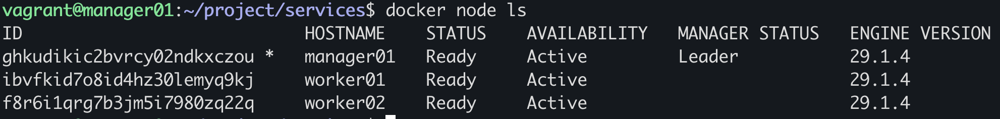

  - Создаем на менеджере рабочую деррикторию проекта и копируем `docker-compose.yml`, /database

```sh
    sudo mkdir -p /home/vagrant/project/services/database
    sudo cp -r /vagrant/services/database/* /home/vagrant/project/services/database
    sudo cp /vagrant/docker-compose.yml /home/vagrant/project/services
```

  - Поскольку прометеус подключается к сервисам по оверлейной сети, а микросервисы между собой подключаются по уже созданой сети `app-network`. То переред запуском создаем оверлейную сеть командой `docker network create --driver overlay app-network` А в конфигурации докер-компос используем `external: true` что бы докер не создавал новую сеть, а подключался к созданной. 

```yaml
    ...
    networks:
      app-network:
        external: true
    ...
```

  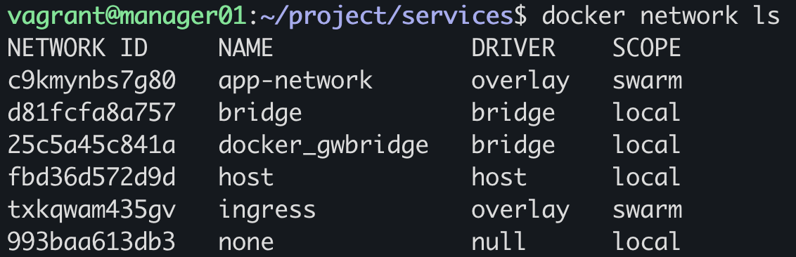

  - Стоит так же учитывать что время в контейнерах и на хосте может отличаться, поэтому проксируем localtime и timezone volumes в каждый контейнер

```yaml
    ...
    - /etc/localtime:/etc/localtime:ro
    - /etc/timezone:/etc/timezone:ro
    ...
```

  - Запускаем стек приложения командой `docker stack deploy -c docker-compose.yml my_services`

  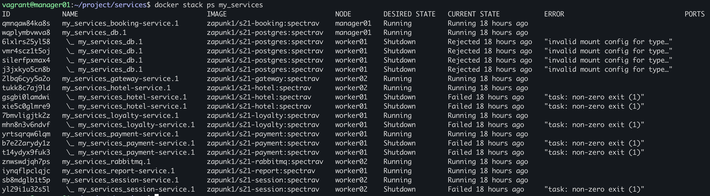

3. Добавить логи приложения с помощью Loki.

    Тут конечно самая жопа была. 

  - создаем дирректорию `/monitoring`
  - создаем loki-config.yml (Loki - это система агрегации логов)

```yaml
auth_enabled: false

server:
  http_listen_port: 3100
  http_listen_address: 0.0.0.0

common:
  path_prefix: /loki
  storage:
    filesystem:
      chunks_directory: /loki/chunks
      rules_directory: /loki/rules
  replication_factor: 1
  ring:
    kvstore:
      store: inmemory

schema_config:
  configs:
    - from: 2023-01-01
      store: tsdb
      object_store: filesystem
      schema: v13
      index:
        prefix: index_
        period: 24h
```

  - создаем promtail-config.yml (Promtail - это локальный сборщик метрик, который передает сами логи Loki)

```yml
server:
  http_listen_port: 9080
  grpc_listen_port: 0

positions:
  filename: /tmp/positions.yaml

clients:
  - url: http://loki:3100/loki/api/v1/push

scrape_configs:
  - job_name: docker-containers
    static_configs:
      - targets:
          - localhost
        labels:
          job: docker
          __path__: /var/lib/docker/containers/*/*.log
```

  - создаем docker-compose-monitoring.yml (Создаем отдельный файл, для запуска отдельным стеком)

```yml
 ...
  loki:
    image: grafana/loki:2.9.4
    command: -config.file=/etc/loki/loki-config.yml
    ports:
      - "3100:3100"
    volumes:
      - ./monitoring/loki-config.yml:/etc/loki/loki-config.yml
      - loki-data:/loki
      - /etc/localtime:/etc/localtime:ro
      - /etc/timezone:/etc/timezone:ro
    networks:
      - app-network
    deploy:
      placement:
        constraints:
          - node.role == manager

  promtail:
    image: grafana/promtail:2.9.4
    user: root
    command: -config.file=/etc/promtail/promtail-config.yml
    volumes:
      - ./monitoring/promtail-config.yml:/etc/promtail/promtail-config.yml
      - /var/lib/docker/containers:/var/lib/docker/containers:ro
      - /var/log:/var/log:ro
      - /etc/localtime:/etc/localtime:ro
      - /etc/timezone:/etc/timezone:ro
    networks:
      - app-network
    deploy:
      mode: global
...
```

  - запускаем отдельный стек командой `docker stack deploy -c docker-compose-monitoring.yml monitoring`

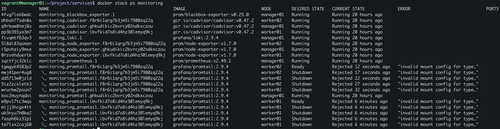

  - проверяем, и видим сервис готов


4. Создать новый стек для Docker Swarm из сервисов с Prometheus Server, Loki, node_exporter, blackbox_exporter, cAdvisor. Проверить получение метрик на порту 9090 через браузер.

  - создаем prometheus.yml

```yaml
global:
  scrape_interval: 15s
  evaluation_interval: 15s
  scrape_timeout: 10s

scrape_configs:
  - job_name: 'my_services'
    metrics_path: '/actuator/prometheus'
    scrape_interval: 5s
    static_configs:
      - targets:
          - 'gateway-service:8087'
          - 'session-service:8081'
          - 'booking-service:8083'
          - 'report-service:8086'

  - job_name: cadvisor
    scrape_interval: 5s
    static_configs:
      - targets:
          - 'cadvisor:8080'
        labels:
          job: 'cadvisor'
          app: 'monitoring'

  - job_name: node_exporter
    dns_sd_configs:                        # Это для скарпинга каждого таска отдельно
      - names:
          - tasks.monitoring_node_exporter # Это имя моего сервиса, а не node_exporter
        type: A
        port: 9100

  - job_name: blackbox
    metrics_path: /probe
    params:
      module: [http_2xx]
    static_configs:
      - targets:
          - http://gateway-service:8087
          - http://booking-service:8083
    relabel_configs:
      - source_labels: [__address__]
        target_label: __param_target
      - source_labels: [__param_target]
        target_label: instance
      - target_label: __address__
        replacement: blackbox_exporter:9115
```
  - создаем blackbox.yml

```yaml
modules:
  http_2xx:
    prober: http
    timeout: 5s
    http:
      valid_http_versions: ["HTTP/1.1", "HTTP/2"]
      valid_status_codes: []
      follow_redirects: true
      preferred_ip_protocol: "ip4"
      tls_config:
        insecure_skip_verify: false
```
  - дописываем docker-compose-monitoring.yml

```yaml
version: "3.8"

services:

  prometheus:
    image: prom/prometheus:v2.49.1
    ports:
      - "9090:9090"
    volumes:
      - ./monitoring/prometheus.yml:/etc/prometheus/prometheus.yml
      - prometheus-data:/prometheus
      - /etc/localtime:/etc/localtime:ro
      - /etc/timezone:/etc/timezone:ro
    command:
      - "--config.file=/etc/prometheus/prometheus.yml"
      - "--storage.tsdb.path=/prometheus"
    networks:
      - app-network
    deploy:
      placement:
        constraints:
          - node.role == manager

  loki:
    image: grafana/loki:2.9.4
    command: -config.file=/etc/loki/loki-config.yml
    ports:
      - "3100:3100"
    volumes:
      - ./monitoring/loki-config.yml:/etc/loki/loki-config.yml
      - loki-data:/loki
      - /etc/localtime:/etc/localtime:ro
      - /etc/timezone:/etc/timezone:ro
    networks:
      - app-network
    deploy:
      placement:
        constraints:
          - node.role == manager

  promtail:
    image: grafana/promtail:2.9.4
    user: root
    command: -config.file=/etc/promtail/promtail-config.yml
    volumes:
      - ./monitoring/promtail-config.yml:/etc/promtail/promtail-config.yml
      - /var/lib/docker/containers:/var/lib/docker/containers:ro
      - /var/log:/var/log:ro
      - /etc/localtime:/etc/localtime:ro
      - /etc/timezone:/etc/timezone:ro
    networks:
      - app-network
    deploy:
      mode: global

  node_exporter:
    image: prom/node-exporter:v1.7.0
    volumes:
      - /etc/localtime:/etc/localtime:ro
      - /etc/timezone:/etc/timezone:ro
    networks:
      - app-network
    deploy:
      mode: global

  cadvisor:
    image: gcr.io/cadvisor/cadvisor:v0.47.2
    volumes:
      - /:/rootfs:ro
      - /var/run:/var/run:ro
      - /sys:/sys:ro
      - /var/lib/docker:/var/lib/docker:ro
      - /etc/localtime:/etc/localtime:ro
      - /etc/timezone:/etc/timezone:ro
    networks:
      - app-network
    deploy:
      mode: global

  blackbox_exporter:
    image: prom/blackbox-exporter:v0.25.0
    ports:
      - "9115:9115"
    volumes:
      - ./monitoring/blackbox.yml:/etc/blackbox/blackbox.yml
      - /etc/localtime:/etc/localtime:ro
      - /etc/timezone:/etc/timezone:ro
    command:
      - "--config.file=/etc/blackbox/blackbox.yml"
    networks:
      - app-network
    deploy:
      placement:
        constraints:
          - node.role == manager

networks:
  app-network:
    external: true

volumes:
  prometheus-data:
  loki-data:
```

  - перезапускаем стек мониторинга 

```bash
docker stack rm monitoring
sleep 20
docker stack deploy -c docker-compose-monitoring.yml monitoring
```

  - на хосте по IP адресу менеджера `http://192.168.56.10:9090` -> targets проверяем что все сервисы поднялись

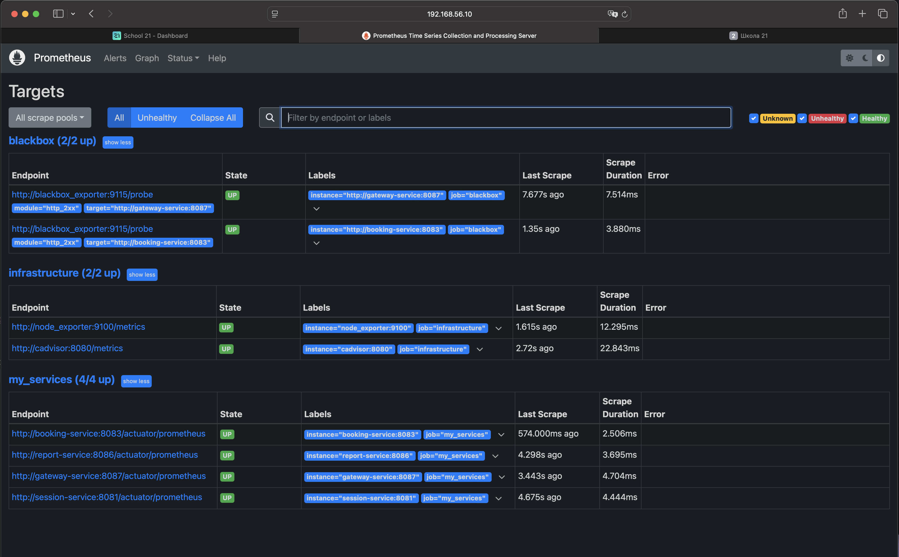

## Part 2. Визуализация

### Задание

1. Развернуть grafana как новый сервис в стеке мониторинга.

   - В файл `docker-compose-monitoring.yml` прописываем новый сервис с Grafana. Используем datasource loki как провизор.

```yml
...
grafana:
    image: grafana/grafana:10.2.3
    ports:
      - "3000:3000"
    volumes:
      - grafana-data:/var/lib/grafana
      - ./monitoring/grafana/provisioning:/etc/grafana/provisioning  # Это что бы локи не ломался после перезапуска стека
      - /etc/localtime:/etc/localtime:ro
      - /etc/timezone:/etc/timezone:ro
    environment:
      - GF_SECURITY_ADMIN_USER=admin
      - GF_SECURITY_ADMIN_PASSWORD=admin
      - GF_USERS_ALLOW_SIGN_UP=false
    networks:
      - app-network
    deploy:
      placement:
        constraints:
          - node.role == manager
...
...
volumes:
  prometheus-data:
  grafana_data:
  loki-data:
```

  - В папке мониторинг создаем `grafana/provisioning/datasources/loki.yml`. Что бы Графана видела датусоурс, хранила данные и не ломалась при перезапусках стека.

```yml
apiVersion: 1

datasources:
  - name: Loki
    uid: loki
    type: loki
    access: proxy
    url: http://loki:3100
    isDefault: false
    editable: false
```

2. Добавить в Grafana дашборд со следующими метриками:\
  (На хосте по IP менеджера(192.168.56.10:3000) заходим на Графану, логинимся(по умолчанию логин и пароль `admin`). В меню Data Source добавляем Prometheus(в строке прописываем `http://prometheus:9090`). Переходим в меню Dashboards, добавляем визуализацию. В меню `query` меняем `build` на `code` и прописываем метрики)

   - количество нод;

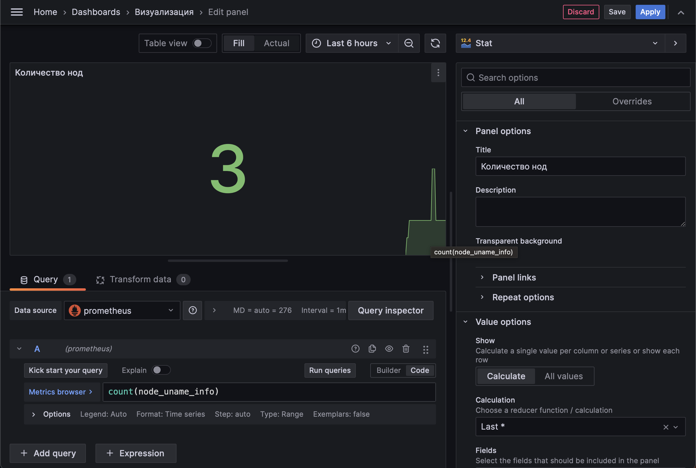

   - количество контейнеров;

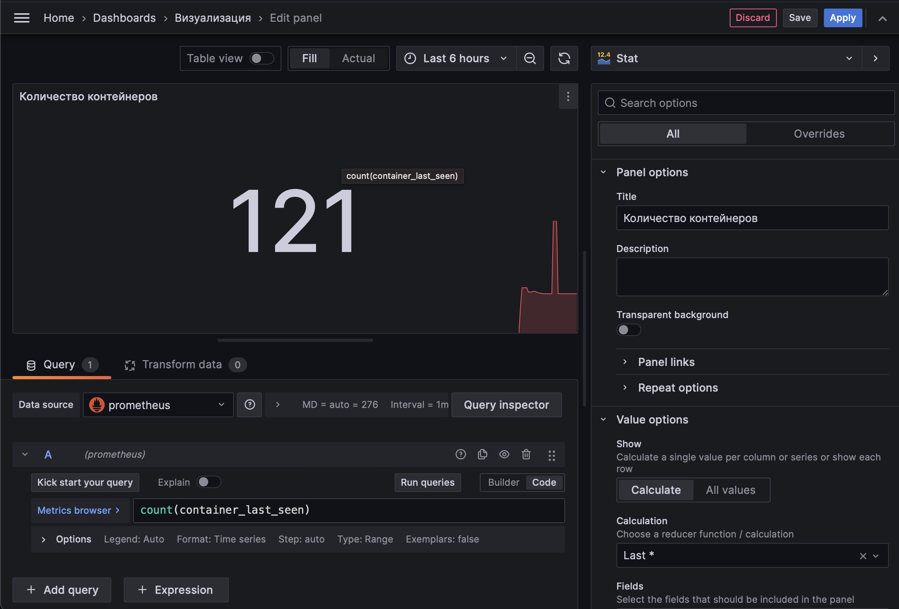

   - количество стеков;


   - использование CPU по сервисам;

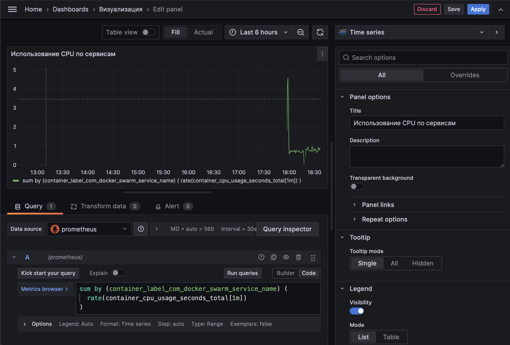

   - использование CPU по ядрам и узлам;

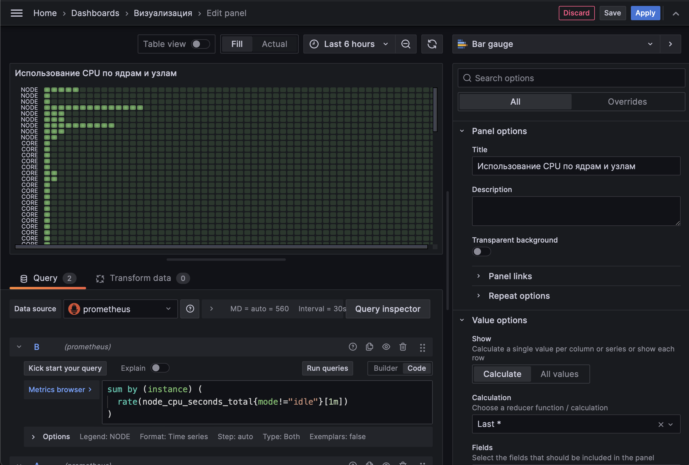

   - затраченная RAM;

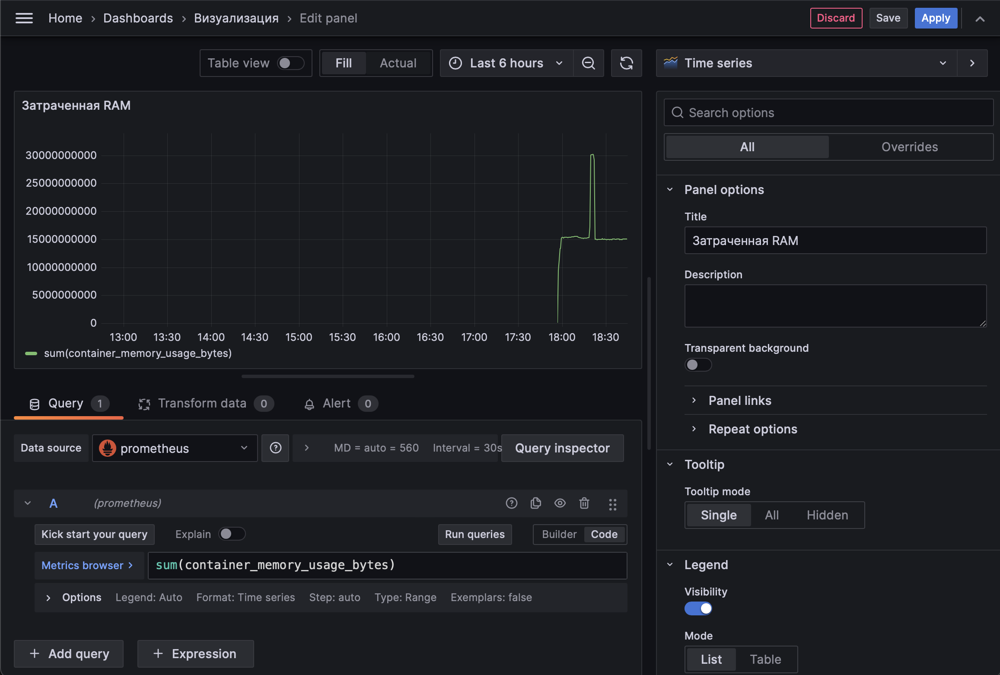

   - доступная и занятая память;

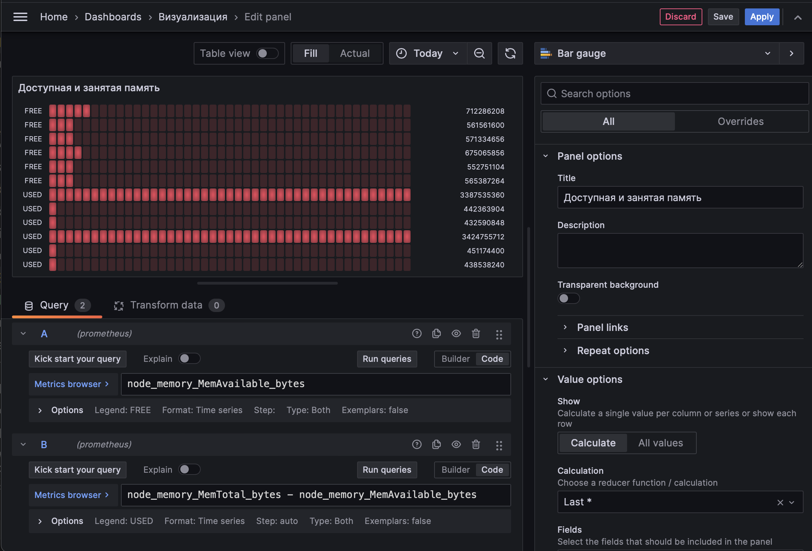

   - количество CPU;

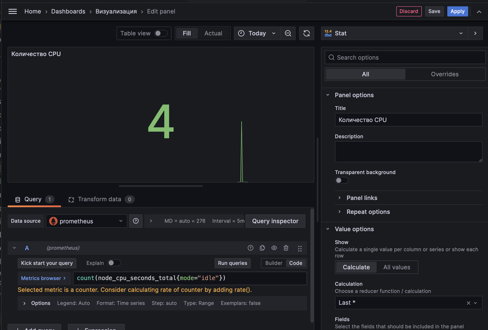

   - доступность google.com;

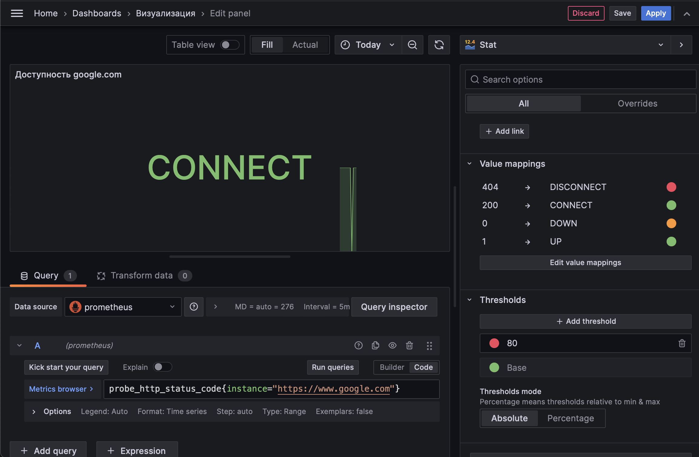

   - количество отправленных сообщений в rabbitmq;

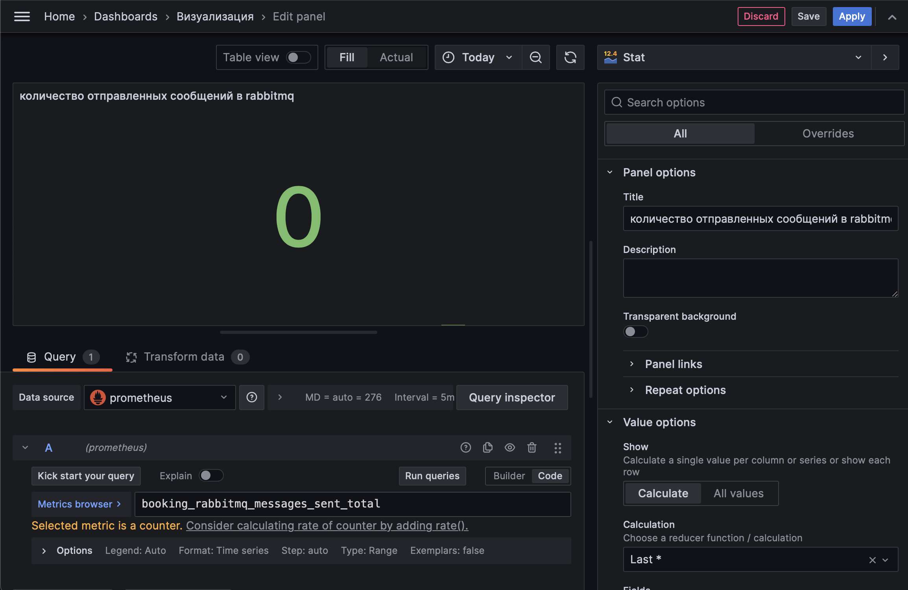

   - количество обработанных сообщений в rabbitmq;

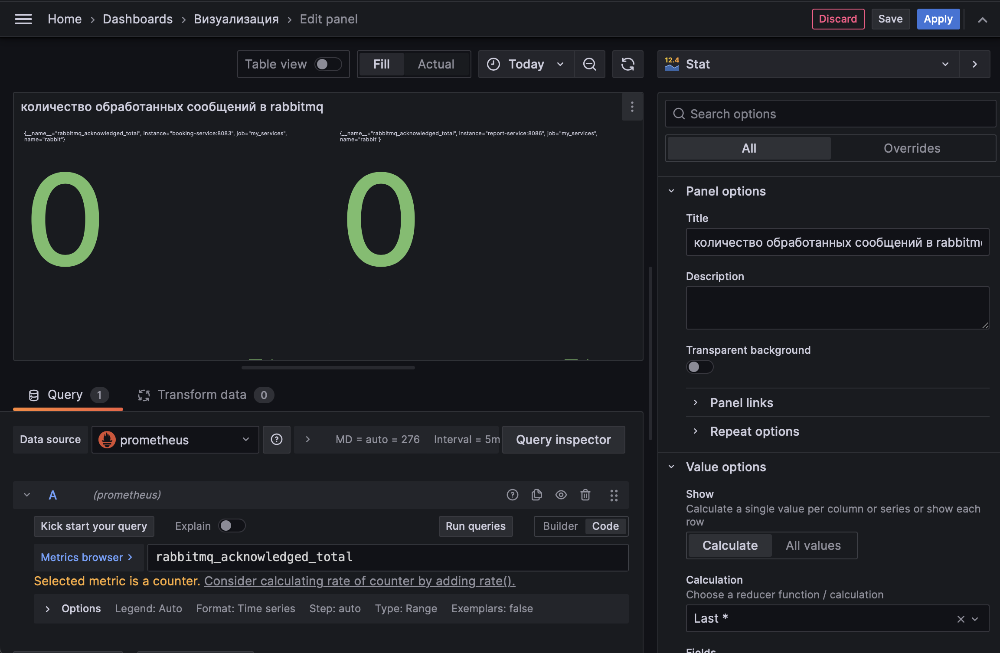

   - количество бронирований;

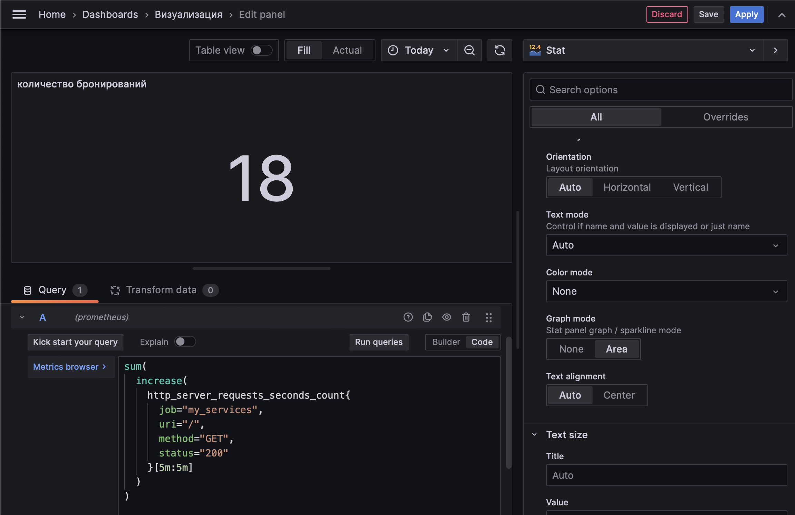

   - количество полученных запросов на gateway;

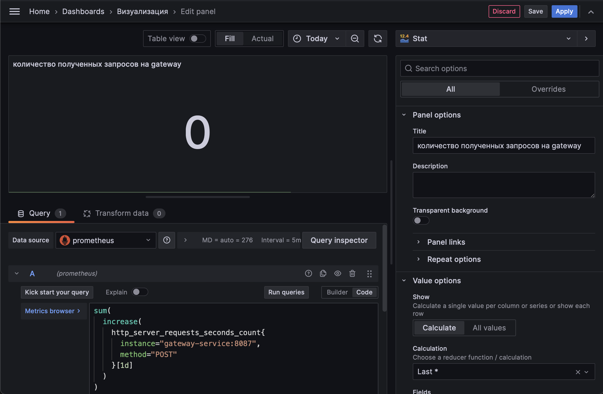

   - количество полученных запросов на авторизацию пользователей;

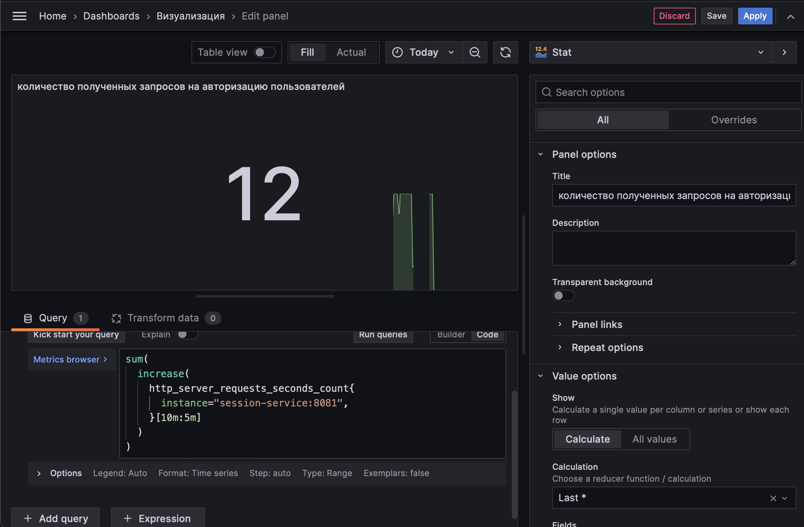

   - логи приложения.

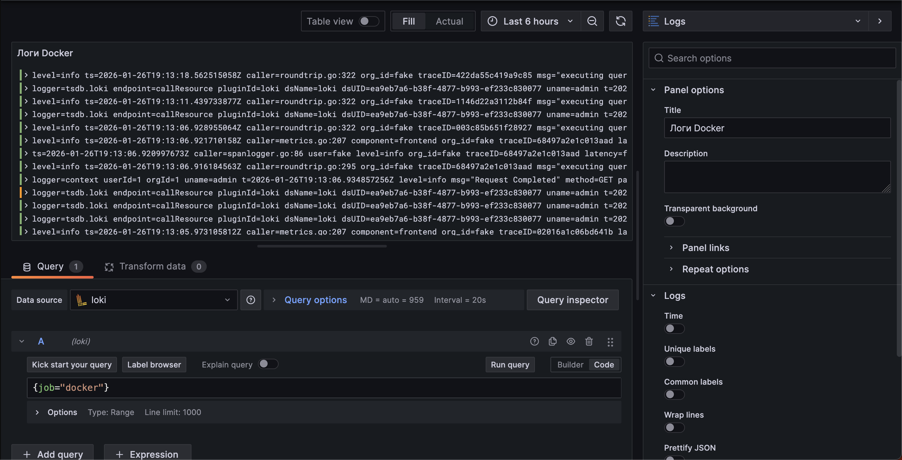

## Part 3. Отслеживание критических событий

### Задание

1. Развернуть Alert Manager как новый сервис в стеке монтиторинга.

  - Добавляем новый сервис в стек мониторинга `docker-compose-monitoring.yml`

```yml
...
alertmanager:
    image: prom/alertmanager:v0.27.0
    ports:
      - "9093:9093"
    env_file:
      - ./monitoring/.env
    volumes:
      - ./monitoring/alertmanager.yml:/etc/alertmanager/alertmanager.yml
    command:
      - "--config.file=/etc/alertmanager/alertmanager.yml"
    networks:
      - app-network
    deploy:
      replicas: 1
      placement:
        constraints:
          - node.role == manager
...
```

2. Добавить следующие критические события:

   - доступная память меньше 100 Мб;
   - затраченная RAM больше 1 Гб;
   - использование CPU по сервису превышает 10%.

(создаем в папке мониторинг `/alerts/alert.yml`)

```yaml
groups:
- name: critical-resources
  rules:

  # 1. Доступная память < 100 MB
  - alert: LowAvailableMemory
    expr: node_memory_MemAvailable_bytes < 104857600
    for: 1m
    labels:
      severity: critical
    annotations:
      summary: "Мало доступной памяти {{ $labels.instance }}"
      description: "Доступная память меньше 100 MB"

  # 2. Используемая RAM > 1 GB
  - alert: HighRAMUsage
    expr: (node_memory_MemTotal_bytes - node_memory_MemAvailable_bytes) > 1073741824
    for: 1m
    labels:
      severity: critical
    annotations:
      summary: "Высокое потребление RAM {{ $labels.instance }}"
      description: "Затраченая RAM больше 1 GB"

  # 3. CPU usage per service > 10%
  - alert: HighServiceCPU
    expr: |
      sum by (container, com_docker_swarm_service_name) (
        rate(container_cpu_usage_seconds_total{container!=""}[1m])
      ) * 100 > 10
    for: 1m
    labels:
      severity: critical
    annotations:
      summary: "Высокое использование CPU {{ $labels.com_docker_swarm_service_name }}"
      description: "Использование CPU превышает 10%"
```

3. Настроить получение оповещений через личные email и Телеграм.\
(создаем в папке мониторинг `alertmanager.yml`)

```yaml
global:
  resolve_timeout: 5m
  smtp_smarthost: 'smtp.gmail.com:587'
  smtp_from: 'zapunk1@gmail.com'
  smtp_auth_username: 'zapunk1@gmail.com'
  smtp_auth_password: '${SMTP_PASS}'

route:
  receiver: 'email-and-telegram'
  group_by: ['alertname']
  group_wait: 30s
  group_interval: 5m
  repeat_interval: 4h

receivers:
- name: 'email-and-telegram'
  email_configs:
    - to: 'zapunk1@gmail.com'
      send_resolved: true

  telegram_configs:
    - bot_token: '${TG_BOT_TOKEN}'
      chat_id: 1306744343
      parse_mode: HTML
      send_resolved: true
```
!ВАЖНО! - Для управления секретами, что бы пароль и токен не попали в открытый доступ GIT, создаем файл `.env` куда прописываем переменные окружения. А в `.gitignore` добавляем `.env` что бы исключить случайную выгрузку в репозиторий. Файл `.env` храним локально!

  - Перезапускаем стек и видим что все развернулось и работает. На скринах Поднятые стеки и скрины уведомлений e-mail и ТГ. 

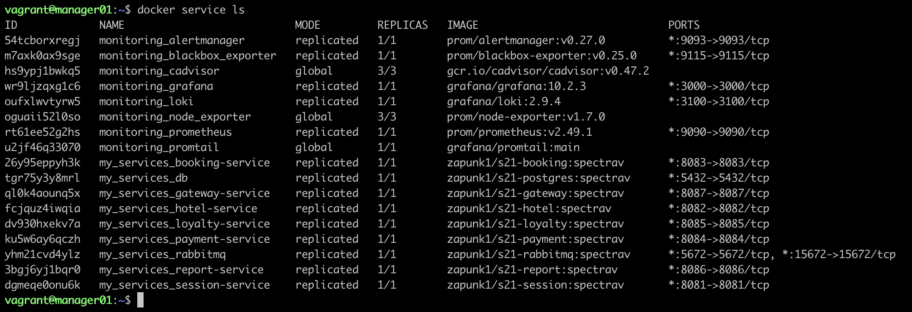

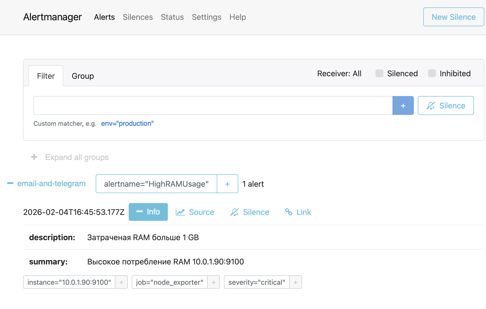

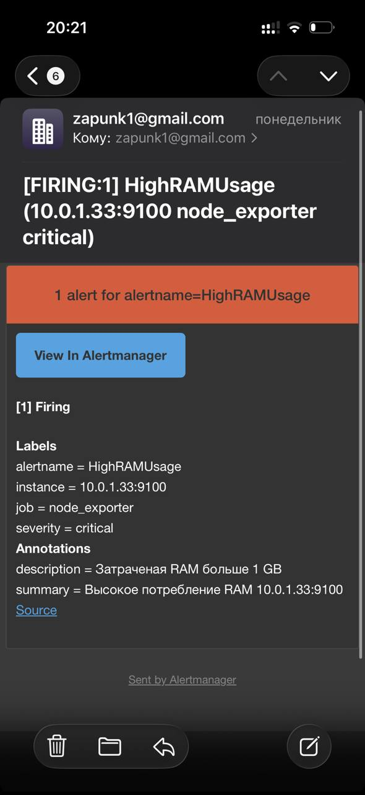

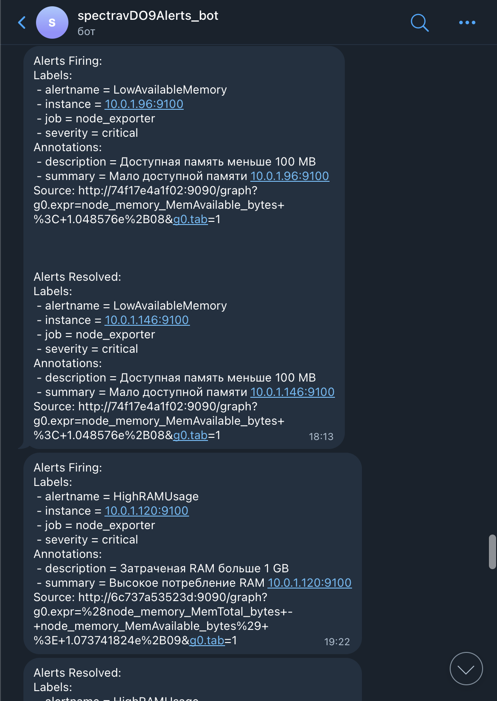

  - Финальный дашборд 

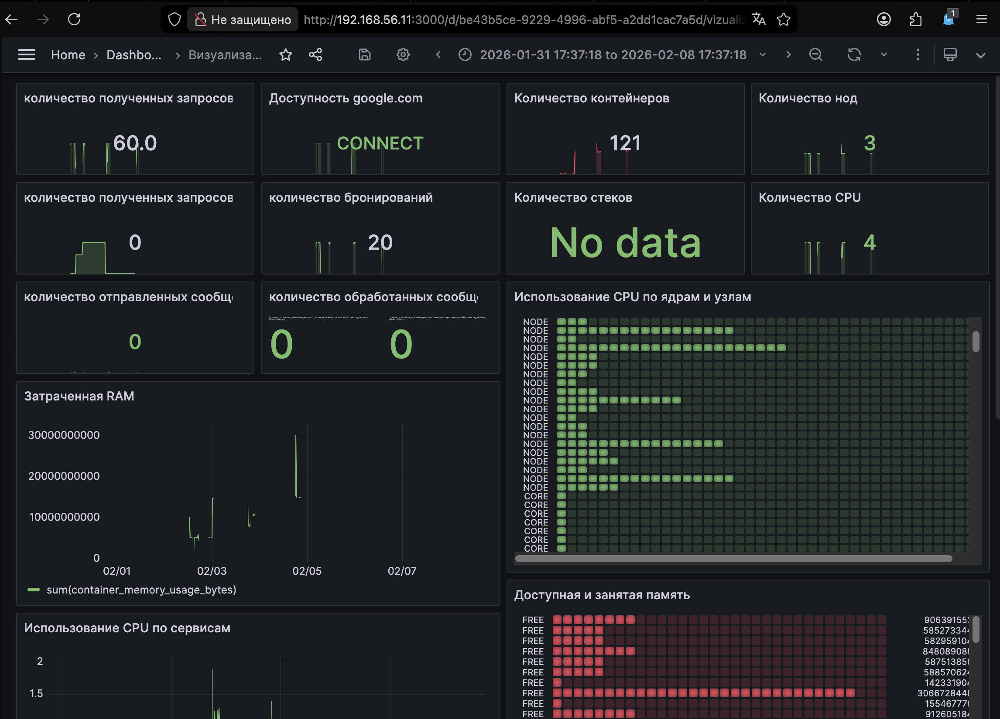