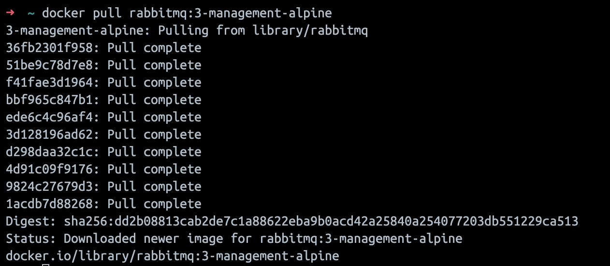
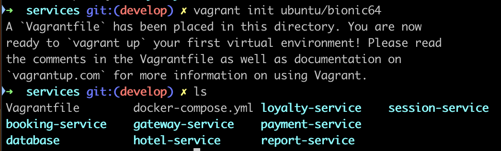
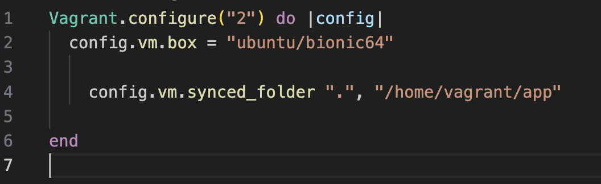
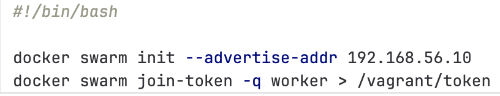
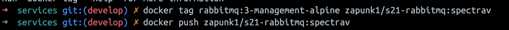
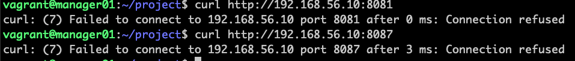
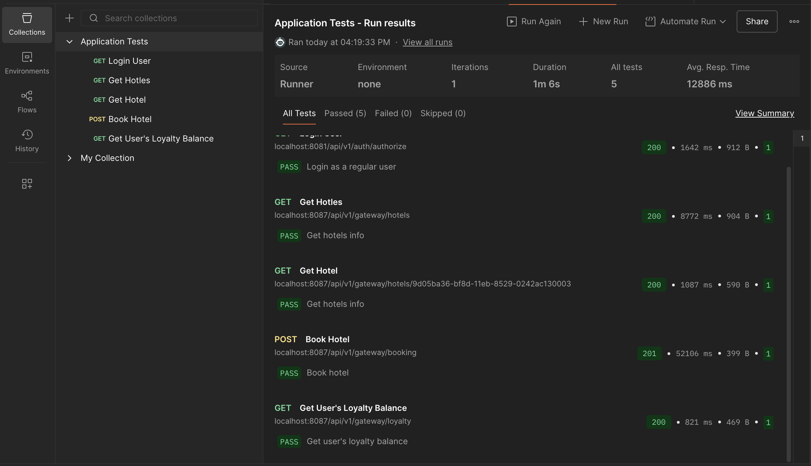
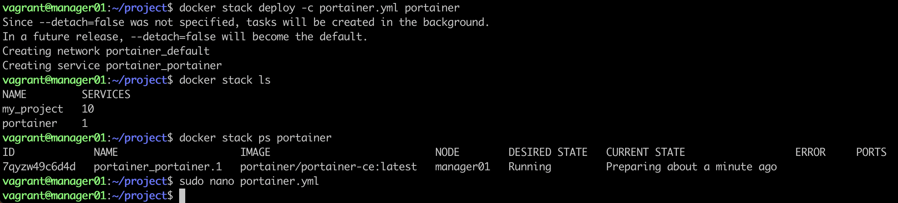

## Part 1. Запуск нескольких Docker-контейнеров с использованием Docker Compose

Создание Dockerfile для каждого микросервиса:

Докерфайлы для микросервисов одинаковые, рассмотрим только на примере `gateway-service`. В сборки использовал multi-stage для облегчения образа. В стадии 'builder' использовал образ `maven` где уже есть большинство зависимостей. А в финальном образе использовал более стабильный `eclipse`, в который перенес уже готовый исполняемый файл .jar

```docker
FROM maven:3.9.9-eclipse-temurin-17 AS builder
WORKDIR /app
COPY .mvn/ .mvn/
COPY pom.xml .
RUN mvn -B -Dmaven.repo.local=/root/.m2/repository --no-transfer-progress dependency:go-offline
COPY src ./src
RUN mvn -B package -DskipTests

FROM eclipse-temurin:17-jre-alpine
WORKDIR /app
RUN apk add --no-cache bash
COPY --from=builder /app/target/*.jar ./app.jar
COPY wait-for-it.sh .
RUN chmod +x wait-for-it.sh
CMD ["./wait-for-it.sh", "-t", "40", "db:5432", "--",\
     "./wait-for-it.sh", "-t", "40", "hotel-service:8082", "--",\
     "./wait-for-it.sh", "-t", "40", "session-service:8081", "--",\
     "./wait-for-it.sh", "-t", "40", "booking-service:8083", "--",\
     "./wait-for-it.sh", "-t", "40", "payment-service:8084", "--",\
     "./wait-for-it.sh", "-t", "40", "loyalty-service:8085", "--",\
     "./wait-for-it.sh", "-t", "40", "report-service:8086",  "--",\
     "java", "-jar", "./app.jar"]
```

Для обмена данными между микросервисами использовал стандартный брокер



На скриншоте видим что размеры оброзов получились небольшими.  


В докер-компос:

- прописываю сервисы.
- прокидываю порты  наружу `например "8083:8083"`.
- Прописываю сеть `app-network`, чтоб сервисы могли подключаться к ней и обращаться друк к другу по имени хоста `например db:5432`.
- прописываю переменные окружения.
- В 'db' прописал том, что бы .sql-файл выполнился автоматически и хранился локально.
- Прописываю 'restart' что бы контейнер автоматически перезапускался, если упадет.

```yaml
services:
  rabbitmq:
    image: rabbitmq:3-management-alpine
    ports:
      - "5672:5672"
      - "15672:15672"
    networks:
      - app-network

  db:
    image: postgres:16-alpine
    restart: unless-stopped
    networks:
      - app-network
    ports:
      - "5432:5432"
    environment:
      POSTGRES_USER: postgres
      POSTGRES_PASSWORD: postgres
      POSTGRES_DB: postgres
    volumes:
      - ./database/init.sql:/docker-entrypoint-initdb.d/init.sql
      - db_data:/var/lib/postgresql/data
    
  booking-service:
    restart: unless-stopped
    build: ./booking-service/
    networks:
      - app-network
    ports:
      - "8083:8083"
    environment:
      POSTGRES_HOST: db
      POSTGRES_PORT: 5432
      POSTGRES_USER: postgres
      POSTGRES_PASSWORD: postgres
      POSTGRES_DB: reservations_db
      RABBIT_MQ_HOST: rabbitmq
      RABBIT_MQ_PORT: 5672
      RABBIT_MQ_USER: guest
      RABBIT_MQ_PASSWORD: guest
      RABBIT_MQ_QUEUE_NAME: messagequeue
      RABBIT_MQ_EXCHANGE: messagequeue-exchange
      HOTEL_SERVICE_HOST: hotel-service
      HOTEL_SERVICE_PORT: 8082
      PAYMENT_SERVICE_HOST: payment-service
      PAYMENT_SERVICE_PORT: 8084
      LOYALTY_SERVICE_HOST: loyalty-service
      LOYALTY_SERVICE_PORT: 8085
    depends_on:
      - db
      - rabbitmq

  session-service:
    restart: unless-stopped
    build: ./session-service/
    networks:
      - app-network
    ports:
      - "8081:8081"
    environment:
      POSTGRES_HOST: db
      POSTGRES_PORT: 5432
      POSTGRES_USER: postgres
      POSTGRES_PASSWORD: "postgres"
      POSTGRES_DB: users_db
    depends_on:
      - db

  hotel-service:
    restart: unless-stopped
    build: ./hotel-service/
    networks:
      - app-network
    ports:
      - "8082:8082"
    environment:
      POSTGRES_HOST: db
      POSTGRES_PORT: 5432
      POSTGRES_USER: postgres
      POSTGRES_PASSWORD: "postgres"
      POSTGRES_DB: hotels_db
    depends_on:
      - db

  payment-service:
    restart: unless-stopped
    build: ./payment-service/
    networks:
      - app-network
    ports:
      - "8084:8084"
    environment:
      POSTGRES_HOST: db
      POSTGRES_PORT: 5432
      POSTGRES_USER: postgres
      POSTGRES_PASSWORD: "postgres"
      POSTGRES_DB: payments_db
    depends_on:
      - db

  loyalty-service:
    restart: unless-stopped
    build: ./loyalty-service/
    networks:
      - app-network
    ports:
      - "8085:8085"
    environment:
      POSTGRES_HOST: db
      POSTGRES_PORT: 5432
      POSTGRES_USER: postgres
      POSTGRES_PASSWORD: "postgres"
      POSTGRES_DB: balances_db
    depends_on:
      - db

  report-service:
    restart: unless-stopped
    build: ./report-service/
    networks:
      - app-network
    ports:
      - "8086:8086"
    environment:
      POSTGRES_HOST: db
      POSTGRES_PORT: 5432
      POSTGRES_USER: postgres
      POSTGRES_PASSWORD: "postgres"
      POSTGRES_DB: statistics_db
      RABBIT_MQ_HOST: rabbitmq
      RABBIT_MQ_PORT: 5672
      RABBIT_MQ_USER: guest
      RABBIT_MQ_PASSWORD: guest
      RABBIT_MQ_QUEUE_NAME: messagequeue
      RABBIT_MQ_EXCHANGE: messagequeue-exchange
    depends_on:
      - db
      - rabbitmq

  gateway-service:
    restart: unless-stopped
    build: ./gateway-service/
    ports:
      - "8087:8087"
    networks:
      - app-network
    environment:
      SESSION_SERVICE_HOST: session-service
      SESSION_SERVICE_PORT: 8081
      HOTEL_SERVICE_HOST: hotel-service
      HOTEL_SERVICE_PORT: 8082
      BOOKING_SERVICE_HOST: booking-service
      BOOKING_SERVICE_PORT: 8083
      PAYMENT_SERVICE_HOST: payment-service
      PAYMENT_SERVICE_PORT: 8084
      LOYALTY_SERVICE_HOST: loyalty-service
      LOYALTY_SERVICE_PORT: 8085
      REPORT_SERVICE_HOST: report-service
      REPORT_SERVICE_PORT: 8086
    depends_on:
      - booking-service
      - hotel-service
      - session-service
      - payment-service
      - loyalty-service
      - report-service

networks:
  app-network:

volumes:
  db_data:
```

Собираем и разворачиваем веб-сервис с помощью Docker Compose


Запускаем тесты в 'Postman' и видим что все ОК


## Part 2. Создание виртуальных машин

Устанавливаем Vagrant с помощью `brew tap hashicorp/tap` и `brew install hashicorp/tap/hashicorp-vagrant`

Проверяем что все установилось `vagrant --version`


Инициализируем Vagrantfile в корень проекта



Поскольку в задании сказано '...Напиши Vagrantfile для одной виртуальной машины. Перенеси исходный код веб-сервиса в рабочую директорию виртуальной машины.', то за основу возьмем станданртный Vagrantfile, а для переноса файлов внуть ВМ использую синхронизированную папку



На скриншоте видно что исходный код перенесен в рабочую папку ВМ


Остановка ВМ осуществляется с помощью `vagrant halt`, а полное уничтожение с помощью `vagrant destroy -f` (f - использую для принудительного удаления без подтверждения)

## Part 3. Создание простейшего Docker Swarm

В настройках 'VirtualBox' проверяем доступный диапазон сетей


Для скрипта по установке Docker, берем команды с сайта докера и копируем в наш скрипт

```shell
sudo apt-get update -y
sudo apt-get install -y ca-certificates curl gnupg lsb-release
sudo mkdir -p /etc/apt/keyrings
sudo chmod 755 /etc/apt/keyrings
curl -fsSL https://download.docker.com/linux/ubuntu/gpg | sudo gpg --dearmor -o /etc/apt/keyrings/docker.gpg
sudo chmod a+r /etc/apt/keyrings/docker.gpg
echo \
  "deb [arch=$(dpkg --print-architecture) signed-by=/etc/apt/keyrings/docker.gpg] \
  https://download.docker.com/linux/ubuntu $(lsb_release -cs) stable" \
  | sudo tee /etc/apt/sources.list.d/docker.list > /dev/null
sudo apt-get update -y
sudo apt-get install -y docker-ce docker-ce-cli containerd.io docker-buildx-plugin docker-compose-plugin
sudo usermod -aG docker vagrant
sudo systemctl enable docker
sudo systemctl start docker
sudo -u vagrant docker --version
```

Пишем скрипт для инициализации Swarm на менеджере



Пишем скрипт для подключения воркеров к менеджеру


Изменяем 'Vagrantfile' для создания 3-х машин

```shell
Vagrant.configure("2") do |config|
  config.vm.box = "ubuntu/jammy64"

    config.vm.synced_folder ".", "/vagrant"
  
  config.vm.define "manager01" do |manager|
    manager.vm.hostname = "manager01"
    manager.vm.network "private_network", ip: "192.168.56.10"

    manager.vm.provision "shell", path: "./install-docker.sh"
    manager.vm.provision "shell", path: "./manager_swarm.sh"
  end
  
  config.vm.define "worker01" do |worker|
    worker.vm.hostname = "worker01"
    worker.vm.network "private_network", ip: "192.168.56.11"

    worker.vm.provision "shell", path: "./install-docker.sh"
    worker.vm.provision "shell", path: "./worker_swarm.sh"
  end

  config.vm.define "worker02" do |worker|
    worker.vm.hostname = "worker02"
    worker.vm.network "private_network", ip: "192.168.56.12"

    worker.vm.provision "shell", path: "./install-docker.sh"
    worker.vm.provision "shell", path: "./worker_swarm.sh"
  end
end
```

Запускаем Vagranеt с помощью команды `vagrant up` затем входим в ВМ с помощью команды `vagrant ssh manager01` и видим что Docker swarm активен и воркеры подключились. 


Выгрузка докер образов: первым делом тегируем образы; затем выгружаем образы. 

На скрине пример с брокером, на остальных образах опирация аналогичная. 



Поскольку у меня в Vagrantfile смонтирована общая папка для хостовой и гостевой машины, то проект и все файлы уже в ВМ. Для ускорения процессов и уменьшения нагрузки на ресурсы, переносим проект из общей папки во внутреннюю папку ВМ, для этого используем скрипт 

```shell
      mkdir -p /home/vagrant/project
      cp -r /vagrant/* /home/vagrant/project/
```

Запускаем стек сервисов внутри ВМ из папки `/home/vagrant/project/`


Как видим все работает


Настраиваю прокси на базе nginx для доступа к gateway service и session service по оверлейной сети. Сами gateway service и session service делаю недоступными напрямую.

  - конфигурация nginx
```shell
upstream gateway {
    server gateway-service:8087;
}

upstream session {
    server session-service:8081;
}

server {
    listen 80;

    location /gateway/ {
        proxy_pass http://gateway/;
        proxy_set_header Host $host;
        proxy_set_header X-Real-IP $remote_addr;
    }

    location /session/ {
        proxy_pass http://session/;
        proxy_set_header Host $host;
        proxy_set_header X-Real-IP $remote_addr;
    }
}
```
  - в docker compose прописываю сервис nginx и меняю ports на expose для gateway и session 

```shell
session-service:
...
  expose:
      - "8081"
...

gateway-service:
...
  expose:
      - "8087"
...

nginx:
    restart: unless-stopped
    image: nginx:1.25.5-alpine
    ports:
      - "80:80"
    networks:
      - app-network
    volumes:
      - ./nginx/default.conf:/etc/nginx/conf.d/default.conf:ro
    depends_on:
      - session-service
      - gateway-service
```

Пересобираем сервис с помощью `docker compose up -d` и видим что с хостовой машины мы можем обращаться в gateway и session


А напрямую с ВМ нет



Прогоняем тесты в postman(тесты postman наcтроены на проверку только по localhost. Поэтому по overlay network тесты не проходят, останавливаем ВМ, запускаем на хосте и все проходит)



Возвращаемся в ВМ. Запускаем стек с помощью `docker stack deploy -c docker-compose.yml my_project` и про помощи команды `docker stack ps my_project` выводим информацию о распределении сервисов по узлам. 


Ставим Portainer внутрь нашего Docker Swarm. Создаем файл portainer.yml

```shell
version: "3.8"
services:
  portainer:
    image: portainer/portainer-ce:latest
    ports:
      - "9000:9000"
      - "9443:9443"
    volumes:
      - /var/run/docker.sock:/var/run/docker.sock
      - portainer_data:/data
    deploy:
      mode: replicated
      replicas: 1
      placement:
        constraints: [node.role == manager]
volumes:
  portainer_data:
```

Запускаем и проверяем что все запустилось



Открываем браузер на хосте по адресу `192.168.56.10:9000` и регистрируемся в Portainer

Можем управлять контейнерами


Открываем визуализацию по узлам


